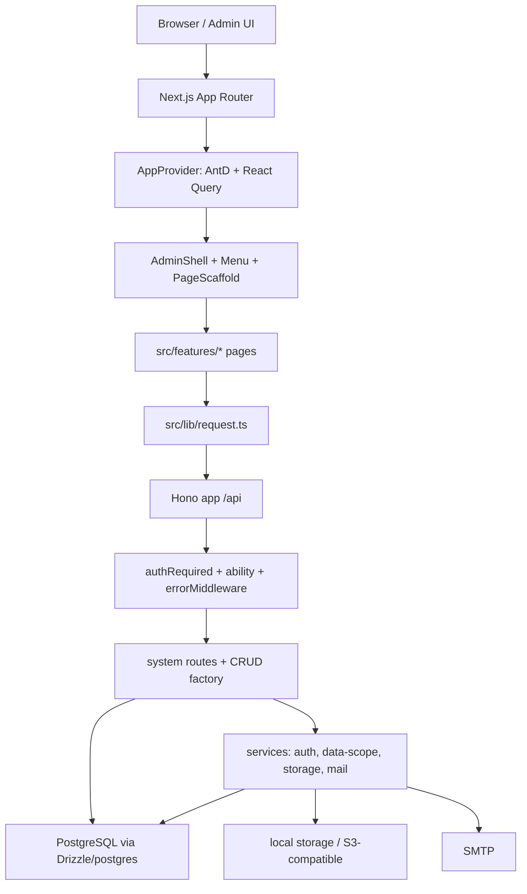

# Admin Base 当前技术栈与架构

> 当前核对：2026-06-22  
> 目标：记录当前项目真实技术栈、模块边界、运行链路和架构约束。后续新增能力时，先更新本文，再改实现。

## 1. 当前技术栈

| 层级          | 当前选型                                    | 当前用途                                                 |
| ------------- | ------------------------------------------- | -------------------------------------------------------- |
| 应用宿主      | Next.js 16 App Router                       | 承载后台页面和 `/api` route handler                      |
| UI 框架       | React 19、Ant Design 6、`@ant-design/icons` | 后台页面、表单、表格、Drawer、Modal、图标                |
| 数据请求      | TanStack React Query 5                      | 列表、详情、辅助数据缓存和 mutation 状态                 |
| 客户端状态    | Zustand 5                                   | 登录态、权限、菜单、布局偏好等全局状态                   |
| API 框架      | Hono 4                                      | API route、middleware、错误处理、权限校验                |
| 数据库        | PostgreSQL                                  | 当前唯一主目标数据库                                     |
| ORM / SQL     | Drizzle ORM 0.45、`postgres` driver         | schema、typed query、事务和手写 SQL 兼容层               |
| 校验          | Zod 4                                       | API 入参和 CRUD schema 校验                              |
| 认证          | Bearer token + `sys_access_token`           | 登录后生成 token，token 保存权限快照                     |
| 密码          | bcryptjs                                    | 用户密码 hash                                            |
| 密钥加密      | Node `crypto` AES-256-GCM                   | SMTP 密码、S3 Secret 等敏感字段加密                      |
| 文件存储      | 本地存储 + S3-compatible                    | 文件上传、下载、物理删除、默认存储配置                   |
| 邮件          | Nodemailer                                  | SMTP 配置、测试发送                                      |
| 文档/文件预览 | `docx-preview`、`xlsx`、浏览器原生预览      | Word、Excel、PDF、图片、音视频、文本预览                 |
| 图表          | ECharts 6                                   | 仪表盘和后续分析图表                                     |
| 单测          | Vitest 4                                    | API、service、CRUD、权限测试                             |
| E2E           | Playwright 1.57                             | 浏览器流测试；当前默认会重置数据库，不能作为普通本地检查 |
| 工具链        | TypeScript 5.9、ESLint 9、Prettier 3、tsx   | 类型检查、代码检查、格式化、脚本运行                     |

当前没有引入：

- Redis、队列、定时任务。
- OpenAPI/Swagger 文档生成。
- Pino 或其他结构化日志库。
- Dockerfile、docker-compose、CI 配置。
- 多租户和完整代码生成器。

这些能力属于生产级增强或插件化范围，不进入当前源码启动主路径。

## 2. 总体架构



关键原则：

- 单仓库、单 Next.js 应用承载前端和 Hono API。
- 前端业务页面放在 `src/features/**`，`src/app/**/page.tsx` 只做路由薄壳。
- Hono API 挂载在 `src/app/api/[[...route]]/route.ts`，当前同源部署。
- 菜单权限以数据库 `sys_rule` 为 source of truth，不从 Next 文件路由反推。
- PostgreSQL-first，不再维护 SQLite 本地开发路径。
- 常规系统模块优先用 CRUD factory；复杂事务和副作用保留显式 route/service。

## 3. 目录职责

| 路径                           | 职责                                                   |
| ------------------------------ | ------------------------------------------------------ |
| `src/app/**`                   | Next 路由壳、API route handler、上传文件访问路由       |
| `src/features/**`              | 真实业务页面，尽量不直接依赖 Next API                  |
| `src/components/**`            | 后台业务通用组件：表格、表单、搜索、字段、权限按钮     |
| `src/ui/**`                    | 全局 UI 壳层、主题、反馈、状态页、React Query Provider |
| `src/lib/**`                   | 前端请求、响应、tree、auth token 等通用工具            |
| `src/platform/**`              | 平台适配层，例如 navigation                            |
| `src/router/route-manifest.ts` | 前端可渲染页面清单和路由权限声明                       |
| `src/stores/**`                | Zustand 全局状态                                       |
| `src/server/app.ts`            | Hono app 入口、全局 middleware、health                 |
| `src/server/routes/**`         | API route，系统模块入口                                |
| `src/server/crud/**`           | CRUD factory、typed list query、权限 meta registry     |
| `src/server/services/**`       | 认证、数据权限、存储、邮件、保护记录等业务服务         |
| `src/server/db/**`             | PostgreSQL 连接、Drizzle schema、migration、seed       |
| `scripts/**`                   | 数据库迁移、seed、reset、路由权限一致性检查            |
| `tests/**`                     | Vitest、Playwright、DB test helper                     |
| `docs/**`                      | 架构、计划、启动、维护规范                             |

## 4. 前端架构

前端页面分三层：

1. `src/app/(admin)/**/page.tsx`：Next 路由薄壳。
2. `src/features/**/XxxPage.tsx`：业务页面。
3. `src/components/**` 和 `src/ui/**`：后台组件和壳层。

约束：

- 业务页面不要直接使用 `next/navigation`、Server Actions、`cookies()`、`headers()`。
- API 请求统一走 `src/lib/request.ts`。
- 列表页优先使用 `AdminDataTable`，保持搜索、分页、排序写入 URL。
- 服务端数据缓存使用 React Query。
- 登录态、权限、菜单、布局偏好使用 Zustand。
- UI 统一走 `AppProvider`、`AdminShell`、`PageScaffold`、`AdminDataTable`、`AdminEntityForm`。

React Query 当前默认策略：

- `refetchOnWindowFocus: false`
- `retry: 1`
- `staleTime: 30_000`

## 5. 后端架构

Hono API 按模块拆分：

```text
src/server/app.ts
src/server/routes/auth.ts
src/server/routes/system/user.ts
src/server/routes/system/role.ts
src/server/routes/system/rule.ts
src/server/routes/system/dept.ts
src/server/routes/system/dict.ts
src/server/routes/system/config.ts
src/server/routes/system/file.ts
src/server/routes/system/storage.ts
src/server/routes/system/mail.ts
```

中间件：

- `authRequired()`：解析 bearer token，校验登录态。
- `ability(code)`：校验 token 权限快照。
- `errorMiddleware`：统一错误响应。

CRUD factory 当前能力：

- `query/create/update/delete/batchDelete`
- `restore/batchRestore`
- `forceDelete/batchForce`
- `status`
- Zod schema 校验
- Drizzle table object
- 权限声明和 fail-fast meta 注册
- audit 字段写入
- 软删除
- transaction hook
- list hook / afterList hook

设计边界：

- 常规 CRUD 走 factory。
- 用户密码 hash、角色权限同步、用户角色同步、文件上传下载、物理删除、SMTP 测试、S3 测试等保留显式 route/service。
- 不引入厚 Repository/DAO 层，避免模板初期过度抽象。

## 6. 数据模型

当前核心表：

| 表                                      | 作用                                   |
| --------------------------------------- | -------------------------------------- |
| `sys_user`                              | 用户、密码 hash、部门、状态、系统保护  |
| `sys_role`                              | 角色、状态、`data_scope`、系统保护     |
| `sys_user_role`                         | 用户角色关系                           |
| `sys_role_dept`                         | 角色自定义数据权限部门                 |
| `sys_rule`                              | 菜单、路由、按钮/API 权限              |
| `sys_role_rule`                         | 角色权限关系                           |
| `sys_dept`                              | 部门树                                 |
| `sys_access_token`                      | 登录 token hash 和权限快照             |
| `sys_login_record`                      | 登录日志                               |
| `sys_dict` / `sys_dict_item`            | 字典和字典项                           |
| `sys_config_group` / `sys_config_items` | 系统配置和文件策略                     |
| `sys_storage`                           | 本地/S3-compatible 存储配置            |
| `sys_file_group` / `sys_file`           | 文件分组、文件元数据、sha256、存储归属 |
| `sys_mail_account`                      | SMTP 账号配置                          |

数据库策略：

- 主目标数据库为 PostgreSQL。
- 主数据表使用 `deleted_at` 软删除。
- 唯一索引用 PostgreSQL partial unique index 排除软删除记录。
- `created_at`、`updated_at` 由数据库默认值和 trigger 兜底。
- `created_by`、`updated_by`、`deleted_by` 由 CRUD factory 或显式 route 写入。
- migration 当前在 `src/server/db/migrations.ts` 中维护手写 SQL。

## 7. 权限与数据权限

功能权限：

- `sys_rule.type = menu | route | nested | action`
- 按钮和 API 权限使用 action rule，例如 `system.user.query`。
- 后端 API 必须使用 `ability(code)` 或 CRUD factory 权限声明。
- 前端 `AuthButton` 只负责交互显隐，不作为安全边界。

数据权限：

| `data_scope`        | 含义                 |
| ------------------- | -------------------- |
| `all`               | 全部数据             |
| `custom_dept`       | 指定部门             |
| `current_dept`      | 当前用户部门         |
| `current_dept_tree` | 当前用户部门及子部门 |
| `self`              | 仅本人               |

实现入口：

- `src/server/services/data-scope.ts`
- `resolveDataScopeForUser()`
- `buildDataScopeCondition()`
- `buildDataScopeWhereSql()`

当前覆盖：

- 用户列表。
- 部门和角色关联用户相关列表。
- 后续业务 CRUD 可以通过 `dept_id`、`created_by`、`owner_id` 接入。

## 8. 文件、存储和邮件

文件：

- 上传走默认启用存储。
- 文件策略来自 `sys_config_items`，不是 `.env`。
- 支持扩展名白名单、黑名单、大小限制、sha256、分类、预览大小建议。

存储：

- `local` 默认存储落到 `storage/uploads`。
- `s3` 支持 S3-compatible endpoint、region、bucket、access key、secret key。
- `secret_key_encrypted` 使用 `ADMIN_BASE_SECRET_KEY` 加密。

邮件：

- `sys_mail_account` 保存 SMTP 配置。
- 支持启停、默认账号、测试发送。
- `password_encrypted` 使用 `ADMIN_BASE_SECRET_KEY` 加密。

密钥注意：

- `ADMIN_BASE_SECRET_KEY` 改动会影响历史 SMTP/S3 密钥解密。
- 生产环境必须禁止使用开发默认密钥。

## 9. 当前质量门禁

常规检查：

```bash
pnpm typecheck
pnpm lint
pnpm test
pnpm admin:check-routes
pnpm build
```

启动检查：

```bash
pnpm db:migrate
pnpm db:seed
pnpm dev
curl http://localhost:3000/api/health
```

注意：

- 当前 `pnpm e2e` 会执行 `pnpm db:reset`，会清空本地配置数据。
- 后续需要补一个非破坏性 E2E 或 browser smoke 命令，作为日常验收。

## 10. 架构约束

- 不把 SMTP、S3、文件策略写死到 `.env`；这些属于后台配置。
- 不把 Docker 作为唯一启动方式；源码直接启动是主路径。
- 不复制 XinAdmin 或 ContiNew 的代码和 API；只对齐后台能力和工程化标准。
- 不在当前阶段引入 SQLite 兼容目标。
- 不在当前阶段引入完整多租户、AI、SMS、定时任务；这些作为插件或后置模块。
- 新增后台页面必须同时维护 route manifest、seed rule/action、API 权限、页面入口和 `admin:check-routes`。
