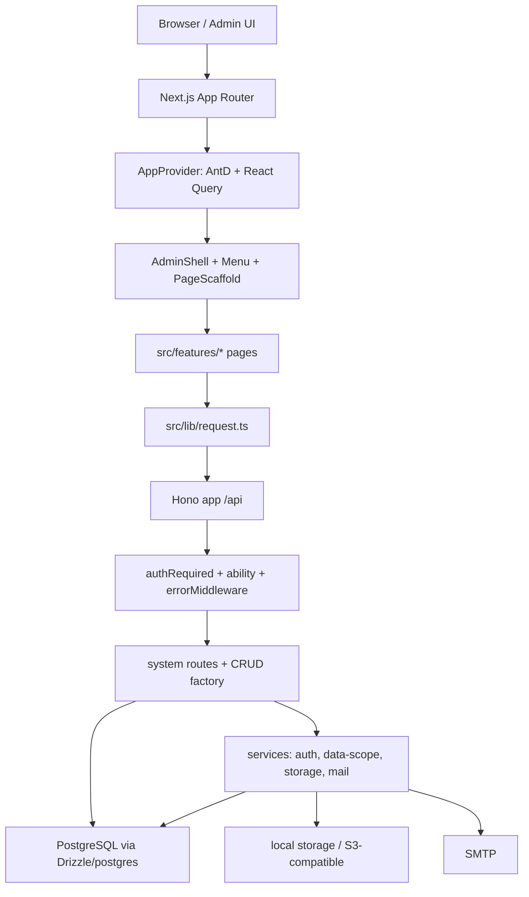

# Admin Base 当前技术栈与架构

> 当前核对：2026-08-24
> 目标：记录当前项目真实技术栈、模块边界、运行链路和架构约束。后续新增能力时，先更新本文，再改实现。

AI 服务商连接、模型、Playground、Chat 和 Agent 的详细职责见
[`docs/ai-module-boundaries.md`](./ai-module-boundaries.md)。
Web Search 的已交付边界以及 Knowledge/RAG、Notebook、Eval、Memory、Runtime Skill 和 MCP 的
采用边界见 [`docs/ai-capability-evolution-roadmap.md`](./ai-capability-evolution-roadmap.md)。路线图中
除明确标为已实现的能力外，均不等于当前实现。
AI SDK、DeepSeek Harness、Mastra 和 Pi 的 Runtime 选型结论见
[`docs/ai-runtime-framework-comparison.md`](./ai-runtime-framework-comparison.md)。
长期 Memory/Skill/Knowledge Tool、MCP、Worker/Outbox 和配额账本的运行边界分别见
[`docs/ai-memory-and-skills.md`](./ai-memory-and-skills.md)、
[`docs/ai-mcp-governance.md`](./ai-mcp-governance.md)、
[`docs/ai-worker-and-outbox.md`](./ai-worker-and-outbox.md) 和
[`docs/ai-quota-and-billing.md`](./ai-quota-and-billing.md)。
CRM、企业知识库、数据查询和供应链的端到端组合示例见
[`docs/ai-business-use-case-cookbook.md`](./ai-business-use-case-cookbook.md)。
Notebook/RAG 的引用交互、公开研究依据和开源参考边界见
[`docs/ai-notebook-citation-experience.md`](./ai-notebook-citation-experience.md)。

## 1. 当前技术栈

| 层级          | 当前选型                                    | 当前用途                                                            |
| ------------- | ------------------------------------------- | ------------------------------------------------------------------- |
| 应用宿主      | Next.js 16 App Router                       | 承载后台页面和 `/api` route handler                                 |
| UI 框架       | React 19、Ant Design 6、`@ant-design/icons` | 后台页面、表单、表格、Drawer、Modal、图标                           |
| 数据请求      | TanStack React Query 5                      | 列表、详情、辅助数据缓存和 mutation 状态                            |
| 客户端状态    | Zustand 5                                   | 登录态、权限、菜单、布局偏好等全局状态                              |
| API 框架      | Hono 4                                      | API route、middleware、错误处理、权限校验                           |
| 数据库        | PostgreSQL                                  | 当前唯一主目标数据库                                                |
| ORM / SQL     | Drizzle ORM 0.45、`postgres` driver         | schema、typed query、事务和手写 SQL 兼容层                          |
| 校验          | Zod 4                                       | API 入参和 CRUD schema 校验                                         |
| 认证          | Bearer token + `sys_access_token`           | 登录后生成 token，token 保存权限快照                                |
| 密码          | bcryptjs                                    | 用户密码 hash                                                       |
| 密钥加密      | Node `crypto` AES-256-GCM                   | SMTP 密码、S3 Secret 等敏感字段加密                                 |
| 文件存储      | 本地存储 + S3-compatible                    | 文件上传、下载、物理删除、默认存储配置                              |
| 邮件          | Nodemailer                                  | SMTP 配置、测试发送                                                 |
| AI 模型运行时 | AI SDK 7                                    | Provider、生成、流式、Tool Calling、结构化输出、Embedding 和 Rerank |
| AI 编排内核   | Mastra Core 1.59                            | 渐进式 Agent/Workflow 编排；当前仅通用助手 canary                   |
| 日志          | Pino + `sys_operation_log`                  | 结构化请求日志、错误日志、request id、后台操作日志                  |
| 文档/文件预览 | `docx-preview`、`xlsx`、浏览器原生预览      | Word、Excel、PDF、图片、音视频、文本预览                            |
| 图表          | ECharts 6                                   | 仪表盘和后续分析图表                                                |
| 单测          | Vitest 4                                    | API、service、CRUD、权限测试                                        |
| E2E           | Playwright 1.57                             | 浏览器流测试；当前默认会重置数据库，不能作为普通本地检查            |
| 工具链        | TypeScript 5.9、ESLint 9、Prettier 3、tsx   | 类型检查、代码检查、格式化、脚本运行                                |

当前没有引入：

- Redis、Kafka、RabbitMQ 和独立任务调度中心；AI 长任务使用 PostgreSQL Queue/Outbox Worker。
- 完整多租户；当前 AI 配额只支持 system/department/user 主体，不提供 tenant 隔离。

静态 OpenAPI、GitHub Actions CI、验收依赖 Compose 和受治理模块生成器已经存在；它们不改变
Next.js + Hono 单应用和 PostgreSQL-first 的源码启动主路径。

## 2. 总体架构



关键原则：

- 单仓库、单 Next.js 应用承载前端和 Hono API。
- 前端业务页面放在 `src/features/**`，`src/app/**/page.tsx` 只做路由薄壳。
- Hono API 挂载在 `src/app/api/[[...route]]/route.ts`，当前同源部署。
- 菜单权限以数据库 `sys_rule` 为 source of truth，不从 Next 文件路由反推。
- PostgreSQL-first，不再维护 SQLite 本地开发路径。
- 常规系统模块优先用 CRUD factory；复杂事务和副作用保留显式 route/service。

## 3. 目录职责

| 路径                           | 职责                                                   |
| ------------------------------ | ------------------------------------------------------ |
| `src/app/**`                   | Next 路由壳、API route handler、上传文件访问路由       |
| `src/features/**`              | 真实业务页面，尽量不直接依赖 Next API                  |
| `src/components/**`            | 后台业务通用组件：表格、表单、搜索、字段、权限按钮     |
| `src/ui/**`                    | 全局 UI 壳层、主题、反馈、状态页、React Query Provider |
| `src/lib/**`                   | 前端请求、响应、tree、auth token 等通用工具            |
| `src/platform/**`              | 平台适配层，例如 navigation                            |
| `src/router/route-manifest.ts` | 前端可渲染页面清单和路由权限声明                       |
| `src/stores/**`                | Zustand 全局状态                                       |
| `src/server/app.ts`            | Hono app 入口、全局 middleware、health、ready          |
| `src/server/routes/**`         | API route，系统模块入口                                |
| `src/server/crud/**`           | CRUD factory、typed list query、权限 meta registry     |
| `src/server/services/**`       | 认证、数据权限、存储、邮件、保护记录等业务服务         |
| `src/server/db/**`             | PostgreSQL 连接、Drizzle schema、migration、seed       |
| `scripts/**`                   | 数据库迁移、seed、reset、路由权限一致性检查            |
| `tests/**`                     | Vitest、Playwright、DB test helper                     |
| `docs/**`                      | 架构、计划、启动、维护规范                             |

## 4. 前端架构

前端页面分三层：

1. `src/app/(admin)/**/page.tsx`：Next 路由薄壳。
2. `src/features/**/XxxPage.tsx`：业务页面。
3. `src/components/**` 和 `src/ui/**`：后台组件和壳层。

约束：

- 业务页面不要直接使用 `next/navigation`、Server Actions、`cookies()`、`headers()`。
- API 请求统一走 `src/lib/request.ts`。
- 列表页优先使用 `AdminDataTable`，保持搜索、分页、排序写入 URL。
- 服务端数据缓存使用 React Query。
- 登录态、权限、菜单、布局偏好使用 Zustand。
- UI 统一走 `AppProvider`、`AdminShell`、`PageScaffold`、`AdminDataTable`、`AdminEntityForm`。

React Query 当前默认策略：

- `refetchOnWindowFocus: false`
- `retry: 1`
- `staleTime: 30_000`

## 5. 后端架构

Hono API 按模块拆分：

```text
src/server/app.ts
src/server/routes/auth.ts
src/server/routes/system/user.ts
src/server/routes/system/role.ts
src/server/routes/system/rule.ts
src/server/routes/system/dept.ts
src/server/routes/system/dict.ts
src/server/routes/system/config.ts
src/server/routes/system/file.ts
src/server/routes/system/storage.ts
src/server/routes/system/mail.ts
```

中间件：

- `authRequired()`：解析 bearer token，校验登录态。
- `ability(code)`：校验 token 权限快照。
- `errorMiddleware`：统一错误响应。

CRUD factory 当前能力：

- `query/create/update/delete/batchDelete`
- `restore/batchRestore`
- `forceDelete/batchForce`
- `status`
- Zod schema 校验
- Drizzle table object
- 权限声明和 fail-fast meta 注册
- audit 字段写入
- 软删除
- transaction hook
- list hook / afterList hook

设计边界：

- 常规 CRUD 走 factory。
- 用户密码 hash、角色权限同步、用户角色同步、文件上传下载、物理删除、SMTP 测试、S3 测试等保留显式 route/service。
- 不引入厚 Repository/DAO 层，避免模板初期过度抽象。

## 6. 数据模型

当前核心表：

| 表                                                                    | 作用                                                                             |
| --------------------------------------------------------------------- | -------------------------------------------------------------------------------- |
| `sys_user`                                                            | 用户、密码 hash、部门、状态、锁定和密码策略字段、系统保护                        |
| `sys_role`                                                            | 角色、状态、`data_scope`、系统保护                                               |
| `sys_user_role`                                                       | 用户角色关系                                                                     |
| `sys_role_dept`                                                       | 角色自定义数据权限部门                                                           |
| `sys_rule`                                                            | 菜单、路由、按钮/API 权限                                                        |
| `sys_role_rule`                                                       | 角色权限关系                                                                     |
| `sys_dept`                                                            | 部门树                                                                           |
| `sys_access_token`                                                    | 登录 token hash、权限快照、IP/User-Agent、过期和最近活跃                         |
| `sys_user_password_history`                                           | 用户历史密码 hash，用于密码历史策略                                              |
| `sys_password_reset_token`                                            | 忘记密码重置 token hash、过期时间和使用状态                                      |
| `sys_login_record`                                                    | 登录日志                                                                         |
| `sys_operation_log`                                                   | 后台操作日志，记录用户、接口、模块、动作和结果                                   |
| `sys_notice` / `sys_notice_read`                                      | 通知公告和用户已读状态                                                           |
| `sys_dict` / `sys_dict_item`                                          | 字典和字典项                                                                     |
| `sys_config_group` / `sys_config_items`                               | 普通系统参数、文件策略、安全/登录/token 策略                                     |
| `sys_storage`                                                         | 本地/S3-compatible 存储配置                                                      |
| `sys_file_group` / `sys_file`                                         | 文件分组、文件元数据、sha256、存储归属及 `general/knowledge/user_content` 用途域 |
| `sys_mail_account`                                                    | SMTP 账号配置                                                                    |
| `sys_ai_web_search_provider`                                          | Tavily、Brave、SearXNG 搜索连接、密钥和调用优先级                                |
| `sys_ai_workflow_run`                                                 | 可信 AI Workflow 运行、状态、输入输出和 Request ID                               |
| `sys_ai_workflow_run_step`                                            | Workflow 确定性步骤、耗时、输入输出和错误                                        |
| `sys_ai_purpose_route` / `sys_ai_purpose_model`                       | Chat、Agent、RAG、Eval 等用途的主模型和有序候选模型                              |
| `sys_ai_invocation` / `sys_ai_invocation_attempt`                     | 逻辑调用、Provider/Model 尝试、Token、费用、延迟和脱敏错误                       |
| `sys_ai_knowledge_base` / `sys_ai_document` / `sys_ai_document_chunk` | 带全局、部门、个人可见范围的知识库、文件/网站快照来源版本、文本分块和 Embedding  |
| `sys_ai_rag_run` / `sys_ai_rag_citation`                              | Grounded Ask 运行、模型 Invocation 关联和可定位引用                              |
| `sys_ai_notebook` / `sys_ai_notebook_source`                          | 带可见范围的 Notebook 工作区及其知识库/文档引用                                  |
| `sys_ai_eval_dataset` / `sys_ai_eval_case`                            | 带可见范围的 Eval 数据集、固定输入、期望和确定性断言                             |
| `sys_ai_eval_run` / `sys_ai_eval_result`                              | 不可覆盖的同步评测批次、结果、指标及 Agent Run Trace 关联                        |
| `sys_ai_notebook_artifact`                                            | 带来源版本、引用、RAG Run 和模型 Invocation 快照的生成产物                       |
| `sys_ai_memory`                                                       | 用户显式保存的跨会话 User/Agent Memory、状态和过期策略                           |
| `sys_ai_runtime_skill` / `sys_ai_agent_skill`                         | Runtime Skill 指令、Agent 绑定及允许 Tool 关系                                   |
| `sys_ai_mcp_server` / `sys_ai_mcp_connection` / `sys_ai_mcp_tool`     | MCP Server、加密 OAuth 连接、远端 Tool 生命周期和 allowlist                      |
| `sys_ai_provider_circuit`                                             | Provider/用途持久熔断、half-open 探针租约和失败计数                              |
| `sys_ai_job`                                                          | PostgreSQL Worker Job、幂等键、优先级、重试和领取租约                            |
| `sys_ai_quota_policy` / `sys_ai_billing_ledger`                       | system/department/user 配额和估算/调整/结算账本                                  |
| `sys_ai_notebook_member`                                              | Notebook viewer/editor 协作成员                                                  |

数据库策略：

- 主目标数据库为 PostgreSQL。
- 主数据表使用 `deleted_at` 软删除。
- 唯一索引用 PostgreSQL partial unique index 排除软删除记录。
- `created_at`、`updated_at` 由数据库默认值和 trigger 兜底。
- `created_by`、`updated_by`、`deleted_by` 由 CRUD factory 或显式 route 写入。
- migration 当前在 `src/server/db/migrations.ts` 中维护手写 SQL。
- `sys_config_items` 只承载普通参数和策略参数；`sys_storage`、`sys_mail_account` 是独立资源型配置，后端 API、权限、默认实例和测试连接逻辑不合并。
- `sys_ai_provider` 保存连接、凭据和网络相关的请求超时；`sys_ai_model` 保存各模型自己的上下文窗口、最大输出、能力、普通输入/缓存读写/输出价格、价格来源和核验日期。运行时先选模型，再解析其 Provider，不能把多模型容量合并到 Provider。
- AI 用途路由和调用账本是全局系统数据，显式使用 `dataScope: false`：只有具备系统权限的管理员可查看或修改。账本默认不保存 Prompt、回复正文或 Provider 密钥。
- Knowledge 记录显式区分 `global | department | user`。部门和个人归属由服务端写入，列表、按 ID 操作、检索和问答使用同一可见性条件，显式传入未授权知识库 ID 不能绕过过滤。
- 文件字节继续复用 `sys_storage` 和 `sys_file`，但管理域由 `sys_file.usage_type` 隔离：`general` 只进入普通后台文件管理，`knowledge` 只由 Knowledge/Notebook 来源管理，`user_content` 预留给 C 端上传 API。普通文件列表、下载、移动、回收站和分组统计都不能越过用途域；知识上传不创建普通文件分组记录。从普通文件库导入时，服务端复制物理对象到新路径并创建独立 `knowledge` 文件记录，来源元数据只用于审计追溯，原普通文件的移动、修改或删除不会影响知识文档。
- Notebook 联网搜索只负责发现候选 URL，选中结果必须重新经过公开 URL 校验、正文抓取、Markdown 快照、分块和索引链路。Deep Research 复用 Worker Job、Workflow Run/Step、Web Search、Website Source、Knowledge/RAG、Citation、Invocation 和 Artifact，不建立第二套检索或 Trace 模型。
- Knowledge/RAG v1 复用 `sys_file`，支持 TXT、Markdown、PDF 和 DOCX；使用 PostgreSQL `tsvector`/GIN 取得关键词候选，并在 TypeScript 中与 JSON Embedding 计算余弦混合分数。授权过滤完成后，已配置的 `rerank` 用途模型会对最多 50 条候选重排序；调用失败时保留混合检索顺序并记录降级 Trace。当前不假设部署环境已安装 `pgvector`，后续可在不改变 Document/Chunk/RAG API 的前提下迁移向量列。
- 知识库按实例保存 `auto | documentation | paragraph | sentence | recursive | fixed` 分块模板、目标长度和语义重叠。Markdown 默认保留标题、段落与代码块，PDF/DOCX/TXT 默认使用递归语义边界。每次索引把实际配置和 chunker 版本快照写入文档与 chunk 元数据；修改知识库配置后需要显式重新索引。
- RAG 问题正文默认只保存 SHA-256，不写入 RAG Run；回答正文不写入调用账本。引用保存当时的 chunk quote，回答 Invocation 可回到统一 Trace 查看 Provider、Model、Token、费用与回退尝试。
- Notebook 显式使用 `global | department | user` 归属。Source 只引用 Knowledge Base 或 Document；公开网站先经过 SSRF 防护抓取、正文提取和 Markdown 快照，再进入与文件相同的 Document/Chunk/Embedding 链路，Notebook 不维护第二套检索实现。问答将当前来源作为检索白名单并继续叠加 Knowledge 数据范围。移除 Source 不级联删除历史 RAG Citation，Artifact 保存当次来源版本、引用 quote、RAG Run、Invocation 和实际模型，新版本生成不覆盖旧产物。
- Eval 显式使用 `global | department | user` 数据集归属，Case 继承数据集可见范围。执行复用真实 Agent Runtime，每个 Case 保存独立 Agent Run，并从 Result 回链 Run/Step/Approval 与 Invocation/Attempt。同步 Eval 不自动批准工具；需要人工审批的调用会留下拒绝证据并使 Case 失败。重跑只新增 Run/Result，不覆盖历史。
- Memory 只接受手工或用户确认写入，按当前用户所有权读取；Runtime Skill 只组合指令和已注册 Tool，不执行上传代码。Agent Knowledge Tool 继续叠加 Knowledge 数据范围。
- MCP 仅允许受控远程 Streamable HTTP。同步 Tool 默认不可信，必须 allowlist 后执行；OAuth Secret 和 Token 加密保存且不回显。
- AI Worker 使用 `FOR UPDATE SKIP LOCKED`、租约续期、幂等键、重试和取消。它是 PostgreSQL Queue/Outbox 基础，不等于外部 Broker 或任务调度中心。
- AI 配额目前按 system/department/user 汇总调用与同币种账本；usage 为模型价格估算，可由管理员确认或作废，但不是 Provider 官方发票。
- `/system/ai/setup` 是普通接入入口，只编排现有 Provider/Model 契约：发现阶段不落库，完成阶段使用单事务创建连接、批量模型和默认用途；高级管理页面继续保留全部配置能力。
- `login.captcha_enabled` 开启后，登录页会通过公开登录选项接口显示验证码，登录接口会强制校验一次性验证码。
- 忘记密码使用 `sys_password_reset_token` 保存 token hash；邮件里只发送明文重置链接，服务端不保存明文 token。

## 7. 权限与数据权限

功能权限：

- `sys_rule.type = menu | route | nested | action`
- 按钮和 API 权限使用 action rule，例如 `system.user.query`。
- 后端 API 必须使用 `ability(code)` 或 CRUD factory 权限声明。
- 前端 `AuthButton` 只负责交互显隐，不作为安全边界。

数据权限：

| `data_scope`        | 含义                 |
| ------------------- | -------------------- |
| `all`               | 全部数据             |
| `custom_dept`       | 指定部门             |
| `current_dept`      | 当前用户部门         |
| `current_dept_tree` | 当前用户部门及子部门 |
| `self`              | 仅本人               |

实现入口：

- `src/server/services/data-scope.ts`
- `resolveDataScopeForUser()`
- `buildDataScopeCondition()`
- `buildDataScopeWhereSql()`

当前覆盖：

- 用户列表。
- 部门和角色关联用户相关列表。
- 后续业务 CRUD 可以通过 `dept_id`、`created_by`、`owner_id` 接入。

## 8. 文件、存储和邮件

文件：

- 上传走默认启用存储。
- 文件策略来自 `sys_config_items`，不是 `.env`。
- 支持扩展名白名单、黑名单、大小限制、sha256、分类、预览大小建议。

存储：

- `local` 默认存储落到 `storage/uploads`。
- `s3` 支持 S3-compatible endpoint、region、bucket、access key、secret key。
- `secret_key_encrypted` 使用 `ADMIN_BASE_SECRET_KEY` 加密。

邮件：

- `sys_mail_account` 保存 SMTP 配置。
- 支持启停、默认账号、测试发送。
- `password_encrypted` 使用 `ADMIN_BASE_SECRET_KEY` 加密。

密钥注意：

- `ADMIN_BASE_SECRET_KEY` 改动会影响历史 SMTP/S3 密钥解密。
- 生产环境必须禁止使用开发默认密钥。

## 9. 当前质量门禁

常规检查：

```bash
pnpm run doctor
pnpm typecheck
pnpm lint
pnpm test
pnpm admin:check-routes
pnpm build
```

启动检查：

```bash
pnpm db:migrate
pnpm db:seed
pnpm dev
curl http://localhost:3000/api/health
curl http://localhost:3000/api/ready
```

注意：

- `pnpm e2e` 只允许使用 `TEST_DATABASE_URL` 指向的 `*_test` 数据库，并在独立 3101 端口启动服务。
- 日常生产预检继续使用非破坏性的 `pnpm smoke`；smoke 不执行 migration、seed 或 reset。

## 10. AI Runtime 和 Mastra 边界

AI SDK 7 继续负责模型协议和 Provider 调用。Mastra 作为同一 Next.js + Hono 进程内的编排内核，
不启动第二个 Server，也不接管 Provider、Model、Chat、权限、审批或操作日志。

```text
AI Chat / Agent / future Workflow
  -> Admin Base governance: sys_rule / data scope / Approval / operation log
  -> legacy | Mastra orchestration adapter
  -> AI SDK 7 LanguageModel
  -> existing sys_ai_provider / sys_ai_model
```

当前迁移规则：

- `ADMIN_BASE_AI_ORCHESTRATOR=legacy` 是默认值，所有 Agent 使用原运行时。
- `ADMIN_BASE_AI_ORCHESTRATOR=mastra` 时，仅 `general-assistant` 使用 Mastra；模块开发 Agent 仍使用
  legacy，避免高风险发布工具在迁移期改变执行语义。
- Mastra Tool 由现有服务端 Tool Registry 映射，执行仍经过权限、审批、Run/Step 和审计边界。
- Mastra RequestContext 注入 `userId`、abilities、requestId 和已解析 data scope。
- Mastra stream 会归一化到现有 SSE 事件，前端和 Chat API 不需要识别第二套协议。
- Workflow 只能从服务端静态注册表执行；首个 `ai-runtime-preflight` 工作流只读检查 Agent、Provider、
  Model、Tool 和治理上下文，不调用外部模型、不修改配置。
- Workflow Run/Step 由 `sys_ai_workflow_run*` 持久化，并继续受 `sys_rule`、Request ID 和操作日志治理。
- Web Search 由 `sys_ai_web_search_provider` 和系统内置 `web-search` Tool 提供；仅接受 query/limit，
  按 Provider sort 回退，并把服务端来源写入 Step、SSE 和 Assistant metadata。
- `ai-reliability-service` 是模型用途解析、调用账本、缓存感知费用估算和有序失败回退的共享边界。Chat、Structured、Embedding、Rerank、Legacy Agent 和 Mastra Agent 共用该边界；已经输出流内容的调用不会切换模型，避免拼接不同模型的半段回答。
- Provider 健康从不可变 Attempt 查询时聚合，业务调用和人工连接测试分开统计；P50/P95 只使用成功的真实业务调用。Provider/用途熔断状态持久化到 PostgreSQL，并用条件更新控制单个 half-open 探针。
- 当前不启用 Mastra Memory，不迁移 `sys_ai_chat_*`，也不双写消息；长期 Memory 使用 Admin Base 自有 `sys_ai_memory`。
- `@mastra/pg` 仍只预留独立 `mastra_runtime` schema，并固定 `disableInit: true`；当前 Workflow 不使用
  Mastra Storage。正式启用 Snapshot/Suspend 持久化前必须将导出 DDL 纳入 Admin Base migration。

## 11. 架构约束

- 不把 SMTP、S3、文件策略写死到 `.env`；这些属于后台配置。
- 不把 Docker 作为唯一启动方式；源码直接启动是主路径。
- 不复制 XinAdmin 或 ContiNew 的代码和 API；只对齐后台能力和工程化标准。
- 不在当前阶段引入 SQLite 兼容目标。
- 不在当前阶段引入完整多租户、外部 Broker、任务调度中心或独立向量数据库。
- Knowledge/RAG、Notebook、Eval、Memory、Runtime Skill、MCP、持久熔断和 PostgreSQL Worker
  已完成基础版本；后续按真实负载扩展，不为对齐参考项目提前引入 Redis 或 Milvus。
- 新增后台页面必须同时维护 route manifest、seed rule/action、API 权限、页面入口和 `admin:check-routes`。
