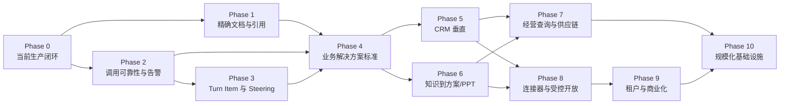

# Admin Base 业务与 AI 长期实施路线图

> 文档角色：业务与 AI 后续建设的唯一总入口  
> 初始版本：2026-08-27  
> 适用范围：Admin Base 当前仓库及后续基于它交付的业务解决方案  
> 参考来源：当前源码与测试、现有 Admin Base 文档，以及对 Novex 的产品和工程对照分析

## 1. 这份文档如何使用

本文件回答“接下来为什么做、先做什么、做到什么程度”。详细技术调研和产品需求分别在：

- [`admin-base-ai-technical-research-plan.md`](./admin-base-ai-technical-research-plan.md)：技术栈、预研任务、架构契约、选型闸门和禁止项。
- [`admin-base-business-product-plan.md`](./admin-base-business-product-plan.md)：业务对象、用户流程、权限、页面、接口、Agent、Eval 和验收标准。

后续任务可以直接使用以下指令：

```text
按 docs/admin-base-business-ai-roadmap.md 执行 Phase N。
先核对当前状态和前置条件，读取该阶段链接的技术与业务章节，输出需求拆解，得到确认后再实现。
```

仅说“按路线图继续”时，执行者必须先选择当前第一个尚未完成且前置条件已满足的阶段，并说明选择依据；
不得把整份路线图一次性实现，也不得把研究结论写成已交付能力。

### 1.1 文档之间的权责

| 问题                                 | Source of truth                                                                          |
| ------------------------------------ | ---------------------------------------------------------------------------------------- |
| 当前代码真实具备什么、近期缺口是什么 | [`admin-base-goals-and-todo.md`](./admin-base-goals-and-todo.md) 与当时源码证据          |
| 仓库架构和不可违反的工程约束         | [`admin-base-architecture.md`](./admin-base-architecture.md) 与根目录 `AGENTS.md`        |
| 长期阶段、依赖、优先级和完成闸门     | 本文件                                                                                   |
| 技术候选、预研实验和采用阈值         | [`admin-base-ai-technical-research-plan.md`](./admin-base-ai-technical-research-plan.md) |
| 业务范围、用户旅程和产品验收         | [`admin-base-business-product-plan.md`](./admin-base-business-product-plan.md)           |
| 具体实现状态                         | 当前分支的 schema、migration、route、service、page、seed 和 test；文档不能替代源码证据   |

出现冲突时，安全与仓库合同优先；当前源码决定“现在是什么”，本路线图决定“准备变成什么”。需要改变已经
批准的目标设计时，先更新对应文档并记录原因，再改代码。

## 2. 状态词典

所有阶段、研究项和业务能力只能使用以下状态，避免把计划和实现混在一起：

| 状态                     | 含义                                                    | 可以宣称什么                             |
| ------------------------ | ------------------------------------------------------- | ---------------------------------------- |
| `current`                | 已从当前源码、迁移、路由和测试中核实                    | 当前代码存在，但仍要单独说明环境验收情况 |
| `implemented-unverified` | 代码已存在，缺少真实 Provider、浏览器、跨进程或生产证据 | 已实现基础，不可称生产完成               |
| `research`               | 正在做技术调查、威胁建模或 PoC                          | 只有研究结果，没有产品能力               |
| `design-approved`        | 数据、接口、权限和验收契约已确认                        | 可以进入实现，仍无交付代码               |
| `planned`                | 已列入路线图，尚未开始                                  | 只表示意图和排序                         |
| `in-progress`            | 当前有明确实现范围和负责人                              | 不能提前标记交付                         |
| `blocked`                | 有可复现的外部或决策阻塞                                | 必须写明阻塞证据和解除条件               |
| `delivered`              | 代码、迁移、权限、审计、测试和适用环境验收全部满足      | 可以按完成定义对外说明                   |
| `deferred`               | 有价值，但未达到业务或规模触发条件                      | 不进入当前实现                           |
| `rejected`               | 与安全、架构或产品目标冲突                              | 除非先修改决策记录，否则不得引入         |

状态更新必须附证据日期、分支/commit、验证命令和未覆盖边界。完成一次 PoC 不等于业务阶段 `delivered`。

## 3. 当前起点与目标终态

### 3.1 当前起点

当前工作区已具备或正在收口的基础包括：

- PostgreSQL-first、Next.js + Hono 单应用、Drizzle、Zod、Ant Design 和统一 Admin Shell。
- CRUD Factory、模块生成草稿、`sys_rule` 权限、数据范围、审计、文件与 Provider 资源治理。
- AI SDK 7 的 Provider/Model、用途路由、fallback、Invocation/Attempt、费用与健康证据。
- Chat、Agent、Tool、Approval、Run/Step、持久 Run Event、attempt/lease/fencing 的实现基础。
- Knowledge/RAG、Notebook、Deep Research、Artifact、Eval、Memory、Runtime Skill 和远程受控 MCP 的实现基础。
- PostgreSQL Worker/Outbox、Provider 熔断、配额和费用账本。
- Mastra canary 和受治理的可视化 Workflow 基础。

其中部分属于当前未提交开发或 `implemented-unverified`，每轮仍必须以当时源码核实，不能从本段推断已经发布。

### 3.2 当前明确缺口

- 完整 production/staging、真实 Provider、浏览器和长时间 Worker 验收尚未形成稳定发布证据。
- 引用只能稳定回到 Chunk/Quote，缺少统一 Block/Page/Section/BBox 和精确原文阅读器。
- Run 租约已覆盖编排，但 Provider 单次长调用的原生取消、调用级 lease/fencing 仍需收口。
- 缺少结构化 AI Alert 生命周期和可确认、可静默、可关闭的统一通知入口。
- 缺少统一 typed Turn Item ledger，以及运行中 steering/follow-up/mailbox 的稳定协议。
- 尚未交付一个“真实业务 CRUD + 日常工作台 + Agent + Approval + Eval + Feedback”的完整业务垂直。
- 公开分享、受限 API Key、完整 tenant/resource ACL 和商业结算仍未完成。

### 3.3 目标终态

Admin Base 不只是一组 AI 管理页面，而应形成两层产品：

```text
治理控制面
  Provider / Model / Agent / Tool / Skill / Knowledge / Workflow
  Run / Attempt / Approval / Alert / Eval / Billing / Audit

业务工作面
  CRM / 客户方案 / 经营分析 / 供应链等业务记录和每日工作台
  每个工作面都有受控 AI Companion、证据、反馈、审批和质量回归
```

最终交付公式固定为：

```text
Business Facts + Work Surface + Governed AI + Approval/Outbox + Eval/Feedback + Operations Evidence
```

## 4. 永久架构原则

1. PostgreSQL、Drizzle schema 和项目 migration 是业务与治理数据事实来源。
2. 普通模块继续在 Next.js + Hono 单应用内实现，不因 AI 或业务场景新建第二个常规后端。
3. `sys_rule` 是菜单和权限 source of truth；页面隐藏不能替代 API 的 `authRequired()` 与 `ability()`。
4. 普通关系 CRUD 使用 CRUD Factory；状态机、流式 AI、外部 Provider、审批、OAuth、文件字节和发布撤销使用显式 route/service。
5. 每类记录必须显式选择 global、department、user、department-and-user 或 custom scope；`createdBy` 不是业务归属。
6. Agent Tool 在执行时重新应用当前用户权限、业务数据范围、Run attempt 和 scope version，不能信任 Prompt 中的 ID。
7. 模型只能提出结构化意图。发送、采购、发布、修改阶段、导出敏感数据等副作用必须由服务端 Tool、Approval、幂等和审计完成。
8. 业务事实进业务表，企业资料进 Knowledge，使用者明确确认的长期偏好才进 Memory。
9. 长任务进入 Worker；Web 请求不承载不可恢复的批量解析、批量生成、文件渲染或外部轮询。
10. AI 的回答、建议和自动化必须有 Run/Step/Invocation/Attempt、引用、Tool 和费用证据；失败不能伪装成空成功。
11. 研究、设计、实现、迁移、数据清理、环境验收是不同活动，任何一项完成都不能代替其他项。
12. Novex 只作为产品和工程参考，不成为依赖、代码来源或新的架构事实。

## 5. Novex 对照结论

### 5.1 值得吸收

- 将治理控制面与客户/业务工作面分开设计，让普通用户看到任务和产物，而不是系统资源表。
- 每个业务解决方案同时建设 Agent、Tool、Skill、Eval、反馈和运行证据，不交付孤立 Chat Demo。
- 身份提供方、Connector Credential 和 Agent Tool 分层，避免“一个连接对象同时代表登录、密钥和能力”。
- 文档解析保留 Block、Page、Section、BBox 和稳定引用定位，支持可核验的原文阅读。
- 使用 typed Turn Item 表示消息、思考摘要、Tool Call、Tool Result、Approval、Artifact 和系统事件，支持重放与诊断。
- 对运行中 Agent 建立 steering/follow-up/mailbox，使新输入有确定的接收时机和顺序。
- Provider 调用有 lease、heartbeat、fencing 和原生取消，不只依赖 Run 最终状态。
- AI 异常进入持久 Alert 生命周期，而不只写日志或瞬时 toast。

### 5.2 不采用或延后

- 不做 Rust-first 多 crate 重写，不用 Repository/DAO 层替换当前 route/service/Drizzle 结构。
- PostgreSQL Worker 没有出现吞吐或 SLA 瓶颈前，不引入 RabbitMQ、Kafka 或 Redis 任务事实。
- 当前混合检索没有规模证据前，不引入 Milvus、Neo4j 或独立搜索集群；先评估 `pgvector`。
- 不开放 stdio MCP、Shell、本地二进制、任意脚本、任意 SQL、任意文件路径和无约束 HTTP Tool。
- 沙箱、信任、签名、版本、权限和回滚模型完成前，不建设插件市场。
- 不复制 Novex 已退役的客户套餐/商业表，也不复制其代码；该仓库未见可确认的整体开源许可证授权。

## 6. 阶段总览与依赖



| 阶段     | 默认状态                   | 核心成果                                             | 进入条件                           |
| -------- | -------------------------- | ---------------------------------------------------- | ---------------------------------- |
| Phase 0  | `planned`/按当前 TODO 核实 | 生产门禁、Mastra 决策、Worker/浏览器/Provider 证据   | 当前代码冻结出可验收候选           |
| Phase 1  | `planned`                  | Block/Page/BBox 解析与引用阅读器                     | P0 数据安全和 Worker 路径可用      |
| Phase 2  | `planned`                  | Provider 调用级取消/fencing 与 AI Alert              | P0 Run/Attempt/Event 契约稳定      |
| Phase 3  | `planned`                  | typed Turn Item、replay projection、steering mailbox | P2 调用终止语义稳定                |
| Phase 4  | `planned`                  | 统一业务解决方案交付模板                             | P1-P3 的契约至少 `design-approved` |
| Phase 5  | `planned`                  | CRM 客户经营与唤醒闭环                               | P4 通过一个垂直设计评审            |
| Phase 6  | `planned`                  | Knowledge/Notebook 到客户方案与 PPTX                 | P1 引用、P4 长任务模板完成         |
| Phase 7  | `planned`                  | 受控经营数据查询和供应链风险助手                     | P5/P6 证明业务 Tool 范式           |
| Phase 8  | `deferred`                 | Connector、公开链接、受限 API Key                    | 有真实外部协作或集成客户           |
| Phase 9  | `deferred`                 | tenant/resource ACL 和商业化                         | 有付费租户与结算需求               |
| Phase 10 | `deferred`                 | Broker、向量库、插件市场升级                         | 量化阈值或客户 SLA 触发            |

阶段编号表达依赖，不是工期承诺。Phase 1、2 在前置契约稳定后可并行研究，但未经确认不能并行改同一运行表。

## 7. 各阶段实施合同

### Phase 0：当前生产闭环和 Runtime 决策

**目标**：先证明现有基础能稳定运行，再叠加新数据模型。

范围：

- 以 [`admin-base-goals-and-todo.md`](./admin-base-goals-and-todo.md) 的 P0 为实时清单，核对而非复制。
- 完成 type/lint/test/coverage/route/build/smoke 中适用的发布门禁。
- 在隔离数据库验证 migration/seed，验证常驻 Worker、租约接管、停止、恢复和监控。
- 使用 Mock 与 staging 真实最小权限凭据分别验证 Provider、对象存储、邮件、OAuth、SMS；证据分开记录。
- 验证浏览器 Chat/Agent/Approval/Notebook/Workflow 的断线、恢复、终态、暗色和窄屏。
- 完成 Mastra M3-M7 闸门，明确默认编排层、legacy 回滚和版本升级策略。

完成定义：当前候选版本的代码、迁移、Worker、外部边界和浏览器核心路径都有可复查证据；未验证项有明确
owner 和阻塞原因。不能用单元测试替代 staging、浏览器或真实 Provider。

### Phase 1：文档 Block/Page/BBox 与引用阅读器

**目标**：从“能引用 Chunk”升级为“能回到原文准确位置”。

范围：

- 形成统一 Document Block contract，保留 page、section path、paragraph/table/cell、字符范围和可选 bbox。
- PDF、DOCX、HTML、Markdown/TXT 和表格经过 Parser Adapter 归一化；OCR 是可选增强，不污染原文层。
- Chunk 保留到 Block 的多对多映射；Citation Snapshot 保存生成时的引用内容和定位版本。
- Notebook/Knowledge 引用阅读器支持原文上下文、页码、关键词高亮和 PDF 页级定位；安全下载仍独立。
- 为页码错位、跨页表格、OCR 低置信度、版本更新和不可预览文件建立退化行为。

技术细节、候选库和实验见技术计划 TR-01；产品验收见业务计划的知识到方案章节。

完成定义：至少 PDF、DOCX、Markdown 三类夹具能从回答编号稳定定位到确定 Block；历史 Artifact 在重新解析后
仍能查看旧快照；跨部门和失效来源不能通过引用接口泄露。

### Phase 2：Provider 调用可靠性与 AI Alert

**目标**：让长模型调用在停止、超时、接管和 Provider 故障时有确定语义，并把异常变成可运营事件。

范围：

- Invocation Attempt 增加调用 lease/owner/heartbeat/fencing 所需契约。
- HTTP/SDK Adapter 全链路传递 `AbortSignal`；客户端停止、Run 取消、租约丢失和超时映射成不同原因。
- Provider 不支持取消时阻止旧 attempt 写结果、计费和副作用，并记录 orphan/late response。
- 建立 AI Alert：open、acknowledged、silenced、resolved、closed；支持去重、严重度、归属、证据链接和通知投递。
- Alert 来源至少覆盖队列积压、租约反复过期、Provider 熔断、错误率/延迟、配额异常、引用失败和成本异常。

完成定义：强杀/超时/主动停止/过期接管测试证明旧调用不能覆盖新 attempt；重复异常不会制造告警风暴；Alert
可回链 Run/Attempt/Provider/Job，并有权限、审计和脱敏。

### Phase 3：typed Turn Item、重放与 Steering

**目标**：把 Agent 的一轮运行从松散消息和 SSE 事件升级为可重建、可插入后续意图的稳定协议。

范围：

- 定义 `user_message`、`assistant_text`、`reasoning_summary`、`tool_call`、`tool_result`、`approval_request`、
  `approval_result`、`artifact`、`citation`、`system_notice`、`error` 等版本化 Turn Item。
- 明确哪些 Item 持久化、哪些只做流式投影；模型可见上下文必须能从持久事实确定性重建。
- 建立 projection，从 Turn Item 生成现有 Chat UI 和兼容 SSE；避免形成第二套冲突消息事实。
- Steering 表示“尽快注入当前运行”，follow-up 表示“当前运行结算后进入下一轮”；mailbox 保证 FIFO、幂等和权限版本。
- 定义运行状态下编辑、停止、重复提交、多标签页和审批等待期间的新输入行为。

完成定义：事件重放得到相同可见对话和 Tool 顺序；进程重启后 mailbox 不丢、不重；steering 无法越过 Tool
审批或数据范围；不支持实时注入的 Provider 自动退化为 follow-up 并明确告知用户。

### Phase 4：业务解决方案统一交付合同

**目标**：形成后续每个业务垂直都必须满足的标准包。

标准包：

```text
业务主数据/交易事实
+ 管理页与每日工作台
+ 只读 Tool / 草稿 Tool / 高风险 Command Tool
+ Agent / Runtime Skill / Knowledge
+ Approval / Outbox / Idempotency / Audit
+ Dataset / Eval / Feedback / Quality Dashboard
+ API/Page 清单 / 运维手册 / 成本与失败边界
```

需要产出可复用的需求模板、数据归属检查表、Tool 风险分类、Eval 最小集、反馈模型和 release gate。任何业务
Agent 如果没有对应业务事实表、权限 Tool 和 Eval，不得标记为解决方案。

完成定义：用 CRM 的一个小切片走通模板评审，证明模板能够同时约束 CRUD、工作台、AI、审批和质量证据。

### Phase 5：CRM 客户经营与唤醒

**目标**：交付第一个完整真实垂直，验证框架能帮助客户经理完成日常工作。

第一阶段包括客户、联系人、活动时间线、标签、偏好、商机、唤醒任务和触达草稿。AI 读取受权限约束的客户
事实和 Knowledge，生成客户简报、停滞原因、下一步建议和触达草稿；真正发送、修改商机阶段或确认敏感标签
必须经受控 Command/Approval。

完成定义：一个客户经理可在同一工作台完成“查看事实 -> 获取有证据建议 -> 编辑草稿 -> 审批 -> Outbox
发送 -> 记录结果 -> 反馈 -> Eval 回归”，跨部门不可见，失败可恢复，所有副作用有幂等和审计。

### Phase 6：企业 Knowledge/Notebook 到客户方案与 PPT

**目标**：把受控来源研究转化为可交付业务产物。

范围包括来源整理、客户事实快照、方案 Notebook、提纲/简报 Artifact、引用覆盖检查、模板化 PPTX Worker、
版本管理和外发审批。模型只产生结构化内容；文件渲染使用服务端 allowlist 模板，不开放文件路径或脚本执行。

完成定义：用户能从指定客户事实和企业来源生成版本化方案/PPTX；每个关键结论能回到 Block/Page；重新生成不
覆盖历史版本；外发前有审批和引用/敏感信息检查。

### Phase 7：受控经营查询与供应链风险助手

**目标**：证明 AI 能安全使用实时业务数据，并把同一范式扩展到第二个行业域。

先交付语义数据集：批准的 dimension、metric、filter、只读 View、行数/超时/脱敏/data-scope。模型提交结构化
查询计划，不提交 SQL。随后接入供应商、SKU、采购单、到货、库存快照、评分卡、风险事件和补货草案。

完成定义：经营问答结果可回放查询计划和范围；供应链建议明确区分业务事实、计算结果、知识证据和建议动作；
创建采购单、改供应商等级或发通知必须 Approval。Text-to-SQL 仍保持关闭，除非另行通过高风险闸门。

### Phase 8：Connector、公开链接和受限 API Key

**触发条件**：真实客户需要外部 CRM/ERP/Drive/IM 接入，或需要把 Notebook/Artifact 安全分享给非后台用户。

范围：身份提供方、Connector Definition、Credential、Connection、Sync Cursor、Tool 分层；公开链接使用随机
token hash、过期、撤销、访问范围和审计；API Key 使用 scope、资源范围、速率、过期和轮换。公开访问不是
复用后台 Bearer Token，Connector Credential 不能返回前端或被模型读取。

### Phase 9：tenant/resource ACL 与商业化

**触发条件**：出现真实多租户、付费合同、账单周期和隔离 SLA。

范围：tenant 贯穿认证、业务数据、Knowledge、文件、AI 资源、Worker、审计和费用；资源 ACL 支持 owner、成员、
角色/部门和分享主体；商业表覆盖 billing account、period、invoice、line、payment、refund、tax 和 Provider 对账。
当前 department/user quota 不能直接改名冒充租户计费。

### Phase 10：规模化基础设施与插件生态

**触发条件**：PostgreSQL Worker、当前检索或内置 Tool Registry 有量化瓶颈。

- Broker：由队列深度、锁竞争、吞吐、延迟和灾备 SLA 触发。
- `pgvector`/外部向量库：由文档/向量规模、查询 P95、索引时间和运维成本触发。
- 插件市场：只有沙箱、签名、信任、能力权限、版本兼容、供应链扫描、停用与回滚全部设计完成后启动。

技术升级必须保留 PostgreSQL 业务事实和 Admin Base 治理边界，不得以换基础设施为由绕过权限与审计。

## 8. 每个阶段开始前必须回答的问题

1. 当前代码、HEAD 基线和未提交开发分别是什么？
2. 本阶段解决哪个具体用户问题，成功指标是什么？
3. 哪些内容只是预研，哪些设计已经批准，哪些允许实现？
4. 数据对象、关系、生命周期和归属是什么？
5. 哪些使用 CRUD Factory，哪些必须显式 route/service，为什么？
6. 权限码、菜单、页面操作和 API ability 如何对应？
7. Agent 能看到什么、Tool 能做什么、服务端如何重新校验 data scope？
8. 哪些动作有外部副作用，Approval、幂等、Outbox、补偿和 operation log 如何实现？
9. 敏感字段、Prompt、引用正文、Credential 和日志如何脱敏与保留？
10. schema/migration/seed、API/page 清单、测试、浏览器和环境验收各是什么？
11. 失败、取消、超时、重试、回滚和旧版本数据如何处理？
12. 哪些明确不在本阶段，什么指标会触发后续升级？

没有这些答案，只能做研究或需求拆解，不能直接生成并发布模块。

## 9. 未来 Coding Agent 执行协议

执行任一阶段时必须按顺序：

1. 阅读根目录 `AGENTS.md`。
2. 阅读本文件和选中阶段链接的技术/业务章节。
3. 阅读 [`admin-base-architecture.md`](./admin-base-architecture.md)、
   [`admin-base-goals-and-todo.md`](./admin-base-goals-and-todo.md) 和最近的专项文档。
4. 检查 `git status`、当前分支、HEAD 与 worktree；保护用户已有变更。
5. 检查最接近的 schema、migration、seed、route、service、feature page 和 test，不从规划猜实现。
6. 先给出可审查的需求拆解：范围、非范围、数据、权限、流程、风险、验收和待决策项。
7. 模块工作使用仓库的 `admin-module`；页面工作使用 `admin-ui`；验证和交付使用 `admin-qa`。
8. 获得实现授权后，选择 CRUD Factory 或显式 service，并在最小安全范围内修改。
9. 每个 API 操作登记 `tests/coverage/api-test-cases.ts`；每个 App Router 页面登记
   `tests/coverage/page-test-cases.ts`；再生成派生文档。
10. 运行与风险相称的最小验证；build、smoke、浏览器和真实 Provider 只在阶段要求时运行并如实记录环境。
11. 只有完成闸门有证据时才更新状态。不要把设计、迁移草案、Mock 成功或静态检查写成生产交付。

## 10. 通用交付物与完成定义

每个实现阶段至少交付：

- 需求与非目标、角色和用户旅程。
- ER/状态模型、数据归属、保留/删除策略。
- 权限矩阵、Tool 风险矩阵、Approval/Outbox/审计矩阵。
- schema、migration、seed、route/service、page 和 API contract。
- loading/empty/error/denied/disabled/expired/cancelled 等产品状态。
- 成功、失败、越权、并发、幂等、取消和数据一致性测试。
- API/page machine-readable coverage 以及必要的浏览器/外部环境证据。
- 运维指标、Alert、成本边界、回滚和升级条件。
- 文档状态更新和明确的剩余边界。

`delivered` 必须同时满足：实现存在、迁移可重复、权限/data scope 无绕过、物质写操作有审计、高风险动作有
审批与幂等、测试通过、适用环境验收完成、文档与源码一致。任何一个条件缺失都只能标为
`implemented-unverified` 或更早状态。

## 11. 路线图维护规则

- 本文件只维护长期方向、阶段和闸门；近期待办继续维护在 `admin-base-goals-and-todo.md`。
- 技术选型变化更新技术计划并增加 Decision Record：日期、证据、决定、替代项、回滚条件。
- 业务范围变化更新业务计划；不要只改某个 Prompt 或页面文案来隐式改变业务规则。
- 每次发布后核对状态表，删除过期快照数据，保留决策原因和未验证边界。
- 时间估算必须在阶段需求批准和技术预研结束后单独给出；本路线图不承诺人天或上线日期。
- 如果 Novex 或其他参考项目更新，只做差异评估；不会自动同步其代码、依赖、数据库或产品范围。

## 12. 相关文档索引

- 当前架构：[`admin-base-architecture.md`](./admin-base-architecture.md)
- 当前能力与近期 TODO：[`admin-base-goals-and-todo.md`](./admin-base-goals-and-todo.md)
- AI 演进历史：[`ai-capability-evolution-roadmap.md`](./ai-capability-evolution-roadmap.md)
- Runtime 对比：[`ai-runtime-framework-comparison.md`](./ai-runtime-framework-comparison.md)
- AI 模块边界：[`ai-module-boundaries.md`](./ai-module-boundaries.md)
- 业务场景手册与示例：[`ai-business-use-case-cookbook.md`](./ai-business-use-case-cookbook.md)
- Worker/Outbox：[`ai-worker-and-outbox.md`](./ai-worker-and-outbox.md)
- MCP：[`ai-mcp-governance.md`](./ai-mcp-governance.md)
- Memory/Skill：[`ai-memory-and-skills.md`](./ai-memory-and-skills.md)
- Notebook 引用：[`ai-notebook-citation-experience.md`](./ai-notebook-citation-experience.md)
- Visual Workflow：[`ai-visual-workflow.md`](./ai-visual-workflow.md)
- 配额与账本：[`ai-quota-and-billing.md`](./ai-quota-and-billing.md)
- 开发指南：[`ai-development-guide.md`](./ai-development-guide.md)
- 业务模块模板：[`business-module-template.md`](./business-module-template.md)
