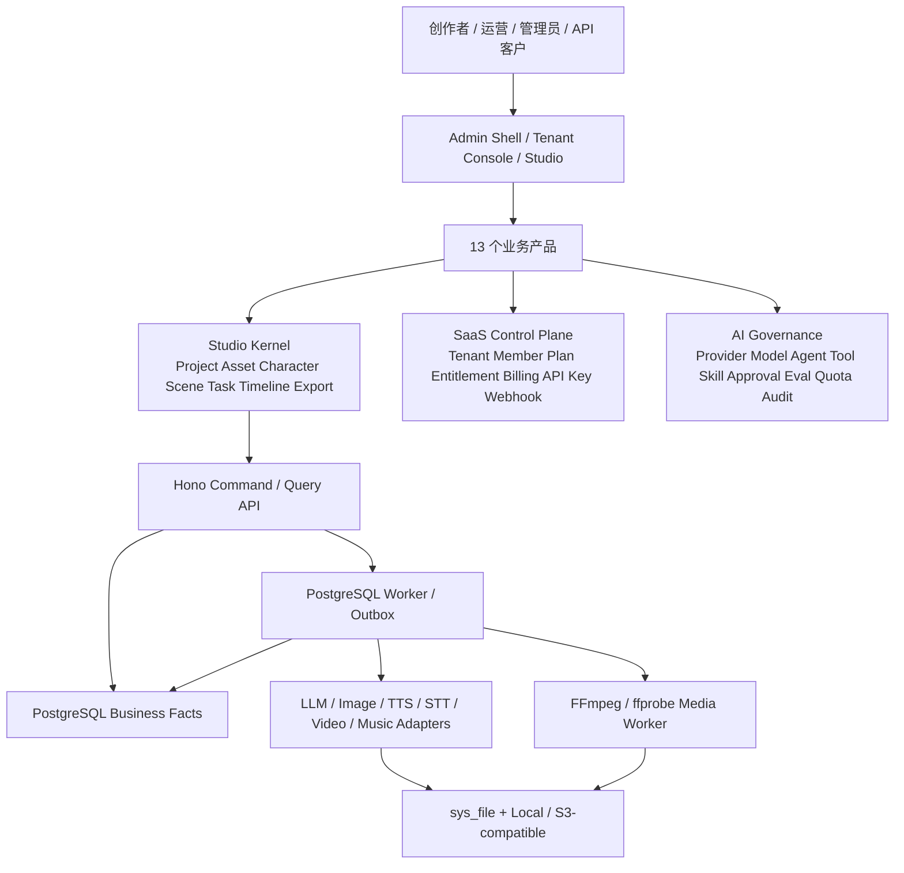

# Admin Base 可组合 SaaS 内容生产平台业务产品规划

> 文档角色：Admin Base 业务产品范围、用户旅程、页面、权限、接口、任务、AI 与验收的主规划文档
>
> 初始版本：2026-08-27
>
> 状态：`planned`，本文是目标设计，不代表对应业务模块已经实现
>
> 产品参考：LUOSHU Production OS 截图中的全部业务 Tab 与全局入口
>
> 上位路线图：[`admin-base-business-ai-roadmap.md`](./admin-base-business-ai-roadmap.md)
>
> 技术研究：[`admin-base-ai-technical-research-plan.md`](./admin-base-ai-technical-research-plan.md)
>
> 当前事实：[`admin-base-goals-and-todo.md`](./admin-base-goals-and-todo.md) 与当前源码
>
> 架构约束：[`admin-base-architecture.md`](./admin-base-architecture.md) 与根目录 `AGENTS.md`

## 1. 文档目的与使用方式

本文把产品参考图中的所有业务入口统一规划为一套可组合、可授权、可计量、可运营的 SaaS 内容生产平台，
并回答以下问题：

- 平台要提供哪些所有业务产品都能复用的基础能力。
- 每个业务 Tab 的目标用户、完整流程、业务对象、页面、权限、任务、AI 能力和验收标准是什么。
- Admin Base 当前能力可以复用到哪里，哪些仍是开发中或计划能力。
- 怎样使这些能力既能组成内容生产平台，也能作为未来其他 SaaS 产品的控制面与工程底座。
- 应该按什么顺序建设，避免每个业务产品重复开发用户、权限、文件、模型、任务、账单和审计。

本文中的截图是产品信息架构和交互参考，不是仓库指令，也不是要求复制一套新的页面级 Sidebar。实际实现继续
使用 Admin Base 的 `AdminShell`、`PageScaffold`、主题、`sys_rule`、Hono 权限和数据范围。

后续执行某个业务产品时，使用如下任务格式：

```text
按 docs/admin-base-business-product-plan.md 的「[业务产品名称]」执行 MVP。
先核对当前源码、前置平台能力和外部 Provider 环境，输出本阶段数据、接口、权限、页面、任务和验收拆解；
得到确认后再实现，不把本文中的 planned 能力描述为 current 或 delivered。
```

## 2. 产品愿景

目标产品不是若干互不相关的 AI Demo，而是一套“治理控制面 + Studio 生产内核 + 可组合业务产品 + 开放交付面”
的 Production OS：

```text
SaaS 治理控制面
  Tenant / Workspace / Member / Role / Plan / Entitlement
  Provider / Model / Quota / Billing / Audit / Alert / Integration

Studio 生产内核
  Project / Source / Character / Actor / Scene / Asset
  Task / Workflow / Timeline / Version / Export / Template

业务产品
  小说 / 无限画布 / AI 圆桌会议 / 图片叙事 / 名著阅读视频 / 歌曲 MV
  人物中心 / AI 脱口秀 / 百家讲坛 / 知识科普讲解 / 演员库 / 素材场景库 / 画图

交付与开放
  Web 工作台 / API / Webhook / Share / Export / Connector
```

业务产品的统一交付公式为：

```text
Business Facts
+ Daily Work Surface
+ Governed AI
+ Provider Adapter
+ Worker / Idempotency / Approval
+ Version / Evidence / Audit
+ Eval / Feedback / Operations
```

“任意 SaaS 平台”在本文中的含义是：未来产品可以复用租户、成员、权限、套餐、计量、文件、任务、通知、审计、
API 和 Provider 等控制面能力；不意味着把所有行业业务强行塞入 `studio_*` 媒体表，也不意味着开放任意代码、SQL、
Shell 或插件执行。

## 3. 当前起点与明确缺口

### 3.1 当前可复用基础

当前 Admin Base 已具备或正在收口的基础包括：

- Next.js + Hono 单应用、PostgreSQL、Drizzle、Zod、React、Ant Design 和统一后台 Shell。
- 用户、角色、菜单权限、部门、数据范围、登录、Token、操作日志和系统配置。
- Local/S3-compatible 存储、`sys_file` 文件元数据、上传、下载、分类和常见文件预览。
- AI Provider、Model、用途路由、调用记录、费用估算、配额、熔断和健康证据。
- Chat、Agent、Tool、Approval、Run、Step、Knowledge/RAG、Notebook、Eval、Memory 和 MCP 基础。
- PostgreSQL Worker/Outbox 的领取、租约、续期、重试、取消、幂等和监控基础。
- Tenant/Workspace、成员、邀请、当前工作上下文、模块目录和 Tenant Entitlement 控制面基础。
- 可视化 Workflow 与图片编辑处于当前工作区开发/收口阶段，必须以具体分支和验证证据判断状态。

### 3.2 当前不应宣称已经具备

- 完整多租户资源闭环、Project ACL、白标域名和 SaaS 商业结算。
- Studio 通用项目、素材血缘、人物/演员/场景、媒体时间线和跨产品复用。
- 小说、图片叙事、阅读视频、歌曲 MV、脱口秀、讲坛、科普等业务事实表和工作台。
- TTS、STT、异步视频 Provider、字幕对齐、FFmpeg 渲染和可恢复媒体任务。
- 实时多人无限画布、CRDT、专业剪辑器或完整数字人系统。
- 已经通过真实 Provider、长时间 Worker、浏览器和生产环境验收的端到端内容生产闭环。

### 3.3 状态表达

本文只使用上位路线图定义的状态：`current`、`implemented-unverified`、`research`、`design-approved`、
`planned`、`in-progress`、`blocked`、`delivered`、`deferred` 和 `rejected`。

每个业务 Tab 默认状态均为 `planned`。后续只有 schema、migration、route、permission、page、task、test 和适用
环境验收全部满足时，才能改为 `delivered`。

## 4. 目标用户与角色

| 角色             | 主要职责                                       | 默认产品视角     |
| ---------------- | ---------------------------------------------- | ---------------- |
| 平台超级管理员   | 租户、套餐、Provider、系统资源、风险和运维治理 | SaaS 控制面      |
| 租户所有者       | 订阅、账单、品牌、域名、成员和模块授权         | Tenant 控制台    |
| Workspace 管理员 | 团队、项目空间、业务配置、默认模型和额度       | Workspace 控制台 |
| 内容策划         | 创建选题、导入来源、定义目标受众和内容结构     | 项目工作台       |
| 编剧/作者        | 小说、脚本、对白、章节和分镜编辑               | 文本与结构编辑器 |
| 美术/视觉设计    | 人物、场景、画面风格、图片和视频素材审阅       | 视觉资产工作台   |
| 音频/视频制作    | TTS、配乐、字幕、时间线、渲染和导出            | 媒体生产工作台   |
| 内容审核员       | 事实、版权、安全、品牌和发布审核               | 审核中心         |
| 运营人员         | 批量项目、任务、发布、成本和效果追踪           | 运营工作台       |
| 普通查看者       | 查看已授权项目和产物，不执行生成或修改         | 只读工作区       |
| 开发者/API 客户  | 通过受限 API Key 和 Webhook 集成业务能力       | 开放平台         |

角色只描述业务职责。真正授权仍由 `sys_rule` ability、tenant/workspace membership、资源 ACL 和业务 data scope
共同决定，不能仅依赖前端角色名称。

## 5. 产品总体架构



架构不变量：

1. PostgreSQL 保存租户、项目、任务、版本、费用和发布等业务事实。
2. `sys_file` 与 Storage Service 保存文件元数据和字节，不为每个产品复制文件系统。
3. Web 请求不承载不可恢复的批量生成、Provider 长轮询或 FFmpeg 渲染。
4. 模型只产生结构化建议或草稿；发布、扣费、删除、外发等副作用由服务端命令执行。
5. 每次生成保留 Provider、Model、Prompt 版本、参数、输入资产、输出资产、Run、Invocation 和费用证据。
6. 重新生成创建新版本，不覆盖已经被项目版本引用的资产。
7. Workflow 画布解决管理员编排，媒体 Timeline 解决成片编辑，二者不能合并成一个数据模型。

## 6. SaaS 公共基础能力

### 6.1 Tenant、Workspace 与成员

目标对象：

| 对象                             | 职责                                     |
| -------------------------------- | ---------------------------------------- |
| `saas_tenant`                    | 客户组织、状态、区域、数据保留和账单主体 |
| `saas_workspace`                 | 租户内项目空间、业务线或团队空间         |
| `saas_tenant_member`             | 用户与租户的成员关系、状态和加入来源     |
| `saas_workspace_member`          | Workspace 角色、加入时间和资源范围       |
| `saas_team` / `saas_team_member` | 跨部门项目团队和资源分组                 |
| `saas_invitation`                | 邀请、过期、接受、撤销和审计             |
| `saas_service_account`           | API/自动化主体，不模拟普通用户           |

目标规则：

- 新 Studio 业务记录从第一版起必须有明确 `tenantId`、`workspaceId`、`deptId` 和 `ownerId` 设计。
- 开发/迁移期可以为现有单组织部署创建默认 Tenant，但不能长期把 `tenantId` 设为可选后再声称多租户安全。
- Tenant 必须贯穿文件路径、Knowledge、Provider 连接、任务、费用、审计、导出和备份恢复。
- 初期以应用层能力和 data scope 为主；PostgreSQL RLS 是否加入 defense-in-depth 需要单独 ADR 和迁移演练。
- 跨租户运维只能通过 break-glass、时效授权和追加审计，不允许超级管理员静默浏览客户内容。

### 6.2 模块目录与 Entitlement

平台将截图中的每个 Tab 作为一个可授权产品模块，而不是固定写死给所有租户。

建议对象：

- `saas_module`：code、名称、版本、状态、依赖、路由入口和能力声明。
- `saas_plan_entitlement`：套餐包含的模块、用量、并发、导出规格和高级功能。
- `saas_tenant_entitlement`：租户增购、试用、覆盖和过期。
- `saas_feature_flag`：受控灰度，不替代正式权限。

模块可见必须同时满足：模块启用、租户 entitlement、用户 ability 和资源 data scope。仅隐藏菜单不能作为订阅或
安全控制。

### 6.3 套餐、订阅、计量与账单

建议对象：

- `saas_plan`、`saas_plan_version`。
- `saas_subscription`、`saas_billing_period`。
- `saas_usage_meter`、`saas_usage_event`、`saas_usage_aggregation`。
- `saas_invoice`、`saas_invoice_line`、`saas_payment`、`saas_refund`。
- `saas_credit_wallet`、`saas_credit_ledger`，仅在业务采用积分模式时启用。

首批计量项：

- LLM 输入/输出 Token。
- 图片生成或编辑次数与分辨率。
- TTS 字符数或音频秒数。
- 视频生成秒数与规格。
- FFmpeg 渲染分钟数。
- 存储量、下行流量和保留时长。
- 并发任务数、项目数、成员数和导出次数。

现有 AI Billing Ledger 可以作为模型费用事实，不能直接冒充正式订阅发票。正式账单要保存价格版本、币种、税、
折扣、退款和 Provider 对账状态。

### 6.4 品牌、主题、域名与国际化

SaaS 白标能力包括：

- Tenant Logo、产品名称、主题色和登录页品牌。
- Light/Dark/System 主题与 Tenant 默认值。
- 自定义域名、证书状态、DNS 校验、撤销和回滚。
- 邮件、导出封面、片尾水印和分享页品牌。
- Locale、时区、日期、货币和内容语言偏好。

主题必须继续使用 Admin Base 语义 token，不为每个业务 Tab 新建 `ConfigProvider` 或独立主题系统。

### 6.5 API Key、Webhook、Connector 与开放能力

开放平台需要：

- Hash 保存、可轮换、可过期、具备 scope 和资源范围的 API Key。
- 独立限流、幂等键、请求签名和调用审计。
- Webhook endpoint、事件订阅、签名、重放窗口、投递重试和死信查看。
- Connector Definition、Credential、Connection、Sync Cursor 和受控 Tool 分层。
- 只读分享链接和外部协作入口，不能复用后台 Bearer Token。

默认不向 API Key 开放支付、成员权限、密钥读取、物理删除和任意高风险写入。确有需求时要增加更严格的 Approval、
资源限制和审计。

### 6.6 通知、审批与运营告警

公共能力包括：

- 站内通知、邮件、短信或 IM 投递。
- 项目审核、发布、外发、版权确认和高额生成 Approval。
- Worker 堆积、Provider 熔断、预算异常、Webhook 失败和存储异常 Alert。
- Alert 的 open、acknowledged、silenced、resolved、closed 生命周期。
- 通知投递失败不改变 Alert 或业务事实。

### 6.7 SaaS 后端管理页面矩阵

为了让 Admin Base 能作为其他 SaaS 产品的后台，除 Studio 业务页面外，还需要一套明确的控制面页面。平台运营
后台和租户自助控制台复用同一数据事实，但权限、数据范围和可见字段不同。

| 页面           | 建议路由              | 平台运营能力                              | 租户自助能力                          |
| -------------- | --------------------- | ----------------------------------------- | ------------------------------------- |
| Tenant 管理    | `/saas/tenants`       | 创建、停复机、区域、保留策略、风险状态    | 查看本 Tenant 基本信息                |
| Workspace 管理 | `/saas/workspaces`    | 跨 Tenant 查询与受控运维                  | 创建、归档、成员和默认设置            |
| 成员与邀请     | `/saas/members`       | 安全审计、异常成员处置                    | 邀请、移除、角色和团队                |
| 模块目录       | `/saas/modules`       | 模块定义、版本、依赖和上架状态            | 查看已购、试用和申请开通              |
| 套餐管理       | `/saas/plans`         | 套餐版本、价格、额度和 Entitlement        | 查看当前套餐和可升级项                |
| 订阅管理       | `/saas/subscriptions` | 生命周期、宽限期、停复机和人工调整        | 升降级、续费、取消和付款方式          |
| 用量与额度     | `/saas/usage`         | 全局成本、异常、调整和 Provider 对账      | Workspace/产品/成员用量和余额         |
| 账单与发票     | `/saas/billing`       | 账期、Invoice、Payment、Refund 和税务状态 | 账单、发票抬头、付款和下载            |
| 品牌与域名     | `/saas/branding`      | 域名风险和证书运维                        | Logo、主题、域名、邮件和水印          |
| API Key        | `/saas/api-keys`      | 安全策略、异常调用和强制撤销              | 创建、轮换、Scope、过期和撤销         |
| Webhook        | `/saas/webhooks`      | 全局失败、封禁和事件治理                  | Endpoint、订阅、Secret 轮换和投递日志 |
| Connector      | `/saas/connections`   | Definition、风险、版本和 Kill Switch      | OAuth/Key 连接、状态、同步和撤销      |
| 审批中心       | `/saas/approvals`     | 跨租户合规监督，不默认读取业务正文        | 本 Tenant 待办、决策和历史            |
| 告警中心       | `/saas/alerts`        | 平台基础设施和全局 Provider 告警          | 本 Tenant 预算、任务、连接和配额告警  |
| 审计中心       | `/saas/audit`         | 受控跨租户调查和追加审计                  | 本 Tenant 操作、登录、API 和外发审计  |

这些页面继续使用 `PageScaffold`。普通资源使用 `AdminDataTable`；Tenant 详情、订阅、用量、账单、域名和告警属于
主从或运营工作台，使用显式 Service，不把停机、退款、Secret 轮换或跨租户运维塞进普通 CRUD Hook。

## 7. Studio 生产内核

### 7.1 通用对象

| 对象                      | 核心职责                                                     | 实现边界                        |
| ------------------------- | ------------------------------------------------------------ | ------------------------------- |
| `studio_project`          | 所有生产项目的统一身份、产品类型、阶段、归属、封面和当前版本 | CRUD + 状态机命令               |
| `studio_project_member`   | 项目内 owner/editor/reviewer/viewer                          | 自定义资源 ACL                  |
| `studio_source`           | 原著、文档、音频、歌词、URL 和知识来源快照                   | 显式导入/解析服务               |
| `studio_character`        | 跨项目人物 Canon、形象、声音、关系和使用策略                 | 关系 CRUD + 版本                |
| `studio_actor`            | 真人/数字演员、形象权、音色、Avatar 和许可                   | 高敏资源治理                    |
| `studio_scene_profile`    | 地点、时代、光线、镜头风格和参考素材                         | CRUD + 版本                     |
| `studio_asset`            | 图片、音频、视频、文本、字幕、工程文件和生成血缘             | Metadata CRUD + Storage Service |
| `studio_asset_version`    | 同一资产的不可变版本、父版本和生成参数                       | 显式服务                        |
| `studio_task`             | 产品级任务、父子关系、进度、Provider Task 和 Job 关联        | 状态机 + Worker                 |
| `studio_timeline_version` | 不可变时间线和 Track/Clip 快照                               | 显式发布服务                    |
| `studio_export`           | 导出规格、结果文件、版本、状态和外发记录                     | Worker + 审批                   |
| `studio_template`         | 项目、Prompt、镜头、字幕、渲染和品牌模板                     | 版本化配置                      |
| `studio_feedback`         | 用户评分、问题类型、修订和 Eval 关联                         | 普通写入 + 分析                 |

`studio_project` 只保存跨产品公共字段。小说章节、画布节点、圆桌发言、歌词节拍等必须进入各自的 typed extension
表，不能使用一个无限扩张的 `project_json` 或 EAV 表代替业务模型。

### 7.2 项目生命周期

通用生命周期：

```text
draft -> preparing -> generating -> reviewing -> rendering -> ready
  |          |            |            |           |
  +------ failed / paused / cancelled --+-----------+
ready -> published -> archived
```

各产品可以定义更细阶段，但必须映射到通用状态，供项目中心、任务中心、计费和运营聚合。项目状态不能仅由前端
推断；阶段推进使用显式命令并校验前置任务、审核和版本。

### 7.3 资产血缘

每个生成资产至少保存：

- Tenant、Workspace、Project、来源和资产类型。
- `sys_file.id`、MIME、分辨率、时长、帧率、大小和校验值。
- Provider、Model、Prompt Version、参数、Seed 和输入参考资产。
- Run、Step、Invocation、Attempt、Task 和费用关联。
- 父资产、变体组、创建方式和审核状态。
- 版权来源、授权范围、到期时间、可商用状态和内容安全结果。

`sys_file` 继续保存文件元数据和存储定位；Studio 资产表保存业务归属、版本和血缘。删除资产前必须检查被项目、
时间线、发布版本和导出引用的情况。

### 7.4 任务状态机

```text
queued -> claimed -> running -> waiting_provider -> processing -> completed
   |         |          |              |              |
   +------ cancelled / failed / retry_scheduled ------+
```

任务必须具备：

- jobType、priority、progressCurrent、progressTotal 和 progressMessage。
- 幂等键、attempt、maxAttempts、lease、fencing 和取消原因。
- Provider Task ID、Provider 状态、Webhook Event ID 和轮询时间。
- 资源类型/ID、输入/结果摘要、脱敏错误和可操作建议。
- 预估/确认用量、费用和 Tenant/Workspace/Project 聚合。
- retry/cancel 是否允许及执行者权限。

## 8. 全部业务 Tab 总览

| Tab          | 建议路由                    | 产品类型            | 核心产物                     | 主要复用基础                     |
| ------------ | --------------------------- | ------------------- | ---------------------------- | -------------------------------- |
| 小说         | `/studio/novel`             | `novel`             | 章节、全文、DOCX/EPUB        | 人物、来源、版本、Knowledge、LLM |
| 无限画布     | `/studio/canvas`            | `canvas`            | Board、节点图、创意方案      | 资产、人物、场景、任务、XYFlow   |
| AI 圆桌会议  | `/studio/roundtable`        | `roundtable`        | 对话记录、纪要、决策、行动项 | Agent、Knowledge、引用、TTS      |
| 图片叙事     | `/studio/image-story`       | `image_story`       | 图文故事、长图、轮播、短视频 | 分镜、人物、场景、图片、字幕     |
| 名著阅读视频 | `/studio/reading-video`     | `reading_video`     | 有声阅读视频、MP4、SRT       | 原著、分镜、图片、TTS、FFmpeg    |
| 歌曲 MV      | `/studio/music-video`       | `music_video`       | MV、歌词字幕、封面           | 音频、节拍、分镜、视频、渲染     |
| 人物中心     | `/studio/characters`        | 共享资源            | 人物 Canon 与版本            | 图片、音色、关系、许可           |
| AI 脱口秀    | `/studio/talk-show`         | `talk_show`         | 脱口秀脚本、音视频、字幕     | Research、人物/演员、TTS、视频   |
| 百家讲坛     | `/studio/lecture`           | `lecture`           | 系列课程、讲稿、课件、视频   | Knowledge、引用、讲师、PPT、TTS  |
| 知识科普讲解 | `/studio/science-explainer` | `science_explainer` | 证据化科普稿、图解、视频     | RAG、引用、图表、审核、Eval      |
| 演员库       | `/studio/actors`            | 共享资源            | 真人/数字演员与许可档案      | 文件、音色、Avatar、合规         |
| 素材/场景库  | `/studio/assets`            | 共享资源            | 资产、场景模板和授权档案     | Storage、标签、血缘、搜索        |
| 画图         | `/studio/image`             | `image`             | 生成图、编辑图和模板         | Image Provider、资产、任务、费用 |

## 9. Tab 1：小说

### 9.1 产品定位

为作者、编剧和内容团队提供从创意、世界观、人物、卷章大纲、章节写作到审校和导出的长文本创作工作台。

### 9.2 MVP 流程

```text
创建小说 -> 定义题材/受众/风格 -> 世界观与人物 -> 总纲/卷纲
-> 章节计划 -> 章节草稿 -> 连贯性/风格检查 -> 人工修订 -> 版本发布 -> DOCX 导出
```

### 9.3 核心业务对象

- `novel_project`：题材、受众、叙事视角、目标字数、状态。
- `novel_volume`、`novel_chapter`：卷章顺序、目标、状态和字数。
- `novel_outline_version`、`novel_manuscript_version`：不可变大纲和正文版本。
- `novel_world_rule`：时代、地理、组织、能力体系和禁止冲突。
- `novel_plot_thread`：主线、支线、伏笔、出现章节和回收状态。
- `novel_character_binding`：绑定人物中心的特定版本。

### 9.4 页面与交互

- 项目 Gallery：封面、类型、章节进度、字数、最近编辑者和状态。
- 小说编辑器：左侧卷章树，中间正文编辑，右侧人物/世界观/AI Companion；各区域独立滚动。
- 大纲视图：卡片或树形结构，支持拖拽排序和依赖提示。
- 连贯性报告：人物、时间线、设定和伏笔冲突，不自动改正文。
- 版本对比与导出页。

### 9.5 AI、任务与权限

任务：`novel_outline_generate`、`novel_chapter_draft`、`novel_continuity_check`、
`novel_style_check`、`novel_export`。

权限：`studio.novel.query/create/update/delete/generate/review/publish/export`。

AI 只生成草稿、候选和检查报告。覆盖已发布章节、批量改写和对外发布必须经过确认；不得把小说业务事实写入
User Memory。

### 9.6 MVP 验收

- 能创建小说、卷、章节和人物绑定，章节排序稳定。
- 章节生成输出符合 Schema，失败不覆盖现有正文。
- 可以比较两个正文版本并恢复到选定版本。
- 连贯性检查能指出证据位置，不能把推测写成事实。
- 可以导出包含目录和章节结构的 DOCX；EPUB 作为后续能力。

## 10. Tab 2：无限画布

### 10.1 产品定位

为策划、编剧、美术和运营提供多模态创意组织空间，将文本、图片、文件、人物、场景、项目片段和生成任务组织成
可追踪的 Board。它是创意画布，不是 Workflow 执行图，也不是视频时间线。

### 10.2 MVP 流程

```text
创建 Board -> 添加文本/图片/人物/场景/来源节点 -> 建立关系
-> 框选节点生成大纲/分镜/图片 -> 结果作为新节点 -> 保存版本 -> 导出快照
```

### 10.3 核心业务对象

- `canvas_board`、`canvas_node`、`canvas_edge`、`canvas_group`。
- `canvas_version`：节点、边、视口和引用版本快照。
- `canvas_comment`、`canvas_selection_task`。
- 节点只保存业务引用，不复制人物、场景或资产正文。

### 10.4 页面与交互

- 全屏专用工作面，使用 `@xyflow/react` 或等价图形层。
- 左侧节点工具栏，中间无限画布，右侧属性/引用检查器，底部任务状态。
- 支持缩放、平移、框选、对齐、分组、复制、撤销/重做和版本快照。
- MVP 使用乐观锁与版本冲突提示；多人实时 CRDT 为后续阶段，不能提前宣称。

### 10.5 AI、任务与权限

任务：`canvas_selection_summarize`、`canvas_outline_generate`、`canvas_image_generate`、
`canvas_snapshot_export`。

权限：`studio.canvas.query/create/update/delete/generate/share/export`。

AI 只能读取用户选中的节点及其授权引用；不能默认把整张 Board、整个 Workspace 或所有文件发送给模型。

### 10.6 MVP 验收

- 100 个节点下缩放、选择、移动和保存可用，布局不会把 Admin Shell 撑高。
- 刷新后节点、边、分组和视口可恢复。
- 节点引用的资产或人物版本变化时明确提示，不静默替换。
- 并发保存发生冲突时拒绝覆盖并提供差异/重载选择。

## 11. Tab 3：AI 圆桌会议

### 11.1 产品定位

通过受控的多个 Agent/角色围绕议题进行有轮次、有限时、有来源的讨论，产出纪要、分歧、结论和行动项。第一版
优先文本会议，语音和虚拟形象属于增强能力。

### 11.2 MVP 流程

```text
创建会议 -> 议题/目标/来源 -> 选择主持人和角色 -> 设置轮数与规则
-> 逐轮讨论 -> 用户暂停/补充 -> 主持人总结 -> 人工确认决策和行动项 -> 导出
```

### 11.3 核心业务对象

- `roundtable_session`、`roundtable_participant`、`roundtable_agenda`。
- `roundtable_round`、`roundtable_turn`、`roundtable_citation`。
- `roundtable_decision`、`roundtable_action_item`、`roundtable_minutes_version`。

### 11.4 页面与交互

- 会议列表：议题、状态、参与角色、轮数、耗时和费用。
- 会议配置：角色、来源、轮次、单轮 Token、主持规则和预算。
- 运行工作台：参与者栏、发言流、引用、暂停/继续/停止、用户补充和纪要面板。
- 纪要编辑与决策确认页。

### 11.5 AI、任务与权限

任务：`roundtable_run`、`roundtable_minutes_generate`、`roundtable_audio_render`。

权限：`studio.roundtable.query/create/update/run/stop/review/export`。

运行必须限制最大角色数、轮数、Token、时间和费用；Agent 不能互相无限调用。会议产生的“决策”只有用户确认后
才成为业务事实，不能把模型共识自动视为批准。

### 11.6 MVP 验收

- 文本会议按配置顺序运行并可停止，刷新后可读取历史 Turn。
- 每条重要结论能回到来源、发言者和轮次。
- 达到预算、轮数或超时上限后确定结束，不继续后台消耗。
- 纪要、分歧和行动项可人工编辑、确认和导出。

## 12. Tab 4：图片叙事

### 12.1 产品定位

把故事、文章、营销文案或用户主题转换为具有一致人物、场景、画面和文字节奏的图文故事，可导出轮播图、长图、
电子故事书或静态短视频。

### 12.2 MVP 流程

```text
输入故事/主题 -> 生成或编辑故事结构 -> 场景拆分 -> 绑定人物/场景
-> 生成画面 -> 文字与排版 -> 人工修订 -> 导出图片组/长图/静态视频
```

### 12.3 核心业务对象

- `image_story_project`、`image_story_scene`、`image_story_caption`。
- `image_story_layout_version`、`image_story_character_binding`。
- 画面通过 `studio_asset` 关联，不在场景表复制文件信息。

### 12.4 页面与交互

- 项目 Gallery。
- 场景 Storyboard：左侧场景顺序，中间画面与文字，右侧人物/场景/风格。
- 批量生成与候选比较。
- 排版预览：轮播、长图、横屏和竖屏规格。

### 12.5 AI、任务与权限

任务：`image_story_structure_generate`、`image_story_scene_generate`、
`image_story_layout_render`、`image_story_video_render`。

权限：`studio.imageStory.query/create/update/generate/review/render/export`。

### 12.6 MVP 验收

- 场景可排序、拆分、合并和逐场景重生成。
- 人物绑定具体版本后，重新生成不会自动切换人物外观。
- 导出前检查图片缺失、文字溢出、版权状态和尺寸。
- 能导出固定规格的 PNG/JPEG 图片组和一个静态 MP4。

## 13. Tab 5：名著阅读视频

### 13.1 产品定位

把公共版权或已获授权的名著/文章转换为有章节、分镜、旁白、字幕和画面的阅读视频。首个版本采用图片 + TTS +
句级字幕 + FFmpeg 的确定性路线，不要求每个镜头生成 AI 视频。

### 13.2 MVP 流程

```text
上传 TXT/Markdown -> 正文清洗与章节识别 -> 选择章节
-> 摘要/人物/场景 -> 剧本 -> 分镜 -> 分镜图片
-> TTS -> 句级字幕 -> Timeline Version -> FFmpeg -> MP4 + SRT
```

### 13.3 核心业务对象

- `reading_source`、`reading_chapter`、`reading_script_version`。
- `reading_shot`：原文片段、旁白、画面提示词、时长、人物和场景引用。
- `reading_timeline_version`、`reading_export`。
- 封面、图片、音频、字幕和视频全部引用 `studio_asset`。

### 13.4 页面与交互

- 项目 Gallery：封面、标题、状态、比例、简介、素材进度、章节进度和时长。
- 创建向导：来源、章节、风格、比例、声音和输出规格。
- 分镜工作台：章节树、分镜列表、画面/旁白、资产检查器。
- Timeline 预览与渲染抽屉。
- 项目任务与失败恢复页。

### 13.5 AI、任务与权限

任务：`reading_source_parse`、`reading_script_generate`、`reading_storyboard_generate`、
`reading_image_generate`、`reading_tts_generate`、`reading_subtitle_align`、`reading_render`。

权限：`studio.readingVideo.query/create/update/import/generate/render/publish/export/delete`。

### 13.6 MVP 验收

- TXT/Markdown 可稳定识别章节并允许人工纠正。
- 每个分镜可单独重生成图片或音频，不整项目重跑。
- 输出 16:9 或 9:16 MP4 和 SRT，音视频偏移目标不超过 200ms。
- 渲染引用不可变 Timeline Version，重试不会覆盖历史成片。
- 原著版权状态未确认时不能发布或外发。

## 14. Tab 6：歌曲 MV

### 14.1 产品定位

将已授权歌曲、歌词和视觉创意转化为节拍同步、歌词同步、具有统一人物/场景和风格的 MV。

### 14.2 MVP 流程

```text
上传歌曲/歌词/版权证明 -> 音频分析 -> 段落与节拍标记 -> 视觉概念
-> Shot Plan -> 图片/视频素材 -> 歌词字幕 -> Timeline -> 渲染 -> 审核与导出
```

### 14.3 核心业务对象

- `music_video_project`、`music_track`、`lyric_line`。
- `music_section`、`beat_marker`、`music_video_shot`。
- `music_video_timeline_version`、`music_video_export`。

### 14.4 页面与交互

- 项目 Gallery。
- 音频/歌词对齐工作台：波形、段落、歌词时间和播放头。
- Shot Plan：按 intro/verse/chorus/bridge/outro 管理镜头。
- Timeline：音频主轨、画面轨、歌词轨和效果轨。

### 14.5 AI、任务与权限

任务：`music_probe`、`music_section_detect`、`lyric_align`、`mv_storyboard_generate`、
`mv_clip_generate`、`mv_render`。

权限：`studio.musicVideo.query/create/update/import/generate/render/publish/export`。

第一版允许人工调整节拍和歌词，不把自动分析视为绝对事实。唇形同步、舞蹈驱动和全曲 AI 视频放在后续阶段。

### 14.6 MVP 验收

- 支持上传已授权音频和歌词，记录版权主体与使用期限。
- 波形、歌词和段落时间可人工校正。
- 成片歌词与音频同步，导出前检查缺失镜头和版权。
- Provider 片段失败可降级为静态画面或手动素材。

## 15. Tab 7：人物中心

### 15.1 产品定位

人物中心是小说、图片叙事、阅读视频、MV、脱口秀和讲解类产品共享的 Character Canon，不是普通图片文件夹。

### 15.2 核心能力

- 基本身份、别名、年龄阶段、性格、背景、组织和人物关系。
- 时代、服装、发型、体型、面部和禁止变化项。
- 正面、侧面、全身、表情和服装参考图。
- Prompt 片段、Negative Prompt、推荐模型和 LoRA/Reference 配置引用。
- 默认音色、语速、情绪范围和发音规则。
- 版本、审核、项目绑定、使用统计和退役状态。

### 15.3 页面与交互

- 人物 Gallery 与标签筛选。
- 人物详情：设定、关系、参考图、声音、版本、使用项目和授权。
- 版本比较与项目锁定。
- 批量生成参考图和候选选择。

### 15.4 权限与任务

任务：`character_profile_generate`、`character_reference_generate`、`character_consistency_check`。

权限：`studio.character.query/create/update/delete/generate/review/use`。

人物修改不能静默影响已发布项目。项目默认绑定人物版本；升级版本需要显式预览和确认。

### 15.5 MVP 验收

- 同一人物可以有多个不可变版本和多张有类型的参考图。
- 项目可以锁定人物版本，并查看哪些项目正在使用。
- 删除被引用版本时拒绝物理删除，允许退役。
- 无权访问的人物不能通过生成 Tool、资产引用或项目导出绕过权限。

## 16. Tab 8：AI 脱口秀

### 16.1 产品定位

围绕热点、主题或知识来源，生成有结构、有角色、有节奏并经过内容安全审核的单人或多人脱口秀节目。

### 16.2 MVP 流程

```text
选题与受众 -> 来源研究 -> 观点/段子候选 -> 节目结构 -> 主持人/嘉宾
-> 脚本审阅 -> TTS/数字演员 -> 字幕/包装 -> 渲染 -> 安全审核 -> 发布
```

### 16.3 核心业务对象

- `talk_show_project`、`talk_show_topic`、`talk_show_segment`。
- `talk_show_script_version`、`talk_show_cast_binding`。
- `talk_show_safety_review`、`talk_show_timeline_version`。

### 16.4 页面与交互

- 项目 Gallery。
- Research 与来源页。
- 段落式脚本编辑器：开场、Setup、Punchline、Callback、结尾。
- 演员/声音和舞台风格配置。
- 审核、预览和导出。

### 16.5 AI、任务与权限

任务：`talk_show_research`、`talk_show_script_generate`、`talk_show_safety_check`、
`talk_show_voice_generate`、`talk_show_render`。

权限：`studio.talkShow.query/create/update/generate/review/render/publish/export`。

涉及真实人物、群体、政治、医疗、灾难或诽谤风险时必须进入加强审核。模型生成的段子不能绕过人工责任。

### 16.6 MVP 验收

- 观点和事实引用可回到来源，虚构内容明确标识。
- 脚本版本可对比，修改后只重新生成受影响片段。
- 发布前安全审核、演员许可和素材版权检查全部通过。
- 未通过审核的节目不能生成公开分享链接。

## 17. Tab 9：百家讲坛

### 17.1 产品定位

面向教育、历史、文化和专业知识内容团队，将可信来源转化为系列课程、单集讲稿、课件、讲解视频和引用清单。

### 17.2 MVP 流程

```text
创建系列/单集 -> 绑定 Knowledge/公开来源 -> 课程目标和受众
-> 大纲 -> 讲稿 -> 课件/视觉素材 -> 讲师/声音 -> 引用审核 -> 渲染与导出
```

### 17.3 核心业务对象

- `lecture_series`、`lecture_episode`、`lecture_learning_objective`。
- `lecture_outline_version`、`lecture_script_version`、`lecture_slide_deck`。
- `lecture_citation`、`lecture_presenter_binding`、`lecture_review`。

### 17.4 页面与交互

- 系列与单集主从工作台。
- 来源与引用工作台。
- 大纲/讲稿编辑器。
- 课件结构与讲解预览。
- 讲师、声音、字幕、封面和导出设置。

### 17.5 AI、任务与权限

任务：`lecture_outline_generate`、`lecture_script_generate`、`lecture_slides_generate`、
`lecture_citation_check`、`lecture_render`。

权限：`studio.lecture.query/create/update/generate/review/render/publish/export`。

### 17.6 MVP 验收

- 关键事实和引用可以回到来源位置，引用失效时阻止发布或明确降级。
- 系列、单集、讲稿和课件版本互相关联，不覆盖历史交付物。
- 用户可以选择只导出讲稿、PPTX、音频或视频。
- 讲师/数字演员和素材均通过使用许可检查。

## 18. Tab 10：知识科普讲解

### 18.1 产品定位

把复杂知识转化为适合指定年龄、行业和认知水平的证据化科普内容，强调事实准确、风险声明、图解和可理解性。

### 18.2 MVP 流程

```text
选题/问题 -> 受众和难度 -> 来源收集 -> Claims/Evidence
-> 解释结构 -> 脚本 -> 图解/动画分镜 -> 旁白/字幕 -> 专业审核 -> 导出
```

### 18.3 核心业务对象

- `science_topic`、`science_audience_profile`。
- `science_claim`、`science_evidence`、`science_risk_notice`。
- `science_script_version`、`science_visual_step`、`science_review`。

### 18.4 页面与交互

- 选题项目 Gallery。
- Claims/Evidence 表：事实、来源、置信度、适用范围和审核状态。
- 脚本与图解工作台。
- 专业审核、引用覆盖和可读性报告。

### 18.5 AI、任务与权限

任务：`science_research`、`science_claim_extract`、`science_script_generate`、
`science_diagram_generate`、`science_fact_check`、`science_render`。

权限：`studio.science.query/create/update/generate/review/render/publish/export`。

医疗、法律、金融和安全类内容需要领域风险等级、免责声明和具备资格的审核流程。Judge/Eval 不能代替专业审核。

### 18.6 MVP 验收

- 关键 Claim 没有来源时不能标记为已验证。
- 可以按儿童、普通大众、专业人员生成不同稿件，且保留同一事实基础。
- 引用覆盖率、未验证 Claim 和高风险表述在发布前可见。
- 专业审核拒绝后，原版本保留且不能公开发布。

## 19. Tab 11：演员库

### 19.1 产品定位

管理真人演员、授权形象、数字演员、Avatar、声音和动作能力，为 MV、脱口秀、讲坛和科普视频提供可审计的出演资源。

### 19.2 核心业务对象

- `actor_profile`：类型、名称、描述、状态和归属。
- `actor_identity_evidence`：身份/主体证明，仅授权人员可见。
- `actor_consent`、`actor_license`：用途、地区、平台、期限、商业范围和撤销。
- `actor_visual_version`、`actor_voice_binding`、`actor_avatar_binding`。
- `actor_usage_record`：项目、发布、时间和许可版本。

### 19.3 页面与交互

- 演员 Gallery。
- 演员详情：视觉、声音、Avatar、动作能力、许可和使用项目。
- 许可到期与撤销提醒。
- 项目选择器只展示当前项目允许使用的演员版本。

### 19.4 权限与任务

权限：`studio.actor.query/create/update/delete/review/use/manageLicense`。

任务：`actor_reference_process`、`actor_avatar_prepare`、`actor_license_expiry_check`。

演员身份材料、合同和生物特征属于高敏信息，不进入 Prompt、普通日志或普通资产列表。许可撤销后要阻止新生成和
新发布，并对历史公开产物触发人工处置任务。

### 19.5 MVP 验收

- 每次项目使用都能回到演员和许可的具体版本。
- 许可范围或期限不满足时，服务端拒绝生成/发布，而不是仅前端提示。
- 无管理权限的用户看不到身份材料和许可敏感内容。
- 删除演员不会破坏历史项目引用和审计记录。

## 20. Tab 12：素材/场景库

### 20.1 产品定位

作为全平台共享资产中心，统一管理上传、生成、导入的图片、音频、视频、字幕、文档、模板和场景设定，并保存
可搜索元数据、版权、血缘、版本和使用关系。

### 20.2 核心能力

- 文件上传、断点续传、校验、去重、缩略图、媒体探测和预览。
- 文件夹、集合、标签、颜色、人物、场景、项目和用途分类。
- 场景地点、时代、天气、时间、光线、镜头和视觉风格模板。
- 资产版本、衍生关系、生成参数、版权和许可。
- 使用项目、Timeline 引用、发布引用和删除保护。
- Tenant/Workspace 隔离、共享范围和外部分享。

### 20.3 页面与交互

- Gallery/Table 双视图与 URL 筛选。
- 资产详情抽屉：预览、元数据、血缘、版权、使用项目和版本。
- 场景模板工作台。
- 上传、导入、批量标记、审核、归档和回收站。

### 20.4 权限与任务

任务：`asset_probe`、`asset_thumbnail`、`asset_transcode`、`asset_metadata_extract`、
`asset_duplicate_scan`、`asset_safety_scan`。

权限：`studio.asset.query/upload/update/delete/download/share/review/use` 和
`studio.sceneProfile.query/create/update/delete/use`。

### 20.5 MVP 验收

- 图片、音频、视频和文档可以预览，媒体元数据可追踪。
- 资产不会跨 Tenant/Workspace 出现在搜索、选择器、Tool 或导出中。
- 被项目或发布版本引用的资产不能物理删除。
- 上传来源、生成来源、版权状态和使用项目可查询。

## 21. Tab 13：画图

### 21.1 产品定位

提供通用的文生图、图生图和受控图片编辑工作台，既可以独立使用，也作为所有内容产品的图片生产入口。

### 21.2 MVP 流程

```text
选择模式 -> Prompt/参考图/尺寸/风格 -> 选择用途级模型策略
-> 生成候选 -> 比较/收藏 -> 编辑/放大 -> 保存到素材库或项目
```

### 21.3 核心业务对象

- `image_generation_request`、`image_generation_candidate`。
- `image_preset`、`image_prompt_version`。
- 结果仍使用 `studio_asset` 和 `studio_asset_version`。

### 21.4 页面与交互

- 左侧输入与参数，中间候选网格，右侧历史/资产信息。
- 支持尺寸、数量、风格、参考图和用途模板；Provider 私有参数不直接暴露给普通用户。
- “随手生图”复用同一服务，以全局 Drawer 提供最小输入，结果进入个人临时集合。

### 21.5 AI、任务与权限

任务：`image_generate`、`image_edit`、`image_upscale`、`image_background_remove`。

权限：`studio.image.query/generate/edit/upscale/save/delete`。

文生图、局部重绘、扩图、抠图和放大是否可用由当前 Provider capability 决定；UI 必须显示真实可用能力，不能
用统一按钮伪装所有模型都支持。

### 21.6 MVP 验收

- 无可用 Image Model 时在调用前明确失败，并提供配置入口。
- 生成结果不覆盖参考图，保存完整血缘和费用。
- 失败、取消或刷新后可以从任务中心查看确定状态。
- 用户只能保存到有权限的项目、Workspace 集合或个人临时集合。

## 22. 全局入口规划

### 22.1 任务中心

任务中心是所有产品的横切运营页面，而不是某个业务 Tab 的本地列表。

功能：

- 按 Tenant、Workspace、产品、项目、任务类型、状态、用户和时间筛选。
- 显示进度、耗时、尝试、费用、Provider、Worker、Request ID 和错误摘要。
- 支持有权限的 retry、cancel、查看 Run/Step/Invocation/Asset。
- 显示队列积压、租约过期、连续失败和预算异常。
- 任务完成可站内通知；页面关闭后任务继续运行。

建议路由：`/studio/tasks`。系统治理人员仍可从 `/system/ai/governance` 查看更底层的 Worker 和账本事实。

### 22.2 默认模型

“默认模型”不是一个全平台唯一 Model ID，而是分层用途路由：

```text
system default
  -> tenant override
    -> workspace override
      -> product purpose route
        -> project pinned version（可选）
```

用途至少包括：chat、structured、novel、storyboard、image、image-edit、embedding、rerank、TTS、STT、video、
moderation 和 evalJudge。运行时保存最终解析结果，历史项目不能因管理员更改默认模型而失去可重现性。

### 22.3 主题

全局入口允许切换 Light/Dark/System。Tenant 管理员可以配置品牌默认值，用户偏好可以覆盖显示模式，但不能覆盖
安全色、状态语义和无障碍对比要求。

### 22.4 账号

账号入口包括：

- 个人资料、安全、登录记录和 OAuth。
- 当前 Tenant/Workspace 切换。
- 邀请、团队和项目角色。
- 个人 API Key（若套餐允许）和授权连接。
- 个人用量、额度和通知偏好。
- 数据导出、账号退出和依法删除申请。

### 22.5 随手生图

作为全局快捷动作，复用“画图”产品的 `image_generate` 服务和任务，不创建第二套图片生成实现。用户可输入
Prompt、比例、风格和可选参考图，生成结果默认进入个人临时资产集合，随后可移动到有权限的项目。

## 23. 共用页面与信息架构

### 23.1 一级导航

建议按能力组组织，不机械照搬截图顺序：

```text
创作
  小说 / 无限画布 / AI 圆桌会议 / 图片叙事

视频生产
  名著阅读视频 / 歌曲 MV / AI 脱口秀 / 百家讲坛 / 知识科普讲解

资源中心
  人物中心 / 演员库 / 素材场景库 / 画图

运营
  项目中心 / 任务中心 / 发布与导出 / 用量与成本

平台管理
  Tenant / Workspace / 成员 / 套餐 / Provider / 模型 / 审计 / 告警 / 集成
```

菜单由 `sys_rule` 与 Tenant Entitlement 共同控制。产品路由属于 `/studio/*`，平台治理属于 `/system/*` 或未来
`/saas/*` 控制面；不能为了使用现有 system-domain 模块生成器而把所有业务产品放进 `/system`。

### 23.2 共用页面模式

| 页面模式           | 适用范围                             | 规则                                     |
| ------------------ | ------------------------------------ | ---------------------------------------- |
| 项目 Gallery       | 小说、图片叙事、阅读视频、MV、脱口秀 | 搜索/筛选/分页进 URL，卡片高度稳定       |
| 主从编辑工作台     | 小说、讲坛、科普、人物、演员         | 左侧导航，中间编辑，右侧检查器，局部滚动 |
| Storyboard         | 图片叙事、阅读视频、MV、脱口秀       | 场景顺序、画面、文本和状态可扫描         |
| Timeline           | 阅读视频、MV、脱口秀、讲坛、科普     | Track/Clip/播放头/版本，独立媒体模型     |
| 无限画布           | Canvas                               | 专用画布，不套普通表格                   |
| 运行工作台         | 圆桌、生成、渲染                     | 输入、进度、Run/Step、停止和错误恢复     |
| 资源 Gallery/Table | 人物、演员、素材、画图               | 预览与元数据并重，支持批量筛选           |
| 普通 CRUD          | 模板、标签、配置、套餐               | 使用共享 AdminDataTable/AdminEntityForm  |

所有页面必须定义 loading、empty、error、retry、permission denied、disabled、narrow、light 和 dark 状态。

## 24. API 与命令契约

### 24.1 路由分层

```text
/api/saas/tenants/*
/api/saas/workspaces/*
/api/saas/plans/*
/api/saas/subscriptions/*
/api/saas/usage/*
/api/saas/api-keys/*
/api/saas/webhooks/*

/api/studio/projects/*
/api/studio/assets/*
/api/studio/characters/*
/api/studio/actors/*
/api/studio/tasks/*
/api/studio/exports/*
/api/studio/<product>/*
```

### 24.2 Query 与 Command 分离

普通查询：

- `GET /projects`、`GET /projects/:id`。
- `GET /projects/:id/shots`、`GET /tasks`、`GET /assets`。

显式命令：

- `POST /projects/:id/commands/import`。
- `POST /projects/:id/commands/generate-script`。
- `POST /shots/:id/commands/regenerate-image`。
- `POST /projects/:id/commands/render`。
- `POST /tasks/:id/commands/retry`。
- `POST /exports/:id/commands/publish`。

每个命令需要 Zod 校验、ability、资源 data scope、幂等键、操作日志、业务状态校验和确定响应。外部 Provider、文件
字节、状态机、发布撤销和批量动作不得隐藏在 CRUD Hook 中。

### 24.3 事件与 Webhook

首批事件：

```text
project.created
project.stage_changed
task.started
task.progressed
task.completed
task.failed
asset.created
timeline.published
export.completed
export.published
quota.threshold_reached
subscription.changed
```

内部事件先以 PostgreSQL Outbox 保证业务事务一致性；对外 Webhook 由独立 Delivery 记录重试，不能在业务事务中
同步调用客户 URL。

## 25. 权限、数据范围与资源 ACL

权限由四层组成：

```text
Module Entitlement：租户是否购买/启用该产品
Ability：用户是否能执行某类动作
Data Scope / ACL：用户能操作哪些实例
Business Guard：当前状态、版权、预算和审核是否允许动作
```

所有 Studio 业务记录必须明确：

- `tenantId`：客户隔离边界。
- `workspaceId`：业务空间边界。
- `deptId`：组织数据范围。
- `ownerId`：负责人和 self 范围。
- 可选项目成员/ACL：跨部门项目协作。

服务端创建时从认证和成员上下文写入，不信任前端隐藏字段。列表、详情、搜索、聚合、导出、Tool、Worker、Webhook、
retry、cancel 和 publish 必须使用同一范围解析器。

风险级别建议：

| 动作                                               | 风险                     |
| -------------------------------------------------- | ------------------------ |
| 查询、预览、普通草稿保存                           | low                      |
| 创建、编辑、上传、单项生成                         | medium                   |
| 批量生成、重试、取消、导出、成员分配               | high                     |
| 发布、外发、物理删除、跨 Tenant 运维、演员许可变更 | high/critical + Approval |

## 26. Provider 与媒体运行时

### 26.1 Provider 类型

目标 Provider 能力：

- LLM Chat/Structured。
- Embedding/Rerank。
- Image Generate/Edit/Upscale。
- TTS/STT/Forced Alignment。
- Video Generate/Image-to-Video/Avatar/Lip Sync。
- Music/Audio Analyze，可按真实产品需求接入。
- Moderation/Safety。

图片、TTS 和视频使用明确 Adapter：

```ts
interface MediaProviderAdapter {
  submit(input: MediaGenerationInput): Promise<{ providerTaskId: string }>;
  getStatus(providerTaskId: string): Promise<MediaTaskStatus>;
  cancel?(providerTaskId: string): Promise<void>;
  normalizeResult(result: unknown): Promise<GeneratedMediaResult>;
  verifyWebhook?(request: Request): Promise<VerifiedProviderCallback>;
}
```

模型和 Workflow 不能接收任意 Provider URL、API Key、脚本或私有请求体。Provider Secret 继续加密保存、掩码展示，
并支持轮换、撤销和最小权限。

### 26.2 FFmpeg/ffprobe

Media Worker 使用 FFmpeg/ffprobe 完成：

- 音视频元数据探测、缩略图和波形数据。
- 图片平移缩放、转场、拼接和比例适配。
- 音量归一化、混音、旁白和背景音乐。
- SRT/VTT 字幕烧录或外挂。
- MP4/WebM 转码、封面和导出。

只有复杂模板和动画对 FFmpeg 维护成本形成真实瓶颈时，才评估 Remotion；不在 MVP 同时建设两套渲染事实。

## 27. Agent、Tool、Skill、Knowledge 与 Eval

### 27.1 每个产品的 AI Companion

每个业务产品可以有独立 Agent/Runtime Skill，但必须复用业务 Service 和受控 Tool：

```text
产品业务事实 -> Query Tool
Knowledge / Sources -> Knowledge Tool
草稿生成 -> Draft Tool
高风险命令 -> Command Tool + Approval
长任务 -> Worker
质量回归 -> Eval Dataset
```

Tool 只接收项目、章节、场景、人物、任务等业务 ID 和有限参数；服务端重新解析当前用户、Tenant、Workspace、
ability 和 data scope。禁止任意 SQL、任意 HTTP、Shell、文件路径或 Provider Secret。

### 27.2 Knowledge、Memory 和业务事实边界

- 原著、研究资料、课程资料和品牌指南可进入 Knowledge，保留来源与权限。
- 项目、章节、分镜、人物、演员许可、任务和发布进入业务表。
- 用户明确确认的长期语言、输出顺序和工作偏好才进入 User Memory。
- 模型产生的角色设定或 Claim 必须经过业务确认后才能成为正式事实。

### 27.3 Eval 最小集

每个 Tab 至少包含：

- Schema 合法性。
- 权限和跨 Tenant/Workspace 数据泄露。
- 来源与引用要求。
- 禁止动作和 Approval 要求。
- Tool 调用参数和幂等。
- Provider 失败、取消、重试和费用证据。
- 业务质量用例，例如人物一致性、章节连贯性、字幕同步和 Claim 准确性。

Eval 不能代替页面验收、真实 Provider 验收、版权审核或专业人工审核。

## 28. 非功能要求

### 28.1 安全与隐私

- Tenant/Workspace 跨域读写、Tool、Job、导出和分享必须有自动化攻击测试。
- API Key、OAuth Token、Provider Secret、演员身份材料和合同不进入 Prompt 或普通日志。
- 上传限制 MIME、大小、扩展名、压缩炸弹、恶意文档、私网 URL 和重定向。
- Webhook 验签、防重放、事件唯一键和异步处理。
- 对外分享使用随机 token hash、过期、撤销、限流和访问审计。
- 支持数据导出、依法删除、保留策略、Legal Hold 和备份恢复。

### 28.2 可靠性

- Web/API 和 Worker 独立常驻，优雅停机不会丢失任务事实。
- 任务至少一次领取，业务结果通过幂等和 fencing 防止重复写入。
- Provider 迟到结果不能覆盖已取消或已接管任务。
- 资产写入和业务引用需要补偿或一致性检查。
- 项目、Timeline 和导出版本不可变，历史产物可查看。

### 28.3 性能与容量

MVP 目标值在实施阶段通过压测确认，初始建议：

- 项目列表 P95 小于 500ms，不含外部 Provider。
- 普通元数据写入 P95 小于 800ms。
- 任务创建在 1 秒内返回 queued 状态。
- 任务进度更新不高频写爆数据库，按阶段或受控间隔聚合。
- 资产列表使用分页、索引和缩略图，不直接加载原始大文件。
- Tenant、Workspace、状态、项目、创建时间和任务领取字段建立组合索引。

### 28.4 可访问性与响应式

- 键盘可达、焦点可见、颜色不作为唯一状态信息。
- 明暗主题对比度可用。
- 1280px 桌面完成全部主要流程；窄屏允许自然纵向布局和局部横向滚动。
- 画布、时间线、表格、聊天和预览在各自容器滚动，不把整个 Shell 撑成长页。

## 29. 产品成功指标

### 29.1 平台指标

- Tenant 激活率、Workspace 创建率、成员邀请成功率。
- 模块试用到启用/付费转化率。
- API/Webhook 成功率、集成留存和错误恢复时间。
- 每租户任务成功率、P95 排队时长和失败恢复率。
- Provider 成本、毛利、预算超限率和账单差异率。
- 跨 Tenant 安全事件必须为零。

### 29.2 Studio 指标

- 创建项目到首个可预览产物的时间。
- 项目进入 ready/published 的完成率。
- 单项目人工修订次数、局部重生成率和整项目重跑率。
- 资产复用率、人物/场景复用率。
- 导出成功率、平均成片分钟成本和平均渲染时长。
- 内容审核一次通过率、版权阻塞率和事实引用覆盖率。

### 29.3 各业务质量指标

- 小说：章节完成率、连贯性问题率、人工采纳率。
- 圆桌：有效结论率、引用覆盖、预算内完成率。
- 图片叙事：场景一次通过率、人物一致性、排版溢出率。
- 阅读视频/MV：字幕偏移、缺失镜头率、渲染成功率。
- 讲坛/科普：关键 Claim 引用覆盖、专业审核通过率。
- 画图：候选收藏/采用率、失败率、单张成本。

## 30. 分阶段实施路线

阶段表达依赖和交付面，不是工期承诺。

### Phase 0：当前基础收口

- 完成现有分支的生产门禁和真实边界核验。
- 收口 Workflow、图片 Runtime、Worker、Provider、Storage 和监控。
- 决定 Tenant/Workspace 数据模型 ADR、默认 Tenant 迁移和历史资源边界。
- 明确 FFmpeg、TTS、视频 Provider 的隔离 PoC 和许可证。

2026-09-01 当前收口：共享数据库 + 强制 Tenant/Workspace 业务列、默认 Tenant 兼容迁移和历史资源边界已经在
[`ADR-0001`](./adr/0001-saas-tenancy-and-legacy-boundary.md) 决策。完整自动门禁和生产 build 已通过；smoke、
全站浏览器、成功真实 Provider、外部 S3/SMTP/OAuth/SMS、FFmpeg/TTS/视频 Provider 仍是环境门禁，不能标为
`delivered`。

完成闸门：基础运行时有可复查的源码、迁移、测试、Worker、Provider 和浏览器证据。

### Phase 1：SaaS 最小控制面与 Studio Kernel

- Tenant、Workspace、成员、邀请和模块 Entitlement。
- Studio Project、Asset、Task、Template、Timeline Version、Export。
- Tenant/Workspace data scope、对象存储前缀、审计和用量基础。
- `/api/saas/*`、`/api/studio/*` 域注册。
- 项目中心、任务中心和资产选择器。

第一切片（2026-09-01，`implemented-unverified`）：已加入 `saas_tenant`、`saas_workspace`、Tenant/Workspace
成员表、默认单组织上下文、`/api/saas/context|tenants|workspaces`、权限/审计、Tenant 与 Workspace 后台页面和
跨 Tenant 直接写入测试。

第二切片（2026-09-01，`implemented-unverified`）：已加入 Tenant/Workspace 成员管理、`saas_invitation` 邀请
状态机、`saas_module` 模块目录、`saas_tenant_entitlement` 试用/开通/覆盖/过期、有效模块服务端解析合同、
`/saas/members`、`/saas/modules` 和邀请自服务页。邀请 Token 只保存 Hash；接受时只绑定邮箱一致的现有
`sys_user`；owner 变更被隔离到未来独立转移流程；模块上架前强制核对真实 route/path/ability 和依赖；成员、
邀请与 Entitlement 的直接跨 Tenant 攻击由自动化测试阻断。详细合同见
[`saas-phase-1b-membership-entitlement.md`](./saas-phase-1b-membership-entitlement.md)。

基座第三切片（2026-09-02，`implemented-unverified`）：已加入 `saas_user_context`、服务端成员/状态校验、
`GET/PUT /api/saas/context`、普通/文本流/SSE 请求的 Tenant/Workspace Header、后台 Header 切换器，以及
已上架产品入口按当前 Tenant 有效 Entitlement 的菜单裁剪。Header 只表达选择，不替代业务 API 的资源
ACL。通用后台、SaaS 基座、Studio Kernel 和垂直产品的边界及后续基座顺序见
[`admin-base-saas-foundation-boundary.md`](./admin-base-saas-foundation-boundary.md)。

Foundation F2（2026-09-02，`implemented-unverified`）：已加入统一 `SaaSResourceScope`、新 SaaS 文件的
`saas_file_binding` 与服务端 Tenant/Workspace 对象前缀、Job/Tool/Export/Callback 的
`saas_async_operation`/`saas_callback_event`、结构化 Tenant 审计，以及文件、异步任务、Tool、Export、Callback
和 Audit 的两 Tenant 攻击矩阵。详细合同见
[`saas-foundation-f2-resource-scope.md`](./saas-foundation-f2-resource-scope.md)。

Team、Studio Kernel、历史文件/Knowledge/AI Job/Tool 逐域迁移、用量以及真实 S3/Worker/Provider 验收仍待后续
切片，不能据此宣称整个 Phase 1 完成。

完成闸门：两个测试 Tenant 在项目、文件、任务、Tool、导出和审计上互不可见。

### Phase 2：共享资源与图片基础

- 画图、随手生图。
- 素材/场景库。
- 人物中心。
- 演员库第一版与许可阻断。
- Image Provider capability、资产血缘和用量计量。

完成闸门：图片可以从独立入口生成、保存、复用到项目，并完整追踪权限、版本、费用和版权。

### Phase 3：第一批可交付内容产品

- 图片叙事。
- 名著阅读视频的静态图 + TTS + 字幕 + FFmpeg MVP。
- 通用 Storyboard、TTS、字幕和媒体渲染基础。

完成闸门：两个产品复用同一人物、场景、资产、任务、模型和导出内核，而不是复制实现。

### Phase 4：文本、知识与协作产品

- 小说。
- 无限画布单人/版本化 MVP。
- AI 圆桌会议文本 MVP。
- 百家讲坛与知识科普的来源、Claim、引用和审核基础。

完成闸门：业务事实、Knowledge、Memory、Tool 和 Eval 边界清晰，关键结论可回到来源。

### Phase 5：高级音视频产品

- 歌曲 MV。
- AI 脱口秀。
- 圆桌语音版、讲坛/科普视频增强。
- 异步视频、Avatar、Lip Sync 和高级 Timeline。

完成闸门：Provider 回调、取消、重试、降级、预算、演员许可和渲染恢复通过真实环境验收。

### Phase 6：商业化与开放平台

- Plan、Subscription、Usage Meter、Invoice 和 Payment Adapter。
- 白标域名、品牌和外部分享。
- API Key、Webhook、Connector 和服务账号。
- Tenant 迁移/导出/删除、账单对账和运营 Dashboard。

完成闸门：至少一个付费 Tenant 从订阅、用量、账单到停复机流程可对账且不破坏客户数据。

### Phase 7：规模化与生态

只有指标触发后评估：

- Redis/RabbitMQ/Kafka 或专用调度。
- pgvector/外部向量系统。
- 实时 CRDT 协作。
- 模板市场、Connector 市场或受签名插件生态。

没有量化瓶颈、沙箱、权限、签名和回滚前保持 `deferred`。

## 31. 每个业务 Tab 的完成定义

一个 Tab 只有满足以下条件才能标记 `delivered`：

- 有明确业务对象、生命周期、唯一键、索引、归属和迁移。
- 页面、菜单、route manifest 和 `sys_rule` action 完整。
- API 使用 `authRequired()`、ability、Tenant/Workspace/业务 data scope。
- 稳定 CRUD 使用 CRUD Factory；状态机和副作用使用显式 route/service。
- 文件、Provider、Task、Timeline、Export 和外部回调有幂等、取消、重试和审计。
- 敏感值加密/掩码，Prompt、错误和操作日志不泄露 Secret 或高敏正文。
- API/page machine-readable coverage 已登记。
- 成功、失败、越权、跨 Tenant、费用、取消、重试、浏览器、明暗主题和窄屏都有验收。
- 真实外部 Provider/FFmpeg/存储边界已验证，或明确标记未验证而不能称生产完成。
- 运维手册、告警、备份恢复和降级路径明确。

## 32. 关键风险与依赖

| 风险                        | 影响                               | 缓解方向                                    |
| --------------------------- | ---------------------------------- | ------------------------------------------- |
| 一次建设 13 个产品          | 范围失控、重复底座、没有可交付闭环 | 先 Kernel，再共享资源，再 1-2 个垂直        |
| 多租户后补                  | 数据、文件、索引和任务迁移成本高   | 新 Studio 记录从第一版设计 Tenant/Workspace |
| Provider 能力差异           | UI 假能力、失败率高、成本不可控    | Capability + Adapter + 环境验收             |
| 每镜头 AI 视频              | 成本、时延和稳定性不可控           | 首个视频 MVP 使用静态图/TTS/FFmpeg          |
| 画布/Workflow/Timeline 混用 | 数据模型和交互失真                 | 三者独立事实，使用受控引用连接              |
| 版权和肖像权                | 无法发布、法律风险                 | 来源、许可、到期、地域和发布 Guard          |
| 模型幻觉                    | 讲坛/科普失实                      | Claim/Evidence、引用、专业审核、Eval        |
| 长任务不可恢复              | 重复费用、结果覆盖                 | Job lease/fencing/idempotency/cancel        |
| 正式账单与 AI 估算混淆      | 对账和客户争议                     | 价格版本、Usage Event、Invoice 独立事实     |
| 工作区现有未提交修改        | 新文档/实现误覆盖用户工作          | 每阶段先检查 Git 状态，保持窄范围           |

## 33. 待决策问题

进入实现前需要逐项形成 ADR 或产品决定：

1. Tenant 采用共享数据库 + tenant column、schema-per-tenant 还是 database-per-tenant；初始建议共享数据库，
   配合应用层范围和后续可选 RLS。
2. 第一批真实客户是单组织私有部署还是公有 SaaS；这决定 Tenant、账单和域名的优先级。
3. 第一批交付产品选择：建议“画图/素材/人物基础 + 图片叙事 + 名著阅读视频”。
4. 首批 Image、TTS、Video Provider 及其数据驻留、商用条款和回调能力。
5. 视频输出规格、帧率、分辨率、字幕、音频响度和品牌水印标准。
6. 内容安全、版权、真人/数字演员许可和专业内容审核责任人。
7. 计费模式采用按量、订阅额度、积分还是混合，以及超额行为。
8. 画布多人协作是否为真实首期需求；若不是，先做版本化单人编辑和冲突提示。
9. 哪些产物允许公开分享、外部下载、API 访问和自动发布。
10. 数据保留、Tenant 导出/删除、Legal Hold、备份和区域要求。

## 34. 明确非目标

- 不在第一阶段同时实现全部 13 个产品。
- 不把 Admin Base 改写为第二个独立业务后端或微服务集合。
- 不开放任意 SQL、Shell、文件路径、任意 HTTP、用户上传代码或未知 MCP Server。
- 不把用户自定义 Prompt 视为可信系统规则。
- 不把 Workflow 画布当媒体 Timeline，也不把无限画布当 Workflow。
- 不在没有指标前引入 Broker、外部向量库或插件市场。
- 不在没有许可和审核时支持真人克隆、声音克隆或公开发布。
- 不用一个万能 JSON/EAV 表代替所有业务产品的 typed facts。
- 不把计划、PoC、Mock 测试或未提交代码描述为已交付生产能力。

## 35. 相关文档

- 当前技术栈与架构：[`admin-base-architecture.md`](./admin-base-architecture.md)
- 长期阶段与依赖：[`admin-base-business-ai-roadmap.md`](./admin-base-business-ai-roadmap.md)
- 技术研究与采用闸门：[`admin-base-ai-technical-research-plan.md`](./admin-base-ai-technical-research-plan.md)
- AI 业务组合边界：[`ai-business-use-case-cookbook.md`](./ai-business-use-case-cookbook.md)
- Module 实施合同：[`business-module-template.md`](./business-module-template.md)
- AI 开发流程：[`ai-development-guide.md`](./ai-development-guide.md)
- UI/UX 规范：[`admin-ui-ux-system.md`](./admin-ui-ux-system.md)
- Worker/Outbox：[`ai-worker-and-outbox.md`](./ai-worker-and-outbox.md)
- 配额与费用：[`ai-quota-and-billing.md`](./ai-quota-and-billing.md)
- 可视化 Workflow：[`ai-visual-workflow.md`](./ai-visual-workflow.md)
