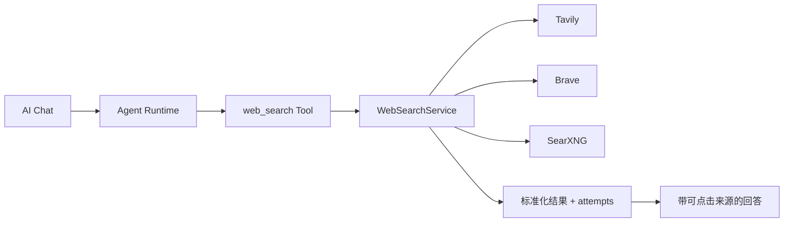
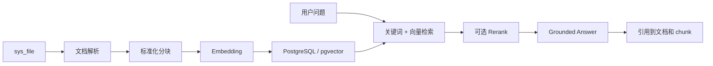

# Admin Base AI 能力演进路线图

Updated: 2026-08-24

本文记录 Admin Base 在现有 AI Runtime 之上的下一阶段能力规划，并以 Novex 的实现作为产品和
工程参考。本文是路线图，不代表所列能力已经上线；当前已实现范围仍以
[`ai-module-boundaries.md`](./ai-module-boundaries.md) 和
[`admin-base-framework-completion-status.md`](./admin-base-framework-completion-status.md) 为准。

DeepSeek Harness、Mastra、Pi 与当前 AI SDK 7 的分层对比、优缺点、替换成本和采用决策见
[`ai-runtime-framework-comparison.md`](./ai-runtime-framework-comparison.md)。当前决策是保留 AI SDK 7，
并把 Mastra Core 作为渐进式编排内核接入；不启动独立 Mastra Server，不迁移现有 Provider、Chat、
Approval 和 operation log 数据模型。

## 1. 目标与原则

Admin Base 的目标不是复制一套庞大的 AI 基础设施，而是在现有 Next.js + Hono 单应用、
PostgreSQL-first、AI SDK 7、Provider/Model、Chat、Agent、Tool、Run、Step 和 Approval 基础上，
补齐真正能被后台业务复用的 AI 产品能力。

演进原则：

- 先解决用户可感知的问题，再增加基础设施层级。
- Provider 继续表示连接和凭据，Model 继续表示该连接下的可调用模型。
- AI streaming、外部 Provider 调用、检索、Agent Tool 和审批继续使用显式 route/service。
- 所有工具由服务端注册并受权限、风险等级、审批和操作日志约束。
- 不向 Agent 暴露任意 Shell、文件系统、Git、SQL、数据库或不受限 HTTP 能力。
- 普通参数放在 `sys_config_items`；Provider、Model、知识库等资源使用独立资源模型。
- 保持 PostgreSQL-first；长任务先使用 PostgreSQL Queue/Outbox Worker，不为基础能力强制引入 Redis、RabbitMQ 或 Milvus。
- 每一层都必须先定义数据归属、权限、审计、失败状态和验收标准，再增加页面。

## 2. 当前能力基线

当前 Admin Base 已实现：

- AI Provider 连接、密钥加密、启停、默认连接和连接测试。
- Provider 下的 Model 管理、远端模型同步、用途和能力声明。
- 基于 AI SDK 7 的 Chat、结构化输出、单条/批量 Embedding 运行时服务。
- AI Playground 流式调试。
- 持久化 AI Chat、System Prompt、会话模型、上下文压缩、用量、导出和重新生成。
- Agent、受控 Tool、Run、Step、Approval，以及审批后的继续执行。
- 当前时间、计算器、系统状态、操作日志摘要和受约束模块开发工具。
- Run/Step/Approval 数据基础和 AI 相关操作日志。
- Mastra Core/PG 固定版本依赖、`legacy|mastra` 环境开关、Model/Tool/RequestContext/Stream 适配边界。
- `general-assistant` 的 Mastra canary 路径；默认仍为 legacy，模块开发 Agent 暂不迁移。
- 服务端静态 Workflow Registry、Admin Base 自有 Workflow Run/Step 持久化，以及首个不调用外部
  模型的 `ai-runtime-preflight` 确定性工作流。
- 受治理的 Web Search Provider chain、优先级失败回退、来源持久化、来源展示和 Tool Step 审计。
- 统一 Invocation/Attempt 费用账本、Provider 成功率和 P50/P95、用途模型路由与有序失败回退。
- Knowledge/RAG v1：知识库可见范围、TXT/Markdown/PDF/DOCX 解析、确定性分块、Embedding、PostgreSQL 全文与余弦混合检索、Grounded Ask、RAG Run 和引用详情。
- Notebook v1：显式可见范围的 Workspace、知识库/文档 Source、限定来源问答、引用快照，以及摘要、提纲、FAQ 和自定义简报 Artifact。
- Eval/Trace v1：带可见范围的 Dataset/Case、真实 Run 固化、同步批次、不可覆盖 Result、确定性断言，以及 Agent Run/Step/Approval 和 Invocation/Attempt 回链。
- AI Pricing Catalog v1：LiteLLM 社区目录的受信 HTTPS 获取、结构校验、Hash 快照、分页候选、Provider/Model 确定匹配、差异预览和逐字段显式应用。
- 跨会话 User/Agent Memory：只接受手工或用户确认写入，可查看、归档、过期和删除。
- Runtime Agent Skill：组合受控指令和服务端注册 Tool，并可绑定 Agent；不执行上传代码或本地命令。
- Agent Knowledge Tool：复用当前用户与 Knowledge 数据范围返回可核验 Chunk 证据。
- MCP 治理基础：远程 Streamable HTTP、OAuth Client Credentials/Authorization Code + PKCE、连接与 Token 生命周期、Tool 同步、allowlist、风险与审批策略。
- Provider 持久熔断：PostgreSQL 保存 closed/open/half-open，条件更新保证同一 Provider/用途只有一个 half-open 探针。
- PostgreSQL Worker/Queue：`SKIP LOCKED` 领取、租约续期、幂等键、指数退避、失败重试和取消，首批承载 Notebook Artifact 与 Eval Dataset。
- Eval Judge 与 Groundedness：确定性断言优先，LLM Judge 提供辅助评分，要求 Groundedness 时必须存在 Knowledge Tool 证据。
- system/department/user 配额和费用账本：调用前额度校验、估算 usage、人工 adjustment 与 confirmed/void 结算基础。
- Notebook 长任务与协作：viewer/editor 成员权限、后台 Artifact Job、历史来源和引用快照。

当前仍未实现的上层能力：

- 真正的 tenant 数据隔离、租户账单周期、Invoice、支付、税务和 Provider 对账文件。
- Redis/Kafka/RabbitMQ 等外部消息基础设施和独立调度中心；当前 Worker 以 PostgreSQL 为队列事实。
- MCP stdio、Shell、本地脚本、任意 URL 执行和旧 SSE 传输执行；当前仅开放受控远程 Streamable HTTP。
- 远端 MCP OAuth revoke endpoint 和长连接 Session 池；当前断开只撤销本地加密 Token，每次调用使用短生命周期 Session。
- Memory 自动候选提取与逐条确认工作流；当前不静默复制聊天原文。
- Notebook 实时共同编辑、评论、分享链接、定时任务和跨节点进度推送。

## 3. Novex 参考边界

参考仓库：[`saberc8/Novex`](https://github.com/saberc8/Novex)

本次评估基于 commit：

```text
e3711d2765663820a40161e1e06578f6c8271b2d
```

重点参考路径：

```text
apps/notebooklm
backend/src/application/ai/notebook_service.rs
backend/src/application/ai/knowledge_service.rs
backend/src/application/ai/memory_service.rs
backend/src/application/ai/eval_service.rs
backend/src/application/ai/foundation_service.rs
backend/migrations/202606050002_create_ai_knowledge.sql
backend/migrations/202606050010_create_ai_eval_runtime.sql
backend/migrations/202606160003_create_ai_notebook_workspace.sql
backend/migration_sources/ai/memory/schema/202606060008_create_ai_memory.sql
```

Novex 的 Rust、多服务、Redis、RabbitMQ、Milvus、Worker 和 Outbox 设计适合更重的 AI 平台，
不能直接作为 Admin Base v1 的默认架构。可借鉴的是能力边界、数据生命周期、来源追踪和运行治理。

## 4. 能力对齐决策

| 能力                  | Novex 参考点                               | Admin Base 决策                                                | 时机               |
| --------------------- | ------------------------------------------ | -------------------------------------------------------------- | ------------------ |
| Web Search            | 多 Provider fallback、标准结果、attempts   | 采用，写成轻量 TypeScript 服务和受控 Tool                      | 优先               |
| 任意 `http.get`       | URL 获取和网络保护                         | 暂缓，不能与 Search 一起开放                                   | 安全代理成熟后     |
| 模型用途路由          | Chat/RAG/Embedding/Rerank/Eval 等 purpose  | 渐进适配，不新增 Deployment/Profile 层                         | 近期               |
| 用量与成本            | token、费用、延迟统计                      | 采用，先做调用账本和聚合                                       | 近期               |
| Provider 健康         | 健康、失败和延迟历史                       | 采用轻量版本                                                   | 近期               |
| fallback              | purpose route 和备用模型                   | 每个用途支持一个有序候选列表                                   | 近期               |
| 熔断和 call lease     | 持久熔断、调用租约、原生取消               | 已实现持久熔断、half-open 和 Worker 租约；外部请求原生取消待补 | 已交付基础         |
| Knowledge/RAG         | Dataset/Document/Chunk/Embedding/Retrieval | PostgreSQL-first 重新实现                                      | 中期               |
| Milvus                | 独立向量数据库                             | 暂缓，先评估 `pgvector`                                        | 数据规模触发后     |
| Parser Worker         | 异步解析队列                               | 已有 PostgreSQL Worker 基础；Parser/OCR Job 尚未接入           | 按解析吞吐扩展     |
| Notebook              | Workspace/Source/Artifact/grounded Ask     | 在 RAG 和引用之后适配                                          | 中期               |
| Citation              | 回答到文档块和来源的引用                   | 采用，作为 RAG 必选项                                          | 中期               |
| Memory                | Scope、Policy、Memory Snippet              | 显式写入、可查看删除的轻量版本                                 | 后期               |
| Runtime Skill         | 指令、资源和 Tool 组合                     | 仅做指令 + 允许 Tool，不执行任意代码                           | 后期               |
| Eval/Trace            | Dataset/Case/Run/Result、trace replay      | 采用轻量按需版本                                               | RAG 后             |
| MCP                   | Server、Tool、OAuth、Gateway               | 已交付受控远程 Streamable HTTP 基础                            | 按真实 Server 扩展 |
| Redis/RabbitMQ/Outbox | 分布式运行和任务恢复                       | 已交付 PostgreSQL Queue/Outbox 基础，外部 Broker 暂缓          | SLA 触发后升级     |
| 多租户 AI 基础        | tenant scope                               | 不在当前主线                                                   | 明确多租户项目时   |

## 5. Web Search v1 已实现

Web Search 应是一个服务端注册的低风险 Agent Tool，而不是让模型访问任意 URL。



Provider 连接保存在独立资源表 `sys_ai_web_search_provider`，由
`/system/ai/web-search` 管理。密钥使用现有 AES-256-GCM 服务加密，不通过普通配置 JSON 或环境变量
暴露给前端。内置 Tavily、Brave 和本地 SearXNG 模板默认停用；管理员配置、测试并启用后才进入
Agent Tool 列表。部署和本地 SearXNG 指南见 [`docs/ai-web-search.md`](./ai-web-search.md)。

工具输入只允许：

```ts
type WebSearchInput = {
  query: string;
  limit?: number;
};
```

标准结果：

```ts
type WebSearchResult = {
  title: string;
  url: string;
  snippet: string;
  publishedAt?: string;
  source: string;
};
```

运行要求：

- Provider 按配置顺序 fallback，并记录每次尝试、耗时、成功和脱敏错误。
- 返回统一结果，去重 URL，限制条数和内容长度。
- 未启用网络能力时不向模型暴露该 Tool。
- 结果进入 Step 详情和操作日志，但不记录 API Key。
- Chat 展示来源标题、域名和 URL，不只显示“进行了 Web Search”。
- `web_search`、`weather_query`、`web_fetch` 和浏览器自动化保持独立能力。
- v1 不实现任意网页正文抓取；需要全文获取时再设计严格 allowlist、私网 IP 阻断和响应大小限制。

v1 验收状态：

- Tavily、Brave、SearXNG 可独立配置和测试。
- 第一 Provider 失败时能落到下一 Provider，`attempts` 可审计。
- 禁用时 Agent 不会虚构已经调用搜索。
- 搜索回答具有可点击来源，来源可追溯到具体 Tool Step。
- 超时、无结果、额度不足和全部 Provider 失败都有明确状态。

以上主路径已由 `tests/api/ai-web-search.test.ts` 自动覆盖；真实 Tavily/Brave 凭据和浏览器视觉
验收保留为部署环境边界。v1 不抓取搜索结果正文，也不把模型自行输出的链接标记为可信来源。

## 6. Knowledge/RAG v1

Knowledge/RAG 是 Notebook 的基础，不应先做 Notebook 外壳再补检索。

已实现数据模型：

```text
sys_ai_knowledge_base
sys_ai_document
sys_ai_document_chunk
sys_ai_rag_run
sys_ai_rag_citation
```

建议处理链路：



v1 范围：

- 复用文件模块选择来源，不重复上传和存储文件字节。
- 首批支持 TXT、Markdown、PDF 和 DOCX；解析失败可重试并展示错误。
- 文档保留解析状态、字符数、chunk 数、hash、版本和最后处理时间。
- chunk 保留顺序、原始页码/段落、标题层级、文本、token 估算和来源 metadata。
- Embedding 模型必须是已启用的 `embedding` 用途模型。
- 当前不假设部署 PostgreSQL 已安装 `pgvector`：Migration 创建生成式 `tsvector` 和 GIN 索引，Embedding 暂存 JSON，由 TypeScript 计算余弦分数；数据量和部署条件满足后再迁移到 `pgvector`。
- 支持知识库和文档范围过滤，普通用户不能越权检索未授权来源。
- 回答必须返回引用；无法从来源支撑时明确表示证据不足。
- v1 支持向量 + PostgreSQL 全文/关键词的混合检索；可选 Rerank 在权限过滤后处理最多 50 条候选，每条最多发送 1800 字符，失败时自动保留混合检索顺序。

v1 不做：

- Milvus 或其他独立向量数据库。
- 分布式 Parser Worker 和消息队列。
- 网页爬取、站点同步和外部 Drive 同步。
- OCR、音视频转录和复杂表格结构化解析。

验收标准：

- 同一文件 hash 不重复生成相同版本索引。
- 文档更新后旧 chunk 不参与新版本检索。
- 查询只能命中授权知识库和文档。
- 每条引用可以定位到文件、页码/段落和 chunk。
- 删除或停用来源后不再参与回答。
- Embedding Provider 失败时任务状态、错误和重试行为可追踪。

v1 当前交付状态：

- `/system/ai/knowledge` 提供知识来源和检索问答两个工作区。
- 来源复用 `sys_file`，同库相同 hash 拒绝重复；同名新 hash 生成新版本并停用旧版本。
- 索引状态为 `pending -> processing -> ready | failed`，失败原因脱敏后可见并可重试。
- `global | department | user` 可见性在列表、文档命令、检索和按 ID 查询中统一执行。
- `embedding`、`rerank` 和 `ragAnswer` 均复用用途模型路由、Invocation/Attempt、Provider 健康和有序回退链路。
- Embedding 索引批次固定为 10；模型能力中的 `dimensions` 会传给 OpenAI-compatible Embedding 请求并校验返回向量维度。
- Rerank 使用 AI SDK 7 的 `rerank()` 和受控 DashScope/Cohere-compatible 适配器。Rerank 查询、候选正文、API Key 和 Authorization 不进入调用账本或操作日志。
- RAG Run 保存查询 hash、回答 Invocation 和 Citation 快照，不把 Prompt 或回答正文写入调用账本。
- 当前未实现 Parser/OCR Job、网页同步和 `pgvector` 原生索引；Agent Knowledge Tool 已复用本服务完成受控接入。

DashScope 推荐配置映射：

| 配置                         | Admin Base 归属                 | 当前值                                   |
| ---------------------------- | ------------------------------- | ---------------------------------------- |
| Embedding Base URL / API Key | 独立 AI Provider，加密保存密钥  | `compatible-mode/v1` 连接                |
| Embedding 模型               | AI Model + `embedding` 用途路由 | `text-embedding-v4`，`dimensions = 1024` |
| Rerank Base URL / API Key    | 独立 AI Provider，加密保存密钥  | `compatible-api/v1` 连接                 |
| Rerank 模型                  | AI Model + `rerank` 用途路由    | `qwen3-rerank`                           |
| 索引批次                     | Knowledge 检索策略              | 10                                       |
| Rerank 候选 / 文本上限       | Knowledge 检索策略              | 50 / 1800 字符                           |

两个 Base URL 不同，因此应创建两个 Provider 连接。密钥不写入 `.env.example`、文档或源码；本地和生产均通过 Provider 管理页写入现有加密字段。

已有环境变量时可以执行一次引导导入：

```bash
pnpm ai:configure:dashscope-rag
```

命令读取 `DASHSCOPE_*`、`EMBEDDING_*` 和 `RERANKER_*`，把两个连接、两个模型和两个用途路由写入数据库，并通过现有 AES-256-GCM 服务加密密钥。运行时随后只读取数据库资源。`EMBEDDING_BATCH_SIZE`、`RERANKER_CANDIDATE_LIMIT` 和 `RERANKER_MAX_DOCUMENT_CHARS` 必须与当前源码治理策略 `10 / 50 / 1800` 一致，否则命令拒绝导入，避免环境变量看似生效但实际没有进入检索链路。

## 7. Notebook v1

Notebook 不是另一个 AI Chat。它负责把长期来源、基于来源的问答和生成产物组织在一个工作空间中。

```text
Notebook Workspace
  -> Sources
  -> Grounded Ask
  -> Citations
  -> Artifacts
```

建议数据模型：

```text
sys_ai_notebook
sys_ai_notebook_source
sys_ai_notebook_artifact
```

职责：

- `Notebook`：名称、描述、所有者、状态、默认模型和可选 System Prompt。
- `Source`：引用知识库或具体文档；公开网站先保存为受管 Markdown 文档快照，再复用同一索引和引用链路。
- `Artifact`：由来源生成的摘要、提纲、FAQ、简报等可保存产物。
- `Grounded Ask`：只检索当前 Notebook 的有效来源，并返回可定位引用。

页面建议采用三栏工作台：

- 左侧：来源列表、添加/移除、解析状态和失败原因。
- 中间：基于来源的问答和 Markdown 流式结果。
- 右侧：引用详情、来源片段和 Artifact 管理。

v1 Artifact：

- 摘要。
- 提纲。
- FAQ。
- 自定义结构化简报。

v1 不做音频概览、播客生成、公开分享和多人实时共同编辑；已支持 owner 管理 viewer/editor 协作者。

v1 当前交付状态：

- `sys_ai_notebook`、`sys_ai_notebook_source`、`sys_ai_notebook_artifact` 已建立 PostgreSQL 契约。
- Notebook 显式区分 `global | department | user`，所有读取、来源、问答和 Artifact 命令复用数据范围。
- Source 引用整个知识库或单个已索引文档，不复制 chunk 或 Embedding；来源选择支持服务端搜索和分页。
- 网站来源支持公开 HTML URL：逐跳校验 DNS/重定向并拒绝内网和保留地址，只提取正文文本，生成带原 URL、Canonical URL、域名、标题、发布时间、抓取时间和内容哈希的受管 Markdown 快照，然后自动分块、Embedding、索引并加入当前 Notebook。
- 联网搜索支持通过 Tavily、Brave、SearXNG 有序 Provider 链发现候选来源；搜索结果不直接入库，用户选择后重新走网站来源安全抓取链路，单次最多 10 条并允许部分成功。
- Deep Research 已复用 PostgreSQL Worker 和 Workflow Run/Step：模型规划互补检索词，按查询轮转选择 URL，并发安全导入，最后只基于本次成功导入的文档生成带引用 `brief` Artifact；运行可查询、取消并检查计划、检索、导入和报告步骤证据。
- 直接上传到 Knowledge 的文件使用 `usage_type = knowledge`，不进入普通文件管理、普通分组、普通下载和回收站链路；普通管理文件可按权限导入为独立 Knowledge 快照，新文件使用独立物理路径并记录来源元数据，原文件后续移动或删除不影响知识文档；`user_content` 保留给未来 C 端上传域。
- Grounded Ask 只检索当前有效来源；空来源拒绝执行，不能退化成搜索全部知识库。
- 移除来源只影响后续问答；历史 RAG Citation、Artifact 来源版本和引用 quote 保留快照。
- Artifact 支持摘要、提纲、FAQ、自定义结构化简报和新版本重新生成，并关联 RAG Run、Invocation 与实际模型。
- Artifact 可同步执行或进入 PostgreSQL Worker 队列；Job 可追踪、失败重试和取消。
- `sys_ai_notebook_member` 提供 viewer/editor 协作，owner/admin 管理成员；viewer 只读，editor 可管理来源和 Artifact。
- `/system/ai/notebook` 使用来源、问答、引用/产物三栏工作台，桌面局部滚动，窄屏纵向排列。
- `/system/ai/notebook` 以底部统一输入框承载“问来源”和“联网研究”：研究模式自动规划检索方向、导入并索引可信来源、生成引用报告；检索方向数和来源上限收进紧凑设置 Popover，活动 Run 可从输入框上方直接打开。页面仍保留联网搜索结果选择、导入结果分桶、运行轮询、取消、步骤时间线和最终报告入口。

验收标准：

- 未选择来源时不允许声称“基于资料回答”。
- 问答只能检索当前 Notebook 来源。
- 网站导入不能携带浏览器 Cookie 或登录态，不能执行脚本、绕过验证码/付费墙，也不能访问 localhost、内网、链路本地或云元数据地址。
- 搜索摘要不能直接成为引用来源；只有重新抓取、建立快照并完成索引的选中 URL 才能进入 Notebook。
- Deep Research 部分来源导入失败时保留成功来源和失败 Step；报告只能使用该 Run 成功导入的文档 ID，不能扩大到整个知识库。
- 引用点击后能打开文件预览并定位到页码/段落，无法精确定位时至少展示 chunk 原文。
- 移除来源后新问答不再使用该来源，历史回答保留当时引用快照。
- Artifact 保存模型、Prompt、来源版本、引用和生成 Run，支持重新生成。

## 8. 模型运行治理

截至 2026-08-24，本节已经完成首版实现：

- `/system/ai/runtime` 提供用途路由、Provider 健康和调用 Trace 三个工作区。
- `sys_ai_purpose_route` 与 `sys_ai_purpose_model` 保存主模型和最多四个有序候选。
- `sys_ai_invocation` 与 `sys_ai_invocation_attempt` 保存不可变调用证据，并按普通输入、缓存读取、缓存写入和输出的每 1M Token 价格估算费用。
- Chat、Structured、Embedding、Legacy Agent、Mastra Agent 和 RAG 回答共用用途解析；Eval 已预留用途并将在对应业务接入时复用。
- 回退只发生在响应输出前；已经开始输出的流保持原模型并明确失败。
- Provider 健康按真实业务调用聚合成功率、P50/P95 和最近错误，人工连接测试单独计数。
- 模型价格目录只更新候选快照；管理员确认后才写入模型价格，手工编辑会清除目录来源元数据，官方账单仍是结算真值。

Admin Base 当前 `Provider -> Model -> default by usage` 足以支撑现阶段，不需要立即复制 Novex 的
Provider、Deployment、Profile、Route 多层模型。下一步只增加稳定用途解析：

```ts
type AiModelPurpose =
  | "chat"
  | "structured"
  | "embedding"
  | "rerank"
  | "agent"
  | "ragAnswer"
  | "evalJudge";
```

建议能力：

- 每个 purpose 配置主模型和有序 fallback 模型。
- 调用前校验模型类型和能力，例如 Agent Tool 必须支持 `toolCalling`。
- 建立调用账本：Provider、Model、purpose、Run/Message、输入/输出 token、缓存 token、耗时、结果和估算费用。
- 建立 Provider 健康历史：最近成功、连续失败、P50/P95 延迟和最后错误类型。
- Playground、Chat、Agent、RAG 和 Eval 都调用同一个 purpose resolver，不各自复制默认模型逻辑。
- Provider/用途熔断状态持久化到 PostgreSQL，open 冷却后通过带租约的单探针进入 half-open，成功关闭、失败重新打开。

验收标准：

- 用途模型不可用时按确定顺序 fallback，选择过程可审计。
- 不支持 Tool Calling 的模型不能被工具型 Agent 静默使用。
- 用量和费用能追溯到用户、会话、Run、Provider 和 Model。
- 健康测试与真实业务调用分开统计。

## 9. Eval 与 Trace

现有 Run、Step、Approval、Invocation 和 Attempt 是 Eval 的运行事实。v1 已复用这些记录建立轻量 Eval，
没有增加第二套模型调用或 Trace 存储。

已实现数据模型：

```text
sys_ai_eval_dataset
sys_ai_eval_case
sys_ai_eval_run
sys_ai_eval_result
```

v1 流程：

1. 在 Agent Run 详情查看输入、模型、Tool Step、Approval、输出、token、耗时和错误。
2. 将真实 Run 保存为 Eval Case。
3. 为 Case 记录期望文本标准、期望/禁止 Tool、标签和固定输入。
4. 管理员可同步运行，也可通过 PostgreSQL Worker 队列执行数据集。
5. 汇总通过率、Tool 准确率、延迟、token 和成本。

v1 当前交付状态：

- `db:migrate` 与 `db:seed` 幂等提供 `Admin Base Agent 基线回归` 数据集，固化基础指令、计算器 Tool 和联网搜索 Tool 三类 Case；外部搜索 Case 明确标记环境依赖且不会自动执行。

- `/system/ai/eval` 提供 Dataset、Case、Run 和 Result 工作台；Agent Run 详情可直接保存 Case。
- Dataset 显式使用 `global | department | user` 归属，Case 继承 Dataset 的可见范围。
- 每个 Case 通过现有 Agent Runtime 执行并创建独立 Agent Run；内部 Chat Session 执行后隐藏，Trace 事实保留。
- 支持期望/禁止文本、期望/禁止 Tool、最大延迟、输入/输出 Token 和估算成本断言。
- 无人值守 Eval 遇到需要 Approval 的 Tool 时创建审批证据并明确拒绝，不自动执行高风险动作。
- 重跑总是新增 Run/Result，结果详情可回到实际 Provider、Model 和 fallback Attempt。

Case 可显式启用 LLM Judge 和 Groundedness。确定性断言先执行，Judge 不能覆盖确定性失败；要求
Groundedness 但没有完成的 `knowledge-search` Step 证据时直接失败，不允许模型凭空判断。Judge 仍只能
作为辅助指标，不能替代确定性断言和人工复核。

验收标准：

- 每个 Eval 结果能回到具体 Run/Step 和使用的 Provider/Model 版本。
- Tool 调用、拒绝调用、审批和最终结果都可设置确定性断言。
- 失败结果可重跑且不会覆盖历史结果。
- 测试数据中的凭据和敏感业务数据受权限与脱敏保护。

## 10. Memory 与 Runtime Skill

### 10.1 Memory（已交付基础）

长期 Memory 与当前会话上下文压缩不同。上下文压缩服务于单个会话窗口；Memory 是跨会话、可持续、
可管理的数据。

v1 只支持：

- User Memory 和 Agent Memory。
- 写入策略：`disabled`、`manual`、`confirmed`。
- 保存内容、scope、来源 session/message、创建者、过期时间和状态。
- 用户可以查看、修改、删除自己的 Memory。
- Agent 使用前按用户、Agent 和权限过滤。

不允许默认静默提取所有对话，也不把完整聊天原文长期复制到 Memory。

### 10.2 Runtime Skill（已交付基础）

运行时 Skill 与仓库中的 `.codex/skills` 开发 Skill 是两个概念：

- Codex development skill：指导编码 Agent 如何修改 Admin Base 仓库。
- Runtime Agent skill：给后台中的业务 Agent 注入指令，并限制可用 Tool。

Runtime Skill v1 字段：

```text
name / code / description / instructions / allowedToolIds / agentIds / status
```

Runtime Skill 只能组合文本指令和服务端注册 Tool，不允许上传或执行 JavaScript、Shell、Python、二进制、
任意 URL handler 或文件系统脚本。

## 11. MCP 治理基础

第一方受控 Tool 对 Web Search、系统查询、知识检索和模块开发仍然是默认选择。MCP 基础只用于接入
已知远程系统，并统一进入 Tool Registry、权限、审批和审计链路。

当前开放边界：

- 仅允许 HTTPS；非生产仅对 localhost/127.0.0.1 放宽 HTTP。
- 仅执行 Streamable HTTP，SSE 只保留配置兼容。
- 支持无认证、Client Credentials 和 Authorization Code + PKCE。
- 同步后的 Tool 默认停用，必须进入 allowlist，并设置风险、审批和启用状态。
- Access/Refresh Token 加密保存和自动刷新；删除 Server 会停用映射 Tool。

不支持 stdio、Shell、脚本、本地二进制或任意 URL 执行。详细边界见
[`ai-mcp-governance.md`](./ai-mcp-governance.md)。

## 12. 分阶段交付顺序

### Phase A：可靠性基础和 Web Search

- 实现 Web Search Provider chain、标准结果、来源 UI 和 Tool Step 审计。
- 加严模型 `toolCalling` 兼容性检查。
- 已完成 Run/Step 调试详情及 Invocation/Attempt Trace。
- 已完成调用用量/成本账本和 Provider 健康历史。
- 已完成 purpose-based 主模型和有序 fallback。

### Phase B：Knowledge/RAG v1

- 已完成不依赖 `pgvector` 的 PostgreSQL-first 部署策略。
- 已完成知识库、文档、chunk、RAG Run 和 Citation 模型。
- 已完成文件复用、解析、版本、索引、状态和文件引用保护。
- 已完成 Embedding、混合检索、权限过滤、Grounded Ask 和引用。
- 已将知识检索作为受控 Agent Tool 接入，并继续复用 Knowledge 数据范围和引用证据。

### Phase C：Notebook v1

- 已完成 Notebook、Source 和 Artifact 数据模型与权限审计。
- 已完成来源选择、grounded Ask、引用面板和来源/引用快照。
- 已完成摘要、提纲、FAQ 和自定义简报的生成、查看、重新生成与删除。
- 已完成 viewer/editor 协作和后台 Worker Artifact 任务。

### Phase D：Eval/Trace

- 已完成 Run/Step/Approval 与 Invocation/Attempt 调试工作台。
- 已支持从当前用户真实 Run 保存 Eval Case。
- 已建立带全局、部门、个人范围的 Dataset、Case、Run 和 Result，并支持同步或 Worker 队列执行。
- 已增加文本、工具、审批、延迟、Token 和成本的确定性断言与指标。
- 已增加 LLM Judge 和基于 `knowledge-search` Step 证据的 groundedness 指标；没有证据时确定性失败。

### Phase E：Memory 与 Runtime Skill（已完成基础）

- 已增加显式 User/Agent Memory 和管理页面。
- 已增加只包含指令和允许 Tool 的 Runtime Skill。
- 已将 Skill 选择接入 Agent，且不引入任意代码执行。

### Phase F：治理基础与后续扩展

- MCP Gateway/OAuth 已完成受控远程基础。
- 持久熔断、half-open 和 PostgreSQL Worker 租约已完成基础。
- Eval/Notebook Worker、队列和 Outbox 已完成基础；Parser/OCR Job 待接入。
- PostgreSQL 之外的向量数据库。
- Deployment/Profile 等更细模型抽象。

## 13. 优先级结论

推荐执行顺序：

1. Web Search。
2. 用量、健康、Run/Step Trace 和用途 fallback。
3. Knowledge/RAG 与引用。
4. Notebook。
5. Eval。
6. Memory 和 Runtime Skill。
7. MCP、PostgreSQL Worker、配额和高级 Eval 已完成基础，外部 Broker、真多租户和正式财务结算按负载与业务触发。

这个顺序使每个上层产品都建立在可验证的下层能力上：Notebook 依赖 RAG 和引用，Eval 依赖可靠
Trace，Memory 和 Skill 依赖成熟的权限与 Tool 治理。它也避免为了对齐 Novex 而把 Admin Base
提前改造成重型 AI 平台。
