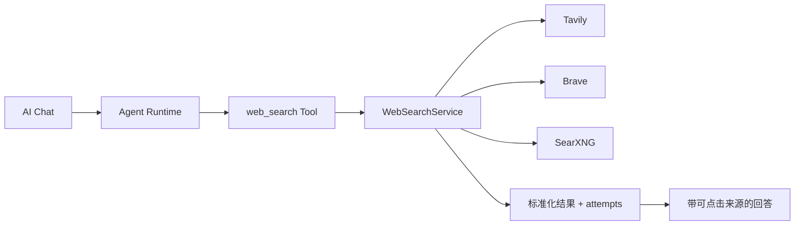
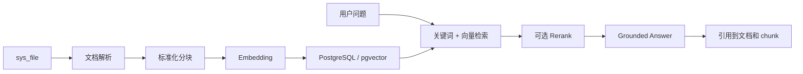

# Admin Base AI 能力演进路线图

Updated: 2026-08-19

本文记录 Admin Base 在现有 AI Runtime 之上的下一阶段能力规划，并以 Novex 的实现作为产品和
工程参考。本文是路线图，不代表所列能力已经上线；当前已实现范围仍以
[`ai-module-boundaries.md`](./ai-module-boundaries.md) 和
[`admin-base-framework-completion-status.md`](./admin-base-framework-completion-status.md) 为准。

DeepSeek Harness、Mastra、Pi 与当前 AI SDK 7 的分层对比、优缺点、替换成本和采用决策见
[`ai-runtime-framework-comparison.md`](./ai-runtime-framework-comparison.md)。当前决策是保留 AI SDK 7，
并把 Mastra Core 作为渐进式编排内核接入；不启动独立 Mastra Server，不迁移现有 Provider、Chat、
Approval 和 operation log 数据模型。

## 1. 目标与原则

Admin Base 的目标不是复制一套庞大的 AI 基础设施，而是在现有 Next.js + Hono 单应用、
PostgreSQL-first、AI SDK 7、Provider/Model、Chat、Agent、Tool、Run、Step 和 Approval 基础上，
补齐真正能被后台业务复用的 AI 产品能力。

演进原则：

- 先解决用户可感知的问题，再增加基础设施层级。
- Provider 继续表示连接和凭据，Model 继续表示该连接下的可调用模型。
- AI streaming、外部 Provider 调用、检索、Agent Tool 和审批继续使用显式 route/service。
- 所有工具由服务端注册并受权限、风险等级、审批和操作日志约束。
- 不向 Agent 暴露任意 Shell、文件系统、Git、SQL、数据库或不受限 HTTP 能力。
- 普通参数放在 `sys_config_items`；Provider、Model、知识库等资源使用独立资源模型。
- 第一阶段保持单进程和 PostgreSQL-first。队列、Worker、Redis、Milvus 和 MCP 必须由真实负载触发。
- 每一层都必须先定义数据归属、权限、审计、失败状态和验收标准，再增加页面。

## 2. 当前能力基线

当前 Admin Base 已实现：

- AI Provider 连接、密钥加密、启停、默认连接和连接测试。
- Provider 下的 Model 管理、远端模型同步、用途和能力声明。
- 基于 AI SDK 7 的 Chat、结构化输出、单条/批量 Embedding 运行时服务。
- AI Playground 流式调试。
- 持久化 AI Chat、System Prompt、会话模型、上下文压缩、用量、导出和重新生成。
- Agent、受控 Tool、Run、Step、Approval，以及审批后的继续执行。
- 当前时间、计算器、系统状态、操作日志摘要和受约束模块开发工具。
- Run/Step/Approval 数据基础和 AI 相关操作日志。
- Mastra Core/PG 固定版本依赖、`legacy|mastra` 环境开关、Model/Tool/RequestContext/Stream 适配边界。
- `general-assistant` 的 Mastra canary 路径；默认仍为 legacy，模块开发 Agent 暂不迁移。
- 服务端静态 Workflow Registry、Admin Base 自有 Workflow Run/Step 持久化，以及首个不调用外部
  模型的 `ai-runtime-preflight` 确定性工作流。
- 受治理的 Web Search Provider chain、优先级失败回退、来源持久化、来源展示和 Tool Step 审计。

当前尚未实现：

- 知识库、文档解析、分块、向量索引、混合检索和 RAG 引用。
- Notebook Workspace、Source 和 Artifact 产品层。
- 跨会话的可管理长期 Memory。
- 面向运行时 Agent 的 Skill 管理。
- AI Eval 数据集、用例、批次和结果中心。
- 完整的模型成本账本、健康历史、用途级 fallback 和熔断。
- MCP Server、MCP OAuth 和第三方 MCP Tool 生命周期。

## 3. Novex 参考边界

参考仓库：[`saberc8/Novex`](https://github.com/saberc8/Novex)

本次评估基于 commit：

```text
e3711d2765663820a40161e1e06578f6c8271b2d
```

重点参考路径：

```text
apps/notebooklm
backend/src/application/ai/notebook_service.rs
backend/src/application/ai/knowledge_service.rs
backend/src/application/ai/memory_service.rs
backend/src/application/ai/eval_service.rs
backend/src/application/ai/foundation_service.rs
backend/migrations/202606050002_create_ai_knowledge.sql
backend/migrations/202606050010_create_ai_eval_runtime.sql
backend/migrations/202606160003_create_ai_notebook_workspace.sql
backend/migration_sources/ai/memory/schema/202606060008_create_ai_memory.sql
```

Novex 的 Rust、多服务、Redis、RabbitMQ、Milvus、Worker 和 Outbox 设计适合更重的 AI 平台，
不能直接作为 Admin Base v1 的默认架构。可借鉴的是能力边界、数据生命周期、来源追踪和运行治理。

## 4. 能力对齐决策

| 能力                  | Novex 参考点                               | Admin Base 决策                           | 时机                     |
| --------------------- | ------------------------------------------ | ----------------------------------------- | ------------------------ |
| Web Search            | 多 Provider fallback、标准结果、attempts   | 采用，写成轻量 TypeScript 服务和受控 Tool | 优先                     |
| 任意 `http.get`       | URL 获取和网络保护                         | 暂缓，不能与 Search 一起开放              | 安全代理成熟后           |
| 模型用途路由          | Chat/RAG/Embedding/Rerank/Eval 等 purpose  | 渐进适配，不新增 Deployment/Profile 层    | 近期                     |
| 用量与成本            | token、费用、延迟统计                      | 采用，先做调用账本和聚合                  | 近期                     |
| Provider 健康         | 健康、失败和延迟历史                       | 采用轻量版本                              | 近期                     |
| fallback              | purpose route 和备用模型                   | 每个用途支持一个有序候选列表              | 近期                     |
| 熔断和 call lease     | 持久熔断、调用租约、原生取消               | 暂缓                                      | 真实故障和并发压力出现后 |
| Knowledge/RAG         | Dataset/Document/Chunk/Embedding/Retrieval | PostgreSQL-first 重新实现                 | 中期                     |
| Milvus                | 独立向量数据库                             | 暂缓，先评估 `pgvector`                   | 数据规模触发后           |
| Parser Worker         | 异步解析队列                               | 暂缓，v1 允许受限同步/后台任务            | 大文件吞吐触发后         |
| Notebook              | Workspace/Source/Artifact/grounded Ask     | 在 RAG 和引用之后适配                     | 中期                     |
| Citation              | 回答到文档块和来源的引用                   | 采用，作为 RAG 必选项                     | 中期                     |
| Memory                | Scope、Policy、Memory Snippet              | 显式写入、可查看删除的轻量版本            | 后期                     |
| Runtime Skill         | 指令、资源和 Tool 组合                     | 仅做指令 + 允许 Tool，不执行任意代码      | 后期                     |
| Eval/Trace            | Dataset/Case/Run/Result、trace replay      | 采用轻量按需版本                          | RAG 后                   |
| MCP                   | Server、Tool、OAuth、Gateway               | 暂缓                                      | 多个外部 MCP 系统接入时  |
| Redis/RabbitMQ/Outbox | 分布式运行和任务恢复                       | 暂缓                                      | 单进程无法满足 SLA 时    |
| 多租户 AI 基础        | tenant scope                               | 不在当前主线                              | 明确多租户项目时         |

## 5. Web Search v1 已实现

Web Search 应是一个服务端注册的低风险 Agent Tool，而不是让模型访问任意 URL。



Provider 连接保存在独立资源表 `sys_ai_web_search_provider`，由
`/system/ai/web-search` 管理。密钥使用现有 AES-256-GCM 服务加密，不通过普通配置 JSON 或环境变量
暴露给前端。内置 Tavily、Brave 和本地 SearXNG 模板默认停用；管理员配置、测试并启用后才进入
Agent Tool 列表。部署和本地 SearXNG 指南见 [`docs/ai-web-search.md`](./ai-web-search.md)。

工具输入只允许：

```ts
type WebSearchInput = {
  query: string;
  limit?: number;
};
```

标准结果：

```ts
type WebSearchResult = {
  title: string;
  url: string;
  snippet: string;
  publishedAt?: string;
  source: string;
};
```

运行要求：

- Provider 按配置顺序 fallback，并记录每次尝试、耗时、成功和脱敏错误。
- 返回统一结果，去重 URL，限制条数和内容长度。
- 未启用网络能力时不向模型暴露该 Tool。
- 结果进入 Step 详情和操作日志，但不记录 API Key。
- Chat 展示来源标题、域名和 URL，不只显示“进行了 Web Search”。
- `web_search`、`weather_query`、`web_fetch` 和浏览器自动化保持独立能力。
- v1 不实现任意网页正文抓取；需要全文获取时再设计严格 allowlist、私网 IP 阻断和响应大小限制。

v1 验收状态：

- Tavily、Brave、SearXNG 可独立配置和测试。
- 第一 Provider 失败时能落到下一 Provider，`attempts` 可审计。
- 禁用时 Agent 不会虚构已经调用搜索。
- 搜索回答具有可点击来源，来源可追溯到具体 Tool Step。
- 超时、无结果、额度不足和全部 Provider 失败都有明确状态。

以上主路径已由 `tests/api/ai-web-search.test.ts` 自动覆盖；真实 Tavily/Brave 凭据和浏览器视觉
验收保留为部署环境边界。v1 不抓取搜索结果正文，也不把模型自行输出的链接标记为可信来源。

## 6. Knowledge/RAG v1

Knowledge/RAG 是 Notebook 的基础，不应先做 Notebook 外壳再补检索。

建议数据模型：

```text
sys_ai_knowledge_base
sys_ai_document
sys_ai_document_chunk
sys_ai_embedding_job       # 可选；仅在异步处理出现后增加
```

建议处理链路：



v1 范围：

- 复用文件模块选择来源，不重复上传和存储文件字节。
- 首批支持 TXT、Markdown、PDF 和 DOCX；解析失败可重试并展示错误。
- 文档保留解析状态、字符数、chunk 数、hash、版本和最后处理时间。
- chunk 保留顺序、原始页码/段落、标题层级、文本、token 估算和来源 metadata。
- Embedding 模型必须是已启用的 `embedding` 用途模型。
- 先确认部署 PostgreSQL 是否支持 `pgvector`，不把支持情况当作默认事实。
- 支持知识库和文档范围过滤，普通用户不能越权检索未授权来源。
- 回答必须返回引用；无法从来源支撑时明确表示证据不足。
- v1 支持向量 + PostgreSQL 全文/关键词的混合检索；Rerank 可作为可选模型用途。

v1 不做：

- Milvus 或其他独立向量数据库。
- 分布式 Parser Worker 和消息队列。
- 网页爬取、站点同步和外部 Drive 同步。
- OCR、音视频转录和复杂表格结构化解析。

验收标准：

- 同一文件 hash 不重复生成相同版本索引。
- 文档更新后旧 chunk 不参与新版本检索。
- 查询只能命中授权知识库和文档。
- 每条引用可以定位到文件、页码/段落和 chunk。
- 删除或停用来源后不再参与回答。
- Embedding Provider 失败时任务状态、错误和重试行为可追踪。

## 7. Notebook v1

Notebook 不是另一个 AI Chat。它负责把长期来源、基于来源的问答和生成产物组织在一个工作空间中。

```text
Notebook Workspace
  -> Sources
  -> Grounded Ask
  -> Citations
  -> Artifacts
```

建议数据模型：

```text
sys_ai_notebook
sys_ai_notebook_source
sys_ai_notebook_artifact
```

职责：

- `Notebook`：名称、描述、所有者、状态、默认模型和可选 System Prompt。
- `Source`：引用知识库或具体文档，不复制文档内容和向量。
- `Artifact`：由来源生成的摘要、提纲、FAQ、简报等可保存产物。
- `Grounded Ask`：只检索当前 Notebook 的有效来源，并返回可定位引用。

页面建议采用三栏工作台：

- 左侧：来源列表、添加/移除、解析状态和失败原因。
- 中间：基于来源的问答和 Markdown 流式结果。
- 右侧：引用详情、来源片段和 Artifact 管理。

v1 Artifact：

- 摘要。
- 提纲。
- FAQ。
- 自定义结构化简报。

v1 不做音频概览、播客生成、公开分享和多人实时协作。

验收标准：

- 未选择来源时不允许声称“基于资料回答”。
- 问答只能检索当前 Notebook 来源。
- 引用点击后能打开文件预览并定位到页码/段落，无法精确定位时至少展示 chunk 原文。
- 移除来源后新问答不再使用该来源，历史回答保留当时引用快照。
- Artifact 保存模型、Prompt、来源版本、引用和生成 Run，支持重新生成。

## 8. 模型运行治理

Admin Base 当前 `Provider -> Model -> default by usage` 足以支撑现阶段，不需要立即复制 Novex 的
Provider、Deployment、Profile、Route 多层模型。下一步只增加稳定用途解析：

```ts
type AiModelPurpose =
  | "chat"
  | "structured"
  | "embedding"
  | "rerank"
  | "agent"
  | "ragAnswer"
  | "evalJudge";
```

建议能力：

- 每个 purpose 配置主模型和有序 fallback 模型。
- 调用前校验模型类型和能力，例如 Agent Tool 必须支持 `toolCalling`。
- 建立调用账本：Provider、Model、purpose、Run/Message、输入/输出 token、缓存 token、耗时、结果和估算费用。
- 建立 Provider 健康历史：最近成功、连续失败、P50/P95 延迟和最后错误类型。
- Playground、Chat、Agent、RAG 和 Eval 都调用同一个 purpose resolver，不各自复制默认模型逻辑。
- 只有当持续 Provider 故障已经影响服务时，再增加持久熔断和 half-open 状态。

验收标准：

- 用途模型不可用时按确定顺序 fallback，选择过程可审计。
- 不支持 Tool Calling 的模型不能被工具型 Agent 静默使用。
- 用量和费用能追溯到用户、会话、Run、Provider 和 Model。
- 健康测试与真实业务调用分开统计。

## 9. Eval 与 Trace

现有 Run、Step 和 Approval 已提供运行事实，应先把这些数据变成可调试界面，再建立轻量 Eval。

建议数据模型：

```text
sys_ai_eval_dataset
sys_ai_eval_case
sys_ai_eval_run
sys_ai_eval_result
```

v1 流程：

1. 在 Agent Run 详情查看输入、模型、Tool Step、Approval、输出、token、耗时和错误。
2. 将真实 Run 保存为 Eval Case。
3. 为 Case 记录期望文本标准、期望/禁止 Tool、标签和固定输入。
4. 管理员按需运行数据集，不引入队列。
5. 汇总通过率、Tool 准确率、延迟、token 和成本。

RAG 加入后再增加引用完整性、检索命中和 groundedness 指标。LLM Judge 只能作为辅助指标，不能替代
确定性断言和人工复核。

验收标准：

- 每个 Eval 结果能回到具体 Run/Step 和使用的 Provider/Model 版本。
- Tool 调用、拒绝调用、审批和最终结果都可设置确定性断言。
- 失败结果可重跑且不会覆盖历史结果。
- 测试数据中的凭据和敏感业务数据受权限与脱敏保护。

## 10. Memory 与 Runtime Skill

### 10.1 Memory

长期 Memory 与当前会话上下文压缩不同。上下文压缩服务于单个会话窗口；Memory 是跨会话、可持续、
可管理的数据。

v1 只支持：

- User Memory 和 Agent Memory。
- 写入策略：`disabled`、`manual`、`confirmed`。
- 保存内容、scope、来源 session/message、创建者、过期时间和状态。
- 用户可以查看、修改、删除自己的 Memory。
- Agent 使用前按用户、Agent 和权限过滤。

不允许默认静默提取所有对话，也不把完整聊天原文长期复制到 Memory。

### 10.2 Runtime Skill

运行时 Skill 与仓库中的 `.codex/skills` 开发 Skill 是两个概念：

- Codex development skill：指导编码 Agent 如何修改 Admin Base 仓库。
- Runtime Agent skill：给后台中的业务 Agent 注入指令，并限制可用 Tool。

Runtime Skill v1 字段：

```text
name / code / description / instructions / allowedToolIds / agentIds / status
```

Runtime Skill 只能组合文本指令和服务端注册 Tool，不允许上传或执行 JavaScript、Shell、Python、二进制、
任意 URL handler 或文件系统脚本。

## 11. MCP 的进入条件

MCP 不是当前必要能力。第一方受控 Tool 对 Web Search、系统查询、知识检索和模块开发更简单、安全，
也更容易审计。

只有同时满足下列条件才进入 MCP 设计：

- 已有多个业务系统通过 MCP 暴露能力。
- 为每个系统手写连接器已经产生明显重复成本。
- OAuth、凭据轮换、Server 状态、Tool allowlist 和审计模型已经明确。
- Agent Approval 和数据权限能够覆盖第三方 Tool 的副作用。
- 生产环境能够限制 MCP Server 出站网络和本地进程权限。

即使引入 MCP，也必须经过统一 Tool Registry 适配，不能让管理员输入任意 stdio 命令或 URL 后直接执行。

## 12. 分阶段交付顺序

### Phase A：可靠性基础和 Web Search

- 实现 Web Search Provider chain、标准结果、来源 UI 和 Tool Step 审计。
- 加严模型 `toolCalling` 兼容性检查。
- 完善 Run/Step 调试详情。
- 增加调用用量/成本账本和 Provider 健康历史。
- 增加 purpose-based 主模型和 fallback。

### Phase B：Knowledge/RAG v1

- 确认 `pgvector` 可用性和部署策略。
- 建立知识库、文档和 chunk 模型。
- 复用文件模块完成解析、版本、索引和状态管理。
- 实现 Embedding、混合检索、权限过滤和引用。
- 提供知识检索 Agent Tool。

### Phase C：Notebook v1

- 建立 Notebook、Source 和 Artifact。
- 提供来源选择、grounded Ask、引用面板和来源预览。
- 支持摘要、提纲、FAQ 和自定义简报。

### Phase D：Eval/Trace

- 完成 Run/Step/Approval 调试工作台。
- 支持从 Run 保存 Eval Case。
- 建立 Dataset、Case、Run 和 Result，按需执行。
- 增加确定性、工具、延迟、token、成本和 RAG 指标。

### Phase E：Memory 与 Runtime Skill

- 增加显式 User/Agent Memory 和管理页面。
- 增加只包含指令和允许 Tool 的 Runtime Skill。
- 将 Skill 选择接入 Agent，而不引入任意代码执行。

### Phase F：条件触发的高级能力

- MCP Gateway/OAuth。
- 持久熔断和调用租约。
- Parser/Eval Worker、队列和 Outbox。
- PostgreSQL 之外的向量数据库。
- Deployment/Profile 等更细模型抽象。

## 13. 优先级结论

推荐执行顺序：

1. Web Search。
2. 用量、健康、Run/Step Trace 和用途 fallback。
3. Knowledge/RAG 与引用。
4. Notebook。
5. Eval。
6. Memory 和 Runtime Skill。
7. MCP、分布式 Worker 和高级模型路由，仅在触发条件满足后实施。

这个顺序使每个上层产品都建立在可验证的下层能力上：Notebook 依赖 RAG 和引用，Eval 依赖可靠
Trace，Memory 和 Skill 依赖成熟的权限与 Tool 治理。它也避免为了对齐 Novex 而把 Admin Base
提前改造成重型 AI 平台。
