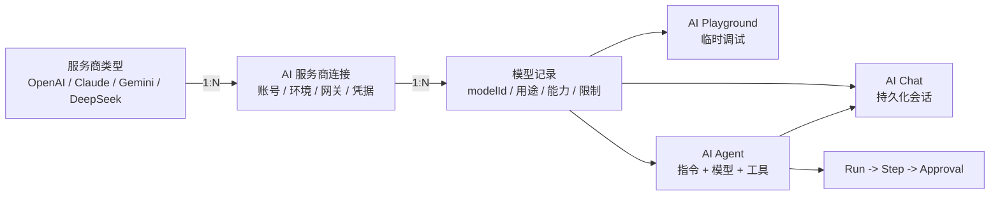

# AI 模块边界与使用流程

Updated: 2026-08-14

本文定义 AI 服务商、模型管理、AI Playground、AI Chat 和 AI Agent 的职责。它们是同一套
AI Runtime 的不同层级，不应合并为一个配置页面，也不应在各业务页面重复保存密钥和模型参数。

## 1. 核心关系

数据库中不存在单独的“服务商类型”记录。`providerType` 是连接实例的协议族标识，
`sys_ai_provider` 的每一行才是一套可独立启停、测试和引用的连接配置。

## 2. AI 服务商

AI 服务商页面管理外部 AI 服务的连接与凭据。一条记录代表一个独立连接，而不是一个模型。

一条连接包含：

- 服务商类型，例如 OpenAI、Anthropic、Google、DeepSeek 或 OpenAI-compatible。
- 连接名称，例如“OpenAI 生产账号”“OpenAI 备用账号”“公司 AI 网关”。
- Base URL、API Key、Organization、Project、连接级请求超时和协议私有配置。
- 唯一内部编码、启停状态、默认状态和连接测试能力。

同一个 `providerType` 可以创建多条连接。系统使用自动生成的唯一 `code` 区分实例，例如
`openai`、`openai-2`、`openai-3`。业务代码不应只按 `providerType` 猜测连接，也不应把
API Key 保存到模型、Playground、Chat 或 Agent 中。

普通接入优先从 `/system/ai/setup` 开始。AI 接入向导使用临时连接测试 `/models`，发现阶段不写入
Provider 或 Model；管理员勾选模型并确认默认用途后，连接、模型和默认标记在一个数据库事务中落库。
高级管理员仍可进入 AI 服务商和模型管理维护全部字段。

## 3. 模型管理

模型管理登记某个服务商连接下可调用的具体模型。每条 `sys_ai_model` 只属于一个
`providerId`，同一个连接可以登记多个模型。

模型记录包含：

- 外部服务使用的准确 `modelId` 和后台显示名称。
- Chat、Embedding、Image 或 Rerank 用途。
- 结构化输出、工具调用、视觉和推理等能力声明。
- 上下文窗口、最大输出、价格和默认业务用途。
- 启停状态以及测试调用。

“同步模型”只读取所选连接的远端模型列表并填充表单候选项，不会自动批量创建数据库记录。
管理员选择一项后，系统回填模型 ID、名称、类型和服务商返回的限制，再由管理员确认保存。
系统会兼容常见的上下文窗口和最大输出字段，但 `/models` 没有统一的容量元数据标准；上游未返回
限制时保持空值，管理员可以从常用规格选择或手工输入。不支持模型列表接口的兼容服务仍允许手工输入
模型 ID。系统不维护容易过期的“模型 ID 到容量”硬编码真值表。

## 4. AI Playground

AI Playground 是无正式会话语义的运行时调试工作台。页面可以选择任意已启用的 Chat 模型，
未显式选择时才使用当前业务用途的默认模型：

- 临时调整 Prompt、System Prompt 和输出参数。
- 查看流式 Markdown、finish reason、token 用量、端点和错误。
- 验证模型是否适合接入 Chat、Agent 或业务服务。

Playground 不管理 Provider 凭据，不创建正式聊天会话，也不替代业务侧的验收测试。

## 5. AI Chat

AI Chat 是面向使用者的持久化对话界面：

- 创建、切换和导出会话。
- 选择普通 Chat 模型或已启用 Agent。
- 保存 System Prompt、消息状态、上下文摘要、用量和重新生成关系。
- 展示 Agent Run、Step 和 Approval，并承接审批后的继续执行。

新会话默认使用已启用的“通用工作助手”。聊天顶部必须把“直接对话”和具体 Agent 作为一级模式
展示和切换，并根据服务端实际可用 Tool 明确显示联网搜索是否可用。选择直接对话时只调用模型，
不会加载联网搜索或其他 Agent Tool；选择 Agent 时，Chat 是 Agent 的交互入口，不复制 Agent 配置。

浏览器能力通过 Client Tool 接入，而不是让服务端直接读取设备能力。内置
`browser-location` 只在 Agent 判断当前位置确有必要且用户未提供城市时发起；Chat 必须先展示
一次性授权操作，再调用 `navigator.geolocation`。允许时仅提交双重粗化后的坐标，拒绝、不支持或
超时也作为合法结果恢复同一 Run，由 Agent 改为询问城市。它不使用管理员高风险 Tool 审批权限，
也不会在页面加载时自动申请浏览器权限。

## 6. AI Agent

AI Agent 是可复用的执行定义，不是 Provider，也不只是一个聊天名称。Agent 组合：

- 一套指令或 System Prompt。
- 一个支持 Chat 的模型；使用工具时模型还必须声明 `toolCalling` 能力。
- 来自服务端固定注册表的受控工具。
- 最大步骤、Temperature、输出限制和启停状态。
- 可审计的 Run、Step 和 Approval 生命周期。

高风险工具必须经过人工审批。工具处理器由服务端注册，管理员不能通过填写任意 handler 名称获得
文件系统、Shell、数据库或 Git 权限。

## 7. 标准配置与使用流程

1. 普通配置从 AI 接入向导选择服务商，填写连接名称、Base URL 和 API Key。
2. 测试临时连接并同步模型；不支持模型列表时切换手工模型 ID。
3. 批量勾选模型，设置 Chat、结构化和 Embedding 默认用途，然后一次性完成接入。
4. 高级管理员在 AI 服务商和模型管理维护超时、Organization、Project、容量、能力和价格。
5. 使用 Playground 做临时运行时调试。
6. 普通连续对话进入 AI Chat；需要指令、工具、步骤和审批时先创建 Agent，再从 AI Chat 使用。

## 8. Agent 编排运行时

AI SDK 7 继续负责 Provider 协议和模型调用。Mastra Core 作为同一个 Next.js + Hono 进程内的
渐进式编排层，不启动独立 Server，也不接管 Provider、Model、Chat 消息、Run/Step、Approval、
`sys_rule`、data scope 或 operation log。

当前 M0/M1 Agent canary 规则：

- `ADMIN_BASE_AI_ORCHESTRATOR=legacy` 是默认值，所有 Agent 使用原有运行时。
- `ADMIN_BASE_AI_ORCHESTRATOR=mastra` 时，只有 `general-assistant` 进入 Mastra；其他 Agent 仍走
  legacy。
- `module-development-agent` 暂不迁移，因为它拥有发布和回滚项目源代码的高风险工具。
- 两种运行时都复用同一套 Provider/Model、服务端 Tool Registry、审批策略和 Chat SSE 契约。
- 一次请求只会选择一种运行时。Mastra 请求失败时不会静默回退，避免 Tool 被重复执行。
- Mastra RequestContext 携带当前 `userId`、abilities、requestId 和已解析 data scope。
- 当前不启用 Mastra Memory、Studio、MCP、RAG 或 Eval，也不写 Mastra Storage 表。

M2 已增加服务端静态 Workflow Registry 和首个 `ai-runtime-preflight` 确定性工作流。它检查 Agent、
Provider、Model、Tool Registry、审批策略和 RequestContext，只读取配置，不调用外部模型。Workflow
运行和步骤写入 Admin Base 自有的 `sys_ai_workflow_run`、`sys_ai_workflow_run_step`，可在 AI Agent
页面的 Workflows 标签查看。

`@mastra/pg` 目前只预留 `mastra_runtime` 独立 schema 配置，并固定 `disableInit: true`。当前 Workflow
不使用 Mastra Storage。只有后续 suspend/resume 或 durable snapshot 确实需要框架存储时，才允许先
导出并审查 DDL，再由 Admin Base migration 创建表。

## 9. 运行时选择规则

- 业务未指定模型时，按用途读取已启用的默认模型及其已启用 Provider。
- 会话明确选择模型时，以会话模型为准；Agent 会话以 Agent 的模型为准。
- 正式调用使用 Provider 的 Base URL、凭据和请求超时，并使用 Model 的上下文窗口和最大输出；
  Playground 与测试弹窗可以临时覆盖输出和超时用于诊断。
- 停用 Provider、缺少必要凭据、停用模型或能力不匹配时，服务端拒绝在线调用。
- Provider 密钥只在服务端解密，列表与详情响应仅返回 `hasApiKey` 等脱敏状态。

## 10. 禁止的混用

- 不在模型记录中重复保存 Base URL 或 API Key。
- 不把 Playground 当作正式 Chat 历史。
- 不把 Agent 当作 Provider 别名或模型别名。
- 不因同一 `providerType` 已存在就复用错误账号；不同账号、环境和网关应建立独立连接。
- 不根据显示名称做稳定业务引用；服务端使用 Provider ID/code 和 Model ID。

## 11. 下一层产品能力

Web Search、Knowledge/RAG、Notebook、Eval、Memory 和 Runtime Skill 位于现有 AI Runtime 之上，
不是 Provider、Model、Playground、Chat 或 Agent 的别名：

- Web Search v1 已实现为受控 `web-search` Agent Tool，返回可追溯的公开网络来源，不等于任意 URL
  访问；Provider、回退、来源和审计契约见 `docs/ai-web-search.md`。
- Knowledge/RAG 负责文档解析、分块、Embedding、检索、权限过滤和引用。
- Notebook 组织长期 Sources、基于来源的问答和 Artifacts，必须建立在 RAG 与引用之上。
- Eval 使用 Run/Step Trace 构建可重复的质量用例和结果，不是 Playground 的单次人工测试。
- Memory 是跨会话、可查看和删除的长期信息，不等于单会话上下文摘要。
- Runtime Skill 是指令和允许 Tool 的受控组合，不等于仓库中的 Codex 开发 Skill，也不执行任意代码。

其中 Web Search 已交付，其他能力仍属于规划范围。详细采用、暂缓、基础设施触发条件和验收标准见
[`ai-capability-evolution-roadmap.md`](./ai-capability-evolution-roadmap.md)。
