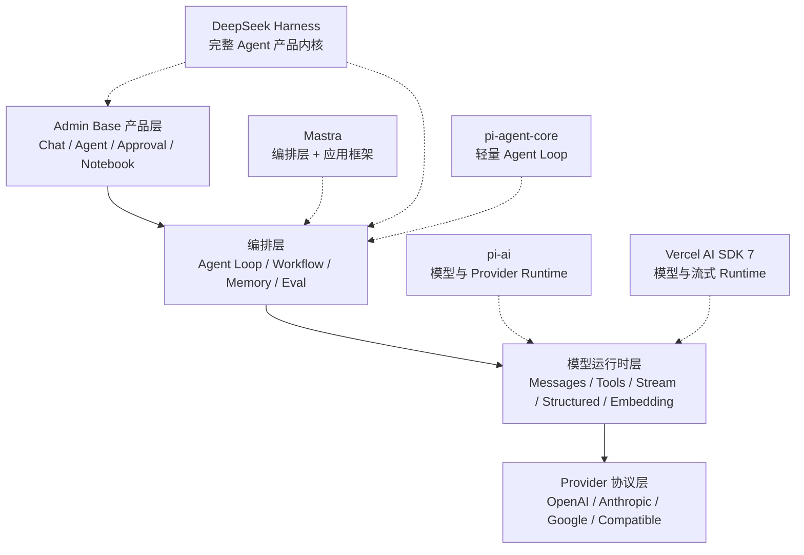
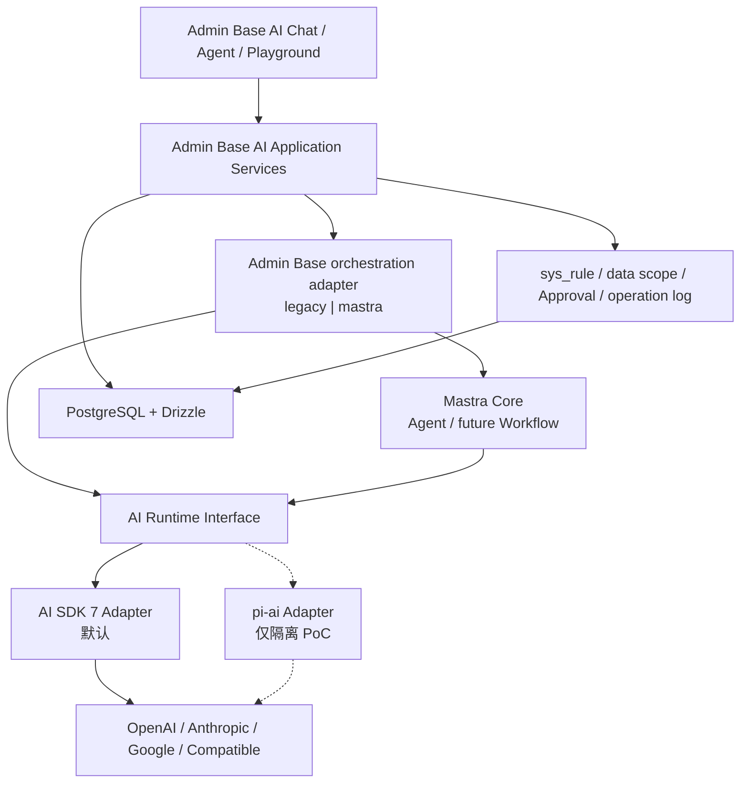

# Admin Base AI Runtime 框架对比与选型

Updated: 2026-08-14

本文对比 Admin Base 当前使用的 Vercel AI SDK 7 与 DeepSeek Harness、Mastra、Pi 的职责、能力、
迁移成本和适用边界。目标是回答两个问题：

1. 当前 AI SDK 是否应该被替换。
2. 三个参考项目有哪些能力值得引入 Admin Base。

结论先行：**不替换 AI SDK 7；采用 Mastra Core 作为 Admin Base 内嵌的渐进式编排内核。** Mastra
不接管 Provider/Model、Chat 数据、`sys_rule`、data scope、Approval 或 operation log，也不启动第二个
Server。迁移通过 `legacy|mastra` 环境开关逐个 Agent 推进，第一批只覆盖
`general-assistant`；Workflow、Memory、RAG 和 Eval 后续分包接入。

## 1. 评估快照

本次源码评估基于以下上游提交，而不是只依据项目首页描述：

| 项目             | 评估提交                                   | 提交日期   | 快照版本/状态                                           | 许可证                                    |
| ---------------- | ------------------------------------------ | ---------- | ------------------------------------------------------- | ----------------------------------------- |
| DeepSeek Harness | `47f943859bef60e4160492346772ded9b24f765a` | 2026-08-13 | `0.1.0-rc.5`，Developer Preview，明确提示会有破坏性变更 | MIT                                       |
| Mastra           | `a9dc4e8f2244599a4da5ab0f65bb61227c1a0ed9` | 2026-08-14 | 主分支 `@mastra/core 1.59.1-alpha.0`                    | 主体 Apache-2.0，`ee/` 目录使用单独许可证 |
| Pi               | `9d2ec7ffabe927bfad2214c1cee25b6632a78dcf` | 2026-08-13 | `0.84.1`                                                | MIT                                       |

参考仓库：

- [deepseek-ai/deepseek-harness](https://github.com/deepseek-ai/deepseek-harness)
- [mastra-ai/mastra](https://github.com/mastra-ai/mastra)
- [earendil-works/pi](https://github.com/earendil-works/pi)

这些项目都处于快速迭代阶段。本文记录的是上述 commit 的事实，不把主分支 API 当作长期稳定契约。

## 2. 四者不在同一层



准确定位：

- **Vercel AI SDK 7**：模型调用、统一消息、Tool Calling、流式、结构化输出和 Embedding。
- **Mastra**：建立在 AI SDK Provider/模型契约之上的 Agent、Workflow、Memory、Eval、MCP、
  Observability 和 Storage 应用框架。
- **Pi**：`pi-ai` 是 AI SDK 的直接竞品；`pi-agent-core` 是更轻量的状态化 Agent Loop。
- **DeepSeek Harness**：拥有 Web/Headless、插件树、会话事件、Tool、审批、沙箱、工作区和 UI 的完整
  Agent 产品，不是一个只替换 `streamText()` 的库。

因此，Mastra 和 DeepSeek Harness 不能简单“替换 AI SDK”。真正能够替换 AI SDK Provider/Runtime
层的是 `pi-ai`，但它不能无成本覆盖当前 AI SDK 的全部功能。

## 3. Admin Base 当前 AI SDK 的职责

当前项目使用：

```text
ai ^7.0.8
@ai-sdk/openai ^4.0.4
@ai-sdk/anthropic ^4.0.3
@ai-sdk/google ^4.0.3
@ai-sdk/openai-compatible ^3.0.2
```

当前 AI SDK 已承担：

- `generateText()` 和 `streamText()`。
- `generateObject()` 结构化输出。
- `embed()` 和 `embedMany()`。
- Zod Tool input schema。
- Tool Calling、`needsApproval` 和 `stepCountIs()`。
- Provider usage、finish reason、warnings、abort、timeout 和流式事件。
- OpenAI、Anthropic、Google 及 OpenAI-compatible Provider 适配。

Admin Base 自己承担：

- `sys_ai_provider`、`sys_ai_model` 资源配置和密钥加密。
- Provider/Model 状态、默认用途和能力校验。
- `sys_ai_chat_*` 会话与消息状态。
- Agent、Tool、Run、Step、Approval 数据模型。
- `sys_rule` 权限、Tool allowlist、人工审批和 `sys_operation_log`。
- 上下文压缩、用量落库、Streamdown UI 和业务页面。

这条边界是合理的：AI SDK 处理 Provider 差异和流式协议，Admin Base 保留产品数据、安全和后台治理。

### 3.1 当前方案优点

- 已与 Next.js、Hono、React、Streamdown、Zod 和现有测试集成。
- 同时覆盖 Chat、Structured Output 和 Embedding，是 RAG v1 的直接基础。
- Provider API 与业务数据库解耦，停用 Provider、默认模型和权限仍由 Admin Base 控制。
- 当前 Agent Runtime 很小，能够按 Admin Base 的审批、审计和权限语义演进。
- 没有第二套 Storage、Auth、API Server、Studio 和数据库迁移体系。

### 3.2 当前方案缺点

- AI SDK 版本升级可能带来消息、Provider 和流事件契约变化。
- 多步 Agent 的事件、重试、恢复、并发 Tool 和可观测性需要项目自己补齐。
- 不提供完整 Workflow、Memory、Eval、Trace UI 和 durable execution。
- Provider 的少数原生能力可能被统一抽象隐藏，需要 Provider-specific options。
- 模型目录、价格和能力信息仍依赖后台配置或自建同步。

这些缺点说明需要增强编排和治理层，但不等于必须替换模型运行时层。

## 4. DeepSeek Harness

### 4.1 定位

DeepSeek Harness 是“everything is a plugin”的完整 Agent Harness。它基于 Cordis 插件树，由 Profile、
Bundle 和 patch 组合运行时。模型适配器、Agent Loop、Session、Tool Registry、审批、沙箱、文件系统、
终端、Web UI 和持久化都可以作为插件替换。

核心设计：

- append-only `SessionEvent` 是可回放事实来源。
- Turn 包含多个 Step；每个 Step 是一次模型请求加一批 Tool 执行。
- 模型可见的内容必须能从 Session Log 重建。
- `agent/*` 是实时控制事件，`session/event` 是持久事实。
- Tool 经过 `pre-execute -> monotonic guards -> execute -> post-execute -> result`。
- 审批默认 fail closed，授权只对单次动作有效。
- 文件系统、进程、Shell、Sandbox、Subagent、Workflow 都有可替换 seam。
- LLM 层既有 DeepSeek 直接 adapter，也通过 `dsh-llm-pi-ai` 使用 `pi-ai` 扩展 Provider。

### 4.2 优点

- Agent 生命周期和事件语义非常完整，适合回放、恢复、fork 和 UI 重建。
- Tool pipeline 的前置策略、单调守卫、审批、执行包装、结果改写和审计边界清晰。
- 插件卸载可以撤销注册副作用，运行时组合能力强。
- 会话日志坚持“模型可见即已记录”，有利于 Trace、Eval 和问题复现。
- 沙箱、文件观察策略、终端、子 Agent 和审批比普通 Agent SDK 更系统。
- Web、Headless、SDK、ACP 等入口已经围绕同一内核构建。

### 4.3 缺点

- Developer Preview 和 RC 状态明确表示会发生破坏性变更。
- Cordis、Profile、Bundle、Patch、Host/Client face 和大量细粒度包带来很高学习成本。
- 它是一套独立产品架构，不是嵌入 Next.js/Hono route 的轻量 Runtime。
- 默认持久化方向包含 JSONL/SQLite，与 Admin Base 的 PostgreSQL/Drizzle contract 不一致。
- 自带 Web UI、设置、凭据、权限 preset 和插件机制，会与现有后台能力重复。
- 当前 Workflow 仍声明无 journaling/resume，不能因为框架庞大就假设所有 durable 能力已经完成。
- LLM provider 广度部分依赖 `pi-ai`，并不是独立于其他运行时的完整 Provider 替代。

### 4.4 对 Admin Base 的价值

**适合参考，不适合引入为依赖或替换现有 Runtime。**

值得借鉴：

- `turn/start -> step/* -> tool/* -> turn/end` 的持久事件模型。
- 模型可见输入必须可重建的 Trace 不变量。
- Tool pre/post hooks、单调 deny guard 和 fail-closed approval。
- Tool Call 参数与审批证据绑定、授权单次消费。
- 并行 Tool 的结果仍按模型调用顺序持久化。
- Runtime context 使用 append-only snapshot，减少隐式状态漂移。

不引入：

- Cordis 插件内核。
- Profile/Bundle/Patch 配置体系。
- 第二套 Web UI、凭据、设置和持久化系统。
- 任意 Shell、文件系统和进程 Tool。

Admin Base 之前已经决定不为了扩展性提前建设插件系统。整体采用 Harness 会逆转该决策，并显著扩大
框架体积。

## 5. Mastra

### 5.1 定位

Mastra 是 TypeScript AI 应用框架，提供：

- Agent、Tool、Processor、Guardrail 和 Multi-agent。
- 图式 Workflow、branch、parallel、suspend/resume 和 durable runner。
- Message History、Working Memory、Semantic Recall、Observational Memory。
- Eval Scorer、Trace Eval 和 CI Eval。
- Observability、OpenTelemetry、日志和反馈。
- RAG、Vector Store、MCP Client/Server。
- Storage adapter、PostgreSQL adapter、Server adapter、Studio 和 Client SDK。

Mastra 不是脱离 AI SDK 的 Provider Runtime。源码同时兼容多代 `@ai-sdk/provider` 类型，支持 AI SDK
Tool，并提供 `@mastra/ai-sdk` 的 `withMastra()`，用于给现有 AI SDK 模型增加 Processor 和 Memory。

### 5.2 优点

- 与 TypeScript、Zod、Next.js 和 Hono 技术栈接近。
- Agent 与确定性 Workflow 分工清晰：开放任务用 Agent，明确步骤用 Workflow。
- Workflow 支持结构化输入输出、控制流、suspend/resume 和外部 Runner。
- Human-in-the-loop 支持调用前审批和 Tool 内运行时 suspend。
- Memory 层次完整，覆盖消息、工作记忆、语义召回和观察式压缩。
- Eval 和 Observability 已经形成完整产品链路，不需要从零设计所有 scorer 和 trace exporter。
- PostgreSQL Storage、Hono adapter、MCP、RAG 和 AI SDK UI 集成都存在。
- 可以继续使用 AI SDK Provider，不要求替换当前模型适配层。

### 5.3 缺点

- 能力面很大，会引入 Mastra instance、Storage domain、表结构、Run/Snapshot、Trace 和 Studio 等第二套
  Runtime ownership。
- 与现有 `sys_ai_chat_*`、Run/Step/Approval、Provider/Model、operation log 和权限模型高度重叠。
- 使用 Mastra Storage 会让数据库出现一套 Mastra runtime table 和一套 Admin Base table；自行适配
  Drizzle 表又会失去采用框架的部分价值。
- Snapshot/Approval、Memory 和 Trace 的资源归属不天然理解 `sys_user`、`sys_rule` 和 data scope。
- 完整引入后，故障诊断和升级需要同时理解 AI SDK、Mastra 以及 Admin Base 三层版本契约。
- 主分支包含 alpha 包和多代 AI SDK compatibility alias，说明兼容面和升级面都很大。
- 企业目录有单独许可证，正式使用具体 EE 能力前需要单独确认。

### 5.4 对 Admin Base 的采用方式

Mastra 是三个项目中最适合作为长期编排内核的框架。当前采用方式不是整体接管，而是通过适配层逐步
替换 Agent Loop，并保持 Admin Base 治理和数据模型为 source of truth。

优先参考：

- Agent 与 Workflow 的产品分界。
- Workflow 的 suspend/resume、输入输出 schema、branch/parallel 和快照语义。
- Processor/Guardrail 的输入和输出处理链。
- Approval 与精确 Tool 参数指纹绑定。
- Memory 的 resource/thread scope。
- Eval scorer、trace evaluation 和 CI gate。
- OpenTelemetry span 结构和 Studio 调试信息架构。

当前已采用：

- 固定 `@mastra/core` 和 `@mastra/pg` 版本，继续复用现有 AI SDK LanguageModel。
- 建立 Model、Tool、RequestContext 和 Stream adapter。
- 用部署级 `ADMIN_BASE_AI_ORCHESTRATOR=legacy|mastra` 控制运行路径。
- 第一批只迁移 `general-assistant`，其他 Agent 保持 legacy fallback。
- 不改变现有 Chat API、SSE、Run/Step/Approval 和前端 Streamdown 契约。

当前不做：

- 同时启用 Mastra Memory 与现有 Chat persistence。
- 让 Mastra Storage 自动成为 Admin Base AI 数据的 source of truth。
- 为使用 Studio 暴露独立未接入 `sys_rule` 的管理入口。

## 6. Pi

### 6.1 定位

Pi 分为两个与本项目直接相关的包：

- `@earendil-works/pi-ai`：统一多 Provider LLM API、模型目录、成本、推理强度、Provider-specific
  transport 和 OAuth/凭据能力。
- `@earendil-works/pi-agent-core`：状态化 Agent Loop、Tool 执行、事件流、steering、follow-up、
  context transform 和 abort。

`pi-ai` 使用 OpenAI、Anthropic、Google、Bedrock 等官方 SDK 或直接协议实现，不依赖 Vercel AI SDK，
因此它是三个项目中唯一真正可能替换当前 AI SDK Provider 层的候选。

### 6.2 `pi-ai` 优点

- Provider 覆盖广，内置模型目录和模型能力数据。
- 深入支持 provider-specific API，例如 OpenAI Responses、Anthropic、Google、Bedrock、Azure、
  推理等级、prompt cache、WebSocket 和 deferred response。
- 支持动态模型发现、费用计算、Provider header/env 和 request transform。
- 流事件协议清晰，能够保留 reasoning、Tool Call、usage 和错误状态。
- 直接暴露 Provider 差异，适合编码 Agent 等需要新模型原生能力的场景。
- MIT，包边界比完整 Harness 和 Mastra 更轻。

### 6.3 `pi-ai` 缺点

- 当前没有与 AI SDK `embed()`/`embedMany()` 对等的一等 Embedding Runtime；Admin Base 的 RAG 路线
  仍需保留或重写 Embedding 适配。
- 没有与当前 `generateObject()` 完全对等的统一高层结构化输出接口；需要基于 Provider response
  format、JSON schema 或 Tool Calling 自行封装。
- 使用 TypeBox，而当前 Admin Base 表单、API 和 Tool schema 主线是 Zod。
- 消息、Tool、usage、finish reason、stream chunk 和错误类型都与 AI SDK 不同。
- 模型目录是一项新的更新和可信来源责任，不能直接覆盖管理员保存的 Provider/Model 记录。
- Provider 原生功能越多，跨 Provider 行为一致性越需要项目自己测试。

### 6.4 `pi-agent-core` 优点

- Agent Loop 比 Mastra 和 DeepSeek Harness 更小，适合阅读、测试或局部适配。
- 明确输出 `agent_start`、`turn_start`、message、Tool、`turn_end`、`agent_end` 事件。
- 支持 Tool 并行/串行、`beforeToolCall`、`afterToolCall`、中止和 Tool 结果顺序稳定。
- 支持 steering、follow-up、上下文转换和自定义消息类型。
- 可以只采用 Agent Core，不采用其 Coding Agent UI。

### 6.5 `pi-agent-core` 缺点

- 官方明确说明没有内置文件、进程、网络或凭据权限系统，也没有内置 sandbox。
- `beforeToolCall` 能阻断 Tool，但不是 Admin Base 的持久 Approval、权限或审计模型。
- 持久化、业务用户归属、角色能力和 data scope 仍需 Admin Base 实现。
- Coding Agent extension 可以执行任意代码，不可直接映射为后台 Runtime Skill。
- 采用 Agent Core 仍需要把事件翻译到现有 Run/Step/Approval 表和前端 stream 协议。

### 6.6 对 Admin Base 的价值

值得借鉴：

- Provider 模型目录、价格和 thinking capability 数据结构。
- Provider-specific options 的显式能力，而不是不断向通用 JSON 塞未声明字段。
- Agent steering/follow-up 队列。
- 并行 Tool preflight 后并发执行、按源顺序持久化结果。
- `beforeToolCall`/`afterToolCall` hooks 和运行结束 barrier。

暂不替换 AI SDK。只有出现下列问题之一时，才启动 `pi-ai` 对照 PoC：

- AI SDK 无法及时支持一个关键 Provider 原生 API。
- 编码 Agent 必须使用 WebSocket、deferred response 或精细 reasoning controls。
- AI SDK 的统一抽象持续丢失关键 usage、reasoning 或 Tool 信息。
- 自建模型目录和成本同步的价值明显高于双 Runtime 维护成本。

## 7. 能力对比矩阵

| 维度                   | Admin Base + AI SDK 7              | DeepSeek Harness                             | Mastra                                 | Pi                                    |
| ---------------------- | ---------------------------------- | -------------------------------------------- | -------------------------------------- | ------------------------------------- |
| 主要定位               | 后台产品 + 模型 Runtime            | 完整 Agent Harness 产品                      | AI 应用/Agent/Workflow 框架            | Provider Runtime + 轻量 Agent Core    |
| 能否直接替换 AI SDK    | 当前基线                           | 否，替换范围远超 SDK                         | 否，内部兼容/依赖 AI SDK               | `pi-ai` 可以，但需要大规模适配        |
| Provider 覆盖          | OpenAI/Anthropic/Google/Compatible | DeepSeek + `pi-ai` adapter                   | AI SDK Provider 生态和模型路由         | 很广，原生 Provider 能力深入          |
| Streaming              | AI SDK stream                      | 持久 chunk 事件和回放                        | Agent/Workflow stream + AI SDK adapter | 自有 typed event stream               |
| Structured Output      | 已有 `generateObject`              | 非核心强项                                   | 完整支持                               | 需自行统一封装                        |
| Embedding              | 已有 `embed/embedMany`             | 不是当前核心                                 | RAG/Vector 能力完整                    | 未发现对等一等 API                    |
| Agent Loop             | 当前轻量实现                       | 高度可组合、事件化                           | 功能完整                               | 轻量、状态化、事件化                  |
| Deterministic Workflow | 未实现                             | Model-written worker workflow，当前无 resume | 强项，graph + suspend/resume           | 不提供完整 Workflow engine            |
| Approval               | 已有持久 Approval                  | fail-closed one-shot seam                    | Tool approval + suspend/resume         | hook 可阻断，无持久审批系统           |
| Permission/Data Scope  | `sys_rule` + data scope            | 自有 preset/sandbox policy                   | 需接入 RequestContext/自定义 guard     | 无内置权限系统                        |
| Persistence            | PostgreSQL/Drizzle                 | JSONL/SQLite 等插件                          | 多 Storage adapter，含 PostgreSQL      | Agent Core 可外接 session backend     |
| Memory                 | 会话历史与上下文压缩               | Session event + compaction                   | 强项，多层 Memory                      | context transform，长期 Memory 需自建 |
| Eval/Observability     | Run/Step 基础，尚待增强            | Event replay/telemetry                       | 强项，scorer/trace/OTel/Studio         | telemetry contract，产品层较少        |
| RAG/MCP                | 路线图能力                         | MCP、Web Tool；非 Notebook/RAG 框架          | 完整 RAG/MCP 生态                      | 非核心                                |
| UI                     | Admin Base 已有                    | 自带 Web Client                              | Studio + Client SDK                    | 主要是 TUI/Coding Agent               |
| 引入冲突               | 无                                 | 极高                                         | 高                                     | Provider 替换高，Agent Core 中等      |
| 当前成熟风险           | AI SDK 升级风险                    | Developer Preview/RC                         | 大型快速迭代框架                       | 0.x，Provider 变化快                  |

## 8. 替换成本

### 8.1 用 Mastra 替换当前 Agent Runtime

需要处理：

- 把 `sys_ai_agent` 映射为 Mastra Agent 或 Stored Agent。
- 把现有 Tool Registry 转为 Mastra Tool，并重新绑定 `sys_rule`、data scope 和 operation log。
- 决定 Mastra Snapshot、Run、Trace 和现有 Run/Step/Approval 哪套是 source of truth。
- 处理 Mastra Storage table 与 Drizzle migration 的所有权。
- 翻译 Mastra Stream 到当前 Chat UI 和 Streamdown 状态。
- 迁移会话 Memory，避免重复写入两套消息表。
- 重写审批 continuation、失败恢复和现有测试。

这是“编排层替换”，不是升级一个 npm 包。除非确定要采用 Mastra Workflow/Memory/Eval 全家桶，否则
收益不足以覆盖双模型和迁移成本。

### 8.2 用 `pi-ai` 替换 AI SDK

需要重写：

- `ai-sdk-runtime.ts` 的 Provider factory。
- `ai-runtime-service.ts` 的 generate/stream 结果归一化。
- `ai-capability-runtime-service.ts` 的 Structured Output 和 Embedding。
- `ai-agent-runtime-service.ts` 的消息、Tool schema、Tool result 和 stop semantics。
- Provider 测试、Chat stream parser、usage/finish reason 和错误分类。
- Zod 到 TypeBox 或双 schema adapter。

还必须解决 `pi-ai` 缺少统一 Embedding 高层 API的问题。最坏结果会变成 Chat 用 Pi、Embedding 和
Structured Output 继续用 AI SDK，长期维护两套 Provider/错误/usage 契约。

### 8.3 用 DeepSeek Harness 替换

这相当于重新选择应用内核：

- Admin Base 要么作为 Harness 的远端业务 Tool/BFF。
- 要么把 Harness 当 sidecar，通过 SDK/RPC 调用。
- 要么放弃现有 Agent/Chat Runtime，迁移到 Cordis 插件树。

三种方式都会产生第二进程、第二配置/权限/持久化边界或大规模重写。当前没有足够收益支持这一选择。

## 9. 已采用的目标架构



关键决策：

- AI SDK 继续作为默认 Runtime adapter。
- `AiRuntime`、`AiToolRuntime` 和持久化模型继续由 Admin Base 拥有。
- 不直接把 AI SDK 类型扩散到业务模块，保持 `ai-runtime-service` 作为适配边界。
- Mastra Core 作为内嵌编排层，不作为独立应用、Server 或权限边界。
- Agent 逐个迁移，legacy fallback 在迁移验收完成前保留；同一次生产请求只运行一种编排器。
- 确定性长流程使用 Mastra Workflow，但必须继续绑定 Admin Base 权限、审批和操作日志。
- `pi-ai` 仅作为 Provider 原生能力对照 adapter，不允许同时成为第二套业务数据 source of truth。
- DeepSeek Harness 仅作为 Agent Harness 设计参考。

## 10. 采用、改造、暂缓清单

### 10.1 近期采用

- Harness：Turn/Step/Tool 的持久事件命名和“模型可见必须可重建”。
- Harness：Tool pre/guard/execute/post/result pipeline 和 fail-closed 原则。
- Pi：Tool 并发执行但按源顺序持久化。
- Pi：steering、follow-up 和 run settlement barrier。
- Mastra：Agent 与 deterministic Workflow 的产品分界。
- Mastra：Approval 参数指纹、Processor/Guardrail 链和 Eval scorer 分类。
- Mastra：OpenTelemetry span 结构，作为 Run/Step Trace 增强参考。

### 10.2 需要适配而不是复制

- Mastra Memory scope -> 映射为 Admin Base user/agent/thread，并保持显式写入策略。
- Mastra Workflow suspend/resume -> 必须绑定 `sys_user`、`sys_rule`、Approval 和 operation log。
- Pi 模型目录 -> 只作为模型同步候选，不覆盖管理员已保存记录。
- Pi 费用数据 -> 作为估算元数据，实际账单仍以 Provider 为准。
- Harness SessionEvent -> 映射到现有 Run/Step/Event 增量表，不引入 Cordis。

### 10.3 当前暂缓

- Mastra Memory、RAG、Eval、MCP、Studio 和全量 Agent 迁移。
- Mastra Runtime 自动建表或接管 `sys_ai_chat_*`。
- `pi-ai` 替换 AI SDK。
- DeepSeek Harness sidecar 或 Cordis 插件内核。
- 第二套 Provider/Model source of truth。
- 任意本地 Extension、Shell、文件系统和 stdio MCP Tool。
- 为框架接入而提前引入 Redis、Worker、独立向量库或新的 API Server。

## 11. 迁移验收和后续 PoC

### 11.1 Mastra M0/M1 canary

当前范围：

- 固定 Mastra Core/PG 版本并使用 AI SDK 7 模型。
- `general-assistant` 动态映射为 Mastra Agent。
- 服务端 Tool Registry 映射为 Mastra Tool。
- RequestContext 注入用户、权限、requestId 和 data scope。
- Stream adapter 保持现有 AI Chat SSE 和页面消费契约。

canary 验收：

- 复用当前 AI SDK Provider，不复制 Provider/Model 配置。
- 默认 legacy 行为不变，只有明确设置环境变量才启用 Mastra。
- 只有通用助手进入 Mastra，模块开发 Agent 继续 legacy。
- 审批 Tool 不会在审批前执行，批准后仍由现有 Approval service 单次执行。
- PostgreSQL 配置使用独立 schema 和 `disableInit: true`，当前 Agent canary 不写 Mastra Storage。
- Mastra 失败不会自动回退并重复执行 Tool；回退只能通过部署级开关完成。
- 现有 Agent、审批和 SSE 回归测试保持通过。

### 11.2 Mastra M2 Workflow foundation

当前范围：

- 增加服务端静态 Workflow Registry，拒绝动态 handler、任意代码和未注册 Workflow。
- 使用 Admin Base migration 创建 `sys_ai_workflow_run` 和 `sys_ai_workflow_run_step`，不使用
  Mastra Runtime 自动 DDL。
- 首个 `ai-runtime-preflight` 确定性工作流检查 Agent、Provider、Model、Tool、审批和 RequestContext。
- 在 AI Agent 页面提供 Workflows 运行、报告和步骤查看入口。

M2 验收：

- 工作流不调用外部模型、不修改配置，配置失败应成为预检报告，而不是丢失运行证据。
- Workflow API 必须经过 `system.aiAgent.executeWorkflow`，运行记录按用户隔离。
- Request ID、输入输出、四个确定性步骤、耗时和错误可以从 PostgreSQL 重建。
- 执行动作写入 `sys_operation_log`，输入输出不包含 Provider 密钥。
- `@mastra/pg disableInit: true` 保持不变，`mastra_runtime` 仍无自动创建表。

### 11.3 `pi-ai` Provider PoC

触发条件：

- 一个关键 Provider 原生能力无法通过 AI SDK 和 provider options 实现。
- 该能力具有明确业务价值，而不是追求 Provider 数量。

PoC 必测：

- OpenAI、Anthropic、Google 和一个 OpenAI-compatible Provider。
- 文本、reasoning、Tool Call、usage、finish reason、abort、timeout 和错误分类。
- 多 Tool、并行 Tool、超长上下文和输出截断。
- Structured Output 的 schema 可靠性。
- Embedding 替代方案和批量限制。
- 当前 Streamdown UI 和持久消息是否无需大改。
- 同一组金丝雀用例比较 AI SDK 与 Pi 的内容、延迟、token 和错误。

只有同时覆盖 Chat、Agent、Structured Output 和 Embedding，才能讨论完整替换；否则只能作为特定
Provider 的专用 adapter。

### 11.4 Harness 参考验证

不做集成 PoC。只针对以下设计增加 Admin Base 自动化测试：

- 每个模型可见消息都能由持久数据重建。
- Tool 参数、审批证据和实际执行参数 hash 一致。
- 被拒绝 Tool 不进入执行函数。
- Tool 后处理不能把 deny 结果重新变成 allow。
- 并发 Tool 结果按原始 Tool Call 顺序进入下一次模型请求。
- abort、timeout 和部分失败都能完成 Run 并留下终态。

## 12. 最终决策

| 决策项                            | 当前结论                                                           |
| --------------------------------- | ------------------------------------------------------------------ |
| 是否替换 AI SDK 7                 | 否                                                                 |
| 是否接入 Mastra                   | 是；作为内嵌编排内核渐进接入，不接管 Provider 和 Admin Base 治理   |
| 是否使用 `pi-ai` 替换 Provider 层 | 否；关键原生能力受阻时再做对照 PoC                                 |
| 是否使用 `pi-agent-core`          | 暂不作为依赖；吸收事件、队列和 Tool 执行设计                       |
| 是否接入 DeepSeek Harness         | 否；仅作为 Agent 生命周期、安全和回放参考                          |
| 下一步工程重点                    | 在 Workflow 和 Web Search 基础上推进用量、健康、Trace、RAG 和 Eval |

AI SDK 负责模型协议，Mastra 负责逐步演进的编排能力，Admin Base 负责后台产品、权限、数据、审批和
审计。这个分层允许后续使用 Workflow、Memory、RAG 和 Eval，同时避免第二套 Provider、Chat、权限和
管理后台成为新的 source of truth。

## 13. 源码参考

DeepSeek Harness：

```text
README.md
docs/architecture.zh.md
docs/agent-lifecycle.zh.md
docs/tool-execution-pipeline.zh.md
packages/llm/llm/README.md
packages/llm/llm-pi-ai/README.md
packages/interaction/user-approval/README.md
packages/workflow/workflow/README.md
```

Mastra：

```text
README.md
packages/core/README.md
packages/core/package.json
docs/src/content/en/docs/agents/overview.mdx
docs/src/content/en/docs/agents/agent-approval.mdx
docs/src/content/en/docs/workflows/overview.mdx
docs/src/content/en/docs/workflows/suspend-and-resume.mdx
docs/src/content/en/docs/memory/overview.mdx
docs/src/content/en/docs/evals/overview.mdx
docs/src/content/en/docs/observability/overview.mdx
docs/src/content/en/docs/storage/overview.mdx
docs/src/content/en/reference/ai-sdk/overview.mdx
```

Pi：

```text
README.md
packages/ai/README.md
packages/ai/src/types.ts
packages/ai/src/models.ts
packages/agent/README.md
packages/agent/src/agent.ts
packages/agent/src/agent-loop.ts
packages/coding-agent/docs/security.md
```
